# GoGoGo

> Go get the password to this crackme! 
>  
> Creator -- quanyang (@quanyang) 
>  
> If your flag doesn't work, contact one of the admins on Discord.


We are given a binary coded in Golang. It is a stripped binary. When we run it, it asks us for a password. Our goal is to find what that password is.
```
$ ./crackme-linux-stripped.go 
Welcome to CrossCTF 2018!
Enter the password:
password
Good Bye!
```


### Tactic to solve

Since the binary is stripped, there are a hell lot of functions without names. It makes reverse engineering much harder. It takes too long to go through all the functions one by one to see which one evaluates the password. 

We know that if the password is wrong, the program prints the string "Good Bye!". It is possible that the very function that evaluates the password prints said string. By finding the address of the string, we can find what function that is. 

We used Binary Ninja to find the string and references to it.

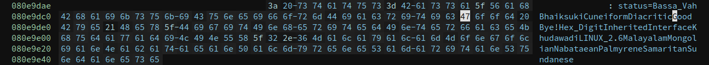

Under xrefs, we can see that only 1 function references the string. That is `sub_80c3500`.

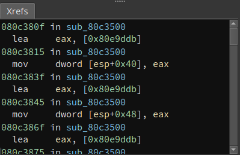

That function accepts arguments, and has a big list of its own local variables.

This is its arguments' addresses. 
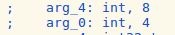


This is its local variables' addresses. There are actually more according to Hopper disassembler, but we are only interested in these.
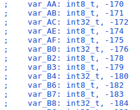


### Reverse engineering

`sub_80c3500` compares some bytes to check if they meet a certain criteria to determine if the string "Good Bye!" should be printed. It is *highly likely* that those bytes being compared are the password we enter. 

The function does a total of 17 different checks. It compares a byte from the argument with a byte from a local variable. No doubt the argument will be the user input string. 


##### Check 1

Check 1 checks to make sure that the value of `arg_4 == 0x10`. As this check checks `arg_4` instead of `arg_0`, which is checked by all 16 other checks, I wonder what the relevance of this particular check is. 

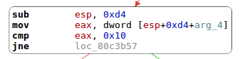


##### Check 2

Check 2 checks that `[arg_0 +1] ^ 0x3 == var_B8`, where `var_B8 = 0xae`.

This means that `[arg_0 +1] = 0xad`. It is the 2nd character of the password string.

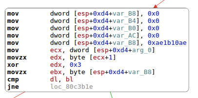


##### Check 3


Check 3 checks that `[arg_0] & 0xfffffffe == var_B7`, where `var_B7 = 0x10`.

This means that `[arg_0] = 0x10`. It is the 1st character of the password string. It could also be 0x11, but we stuck with 0x10. It's a matter of choice, really.

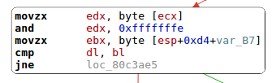


###### Check 4

Check 4 checks that `[arg_0 +3] | 0x3 == var_B6`, where `var_B6 = 0x1b`.

This means that `[arg_0 +3] = 0x1b`. It is the 3rd character of the password string.

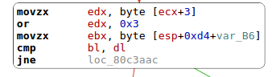

###### Check 5


Check 5 checks that `[arg_0 +2] ^ 0xffffffde == 0xae`.

This means that `[arg_0 +2] = 0x70`. It is the 3rd character of the password string.


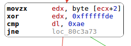

###### Check 6


Check 6 checks that `[arg_0 +5] ^ 0xffffffaf == var_B3`, where `var_B3 = 0xfe`.

This means that `[arg_0 +5] = 0x51`. It is the 6th character of the password string.


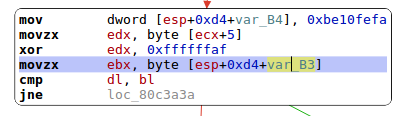

###### Check 7

Check 7 checks that `[arg_0 +7] ^ 0xffffff92 == 0xbe`.

This means that `[arg_0 +7] = 0x2c`. It is the 8th character of the password string.

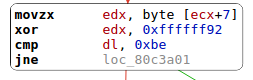

###### Check 8

Check 8 checks that `[arg_0 +4] | 0x3a == var_B4`, where `var_B4 = 0xfa`.

This means that `[arg_0 +4] = 0xfa`. It is the 5th character of the password string.

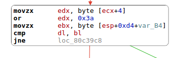

###### Check 9

Check 9 checks that `[arg_0 +6] & 0x19 == var_B2`, where `var_B2 = 0x10`.

This means that `[arg_0 +6] = 0x10`. It is the 7th character of the password string.

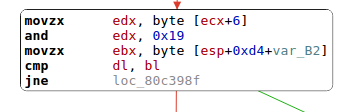

###### Check 10

Check 10 checks that `[arg_0 +8] | 0x3 ^ 0xffffffde == var_B0`, where `var_B0 = 0x21`.

This means that `[arg_0 +8] = 0xFC`. It is the 9th character of the password string. It could also be 0xFF, but we stuck with 0xFC. It's a matter of choice, really.

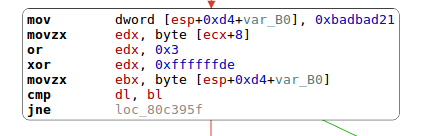

###### Check 11

Check 11 checks that `[arg_0 +9] ^ 0x7f == var_AF`, where `var_AF = 0xad`.

This means that `[arg_0 +9] = 0xD2`. It is the 10th character of the password string.

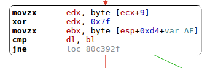

###### Check 12

Check 12 checks that `[arg_0 +10] ^ 0x32 | 0xffffff8a == var_AE`, where `var_AE = 0xdb`.

This means that `[arg_0 +8] = 0xE9`. It is the 11th character of the password string. 

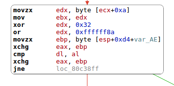

###### Check 13

Check 13 checks that `[arg_0 +11] ^ [arg_0 +10] ^ 0x13 == 0xba`.

This means that `[arg_0 +11] = 0x40`. It is the 12th character of the password string. 

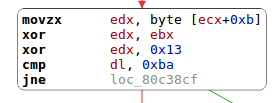

###### Check 14

Check 14 checks that `[arg_0 +12] ^ 0x30 == var_AC`, where `var_AC = 0xdf`.

This means that `[arg_0 +12] = 0xEF`. It is the 13th character of the password string. 

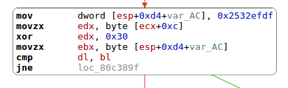

###### Check 15

Check 15 checks that `[arg_0 +13] ^ 0x3a == var_AB`, where `var_AB = 0xef`.

This means that `[arg_0 +13] = 0xD5`. It is the 14th character of the password string. 

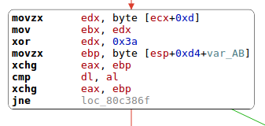


###### Check 16

Check 16 checks that `[arg_0 +14] ^ [arg_0 +13] == var_AA`, where `var_AA = 0x32`.

This means that `[arg_0 +14] = 0xE7`. It is the 15th character of the password string. 

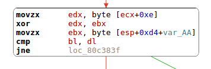

###### Check 17

Check 17 checks that `[arg_0 +15] ^ [arg_0 +1] ^ [arg_0 +2] == 0x25`.

This means that `[arg_0 +15] = 0xf8`. It is the 16th character of the password string. 

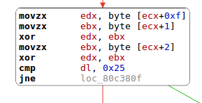


### Got da password 

There are a total of 16 hex characters in the password. With this password, we are given the flag.

```
$ ./crackme-linux-stripped.go 
Welcome to CrossCTF 2018!
Enter the password:
10ad701BFa51102cfcd2e940efd5e7f8
The flag is CrossCTF{4F988F38C637330A46A1F1E19F215109}
```
