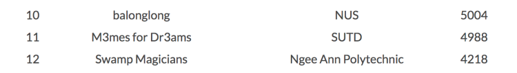
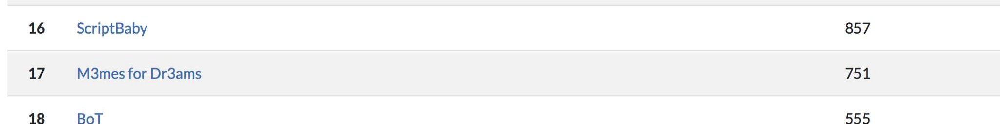

# Cr055CTF2018

[CrossCTF](https://crossctf.github.io/) is a cyber security competition organized by NTU with collaboration with NUS Greyhats and SMU Whitehats. This also provides a platform for participants to hack safely in Singapore. The other reason is to promote Cyber Security Capture-The-Flag Compeitions in Singapore.

We participated as the team M3mes for Dr3ams. The proud members of the group are:
- Foo Ming Qing
- Wong Chi Seng
- Solomon Tan

This repository contains writeups for the challenges we solved during the challenge. 

We completed 11th place in the qualifiers:

We intended to do both IoT-CTF and CrossCTF. However, after a few hours, we realised we bit off more than we could chew. So, we decided to concentrate on just the former. Thus, we only completed 17th place in the finals here:

## Other Writeups

We've compiled a list of other writeups for your viewing pleasure too:

* [OSI Layer 8 (NUS)](https://osilayer8.cf/)
* [Alan's blog (qualifiers)](https://tcode2k16.github.io/blog/posts/crossctf-2018-writeup/)
* [Alan's blog (finals)](https://tcode2k16.github.io/blog/posts/crossctf-final-2018-writeup/)
* [Amos Ng's writeups](https://writeups.amosng.com/)
* [Johan Tan's writeups (qualifiers)](https://github.com/johantannh/CrossCTF2018_Online_Qualifier_Writeups/)

