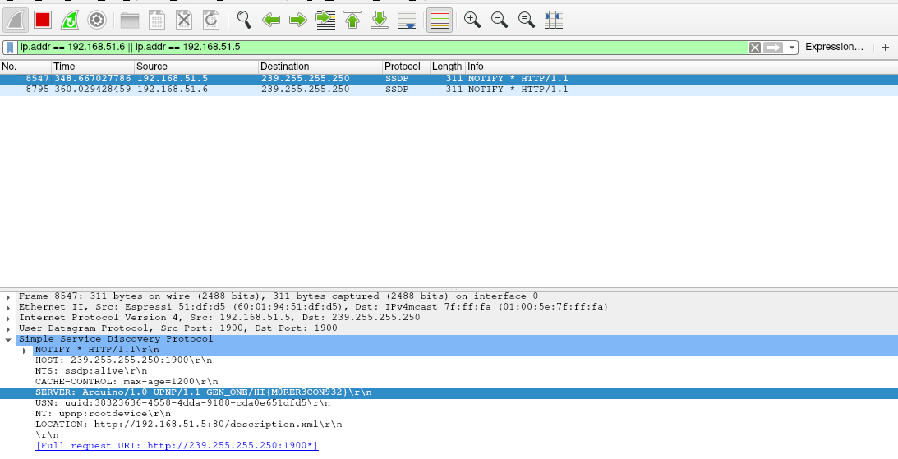

# Firmware Reverse Easy - 424

> You need access into the Home Invasion network before you can solve this challenge. There is only one flag in this challenge. Hint: You need the firmware first. Go find it. Now, reverse it. The first flag should be obvious.

This challenge is a continuation of the Recon Basics Sniff challenge. Recall from Recon Basics Sniff that we managed to identify the correct packet with the flag `HI{M0RER3CON932}`. We have attached the screenshot here for your easy reference.



Do you notice this portion of the packet? We noticed that there was a URL given in the packet: `http://192.168.51.5:80/description.xml`.


We forgot to take a screenshot of the website, so we cannot show it to you. For the sake of the writeup however, the creator of the challenge was kind enough to provide us a screenshot of the source code for the xml file. The XML file gave us *another* url. It was the company's home URL: `http://ragulbalaji.com/luxcorp`.


 Unfortunately the site has been taken down, so you cannot visit it anymore. In the site, we were given the option to download a binary file called `LUXFirmware-G1-Sat16June2018-003.bin`.

After downloading, as we do for any binary, we checked what type of file it was. Never trust what the source claims the file is. It looked like some kind of file image. 
```
➜  iotctf2018 file LUXFirmware-G1-Sat16June2018-003.bin 
LUXFirmware-G1-Sat16June2018-003.bin: , code offset 0x201+3, OEM-ID "@\234\36", Bytes/sector 26688, sectors/cluster 5, FATs 16, root entries 16, sectors 20480 (volumes <=32 MB), Media descriptor 0xf5, sectors/FAT 16400, sectors/track 19228, FAT (12 bit by descriptor)
```

We tried to mount it, but we got some kind of error.
```
➜  iotctf2018 sudo mount -t vfat LUXFirmware-G1-Sat16June2018-003.bin /tmp/luxcorp
mount: /tmp/luxcorp: wrong fs type, bad option, bad superblock on /dev/loop0, missing codepage or helper program, or other error.
```

We decided to use `binwalk` to take a peak into the type of files in the firmware. We never dealt with firmwares before, so we did not know what to expect.
```
➜  iotctf2018 binwalk LUXFirmware-G1-Sat16June2018-003.bin 

DECIMAL       HEXADECIMAL     DESCRIPTION
--------------------------------------------------------------------------------
43932         0xAB9C          SHA256 hash constants, little endian
308701        0x4B5DD         Private key in DER format (PKCS header length: 4, sequence length: 315
309020        0x4B71C         Unix path: /Users/ragulbalaji/Library/Arduino15/packages/esp8266/hardware/esp8266/2.4.1/libraries/ESP8266WiFi/src/include/DataSource.h
312633        0x4C539         XML document, version: "1.0"
359575        0x57C97         Unix path: /Users/ragulbalaji/Library/Arduino15/packages/esp8266/hardware/esp8266/2.4.1/cores/esp8266/abi.cpp
```

Hmmm... We did not know what to do. We knew that the file `"Private key in DER format"` is for the challenge Stealing Unattended Certificates. So what could possibly be the flag for this challenge?

> The first flag should be obvious.
>  
> -- The creator of the challenge

We did not know where do start, so we just decided to use `strings`. Turns out, the key was to use `strings`! The flag for this challenge was `HI{LongLive_STRINGS}`.
```
➜  iotctf2018 strings LUXFirmware-G1-Sat16June2018-003.bin| grep "HI"
HI{H4RDC0DEC3RT}1
HI{H4RDC0DEC3RT}1
HI{LongLive_STRINGS}
HI{PLACEHOLDER}
0123456789abcdefghijklmnopqrstuvwxyzABCDEFGHIJKLMNOPQRSTUVWXYZ
```

The flag `HI{H4RDC0DEC3RT}` is the flag for the challenge, Probing Ports. 
