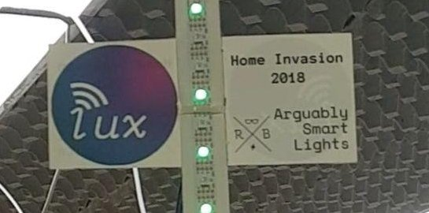
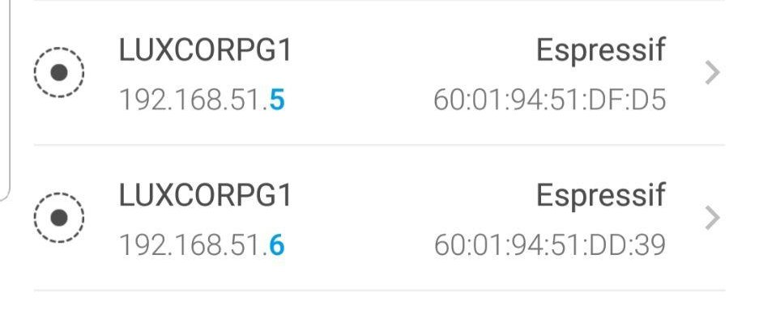
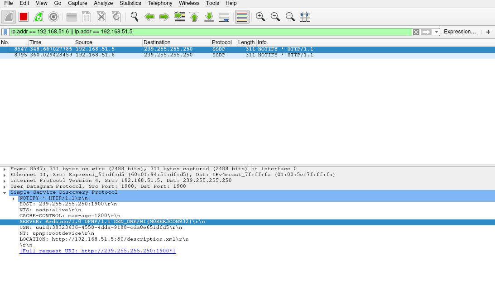

# Recon Basics Sniff - 100

> You need access into the Home Invasion network before you can solve this challenge. There is only one flag in this challenge. Hint: Sniff Around: Gather some information

This challenge is really easy, conceptually speaking. However, some may be overwhelmed by the shear number of packets flying around the network.

We ran `Wireshark` in the background for about 5-10 minutes to capture network traffic in the `home invasion` network, and saved it into a pcap file. (It is not necessary to solve this challenge, but we had to refer back to said pcap file multiple times for other challenges).


We were too lazy to manually comb through the entire pcap file, and using `strings` felt too much like cheating, so we decided to find a "smarter" way of solving the challenge.

We realized that the smart lights had a logo on it labelled "lux" on it.



We then ran a simple scan of the network using a mobile app called `Fing` to find its IP address. 



Turns out it was `192.168.51.5` and `192.168.51.6`. Thus, we searched for packets in our pcap file involving these 2 addresses. It gave us the flag `HI{M0RER3CON932}`.




Since the flag was given in plaintext, it is possible to get it simply using `strings` too. The other flag, `HI{I0T_Mu1t1c45t!!!!1!!1!!!}`, is for another challenge.
```
➜  iotctf2018 strings spam_sniffing.pcapng | grep "HI{"
:HI{I0T_Mu1t1c45t!!!!1!!1!!!}
:HI{I0T_Mu1t1c45t!!!!1!!1!!!}
[...]
SERVER: Arduino/1.0 UPNP/1.1 GEN_ONE/HI{M0RER3CON932}
:HI{I0T_Mu1t1c45t!!!!1!!1!!!}
[...]
:HI{I0T_Mu1t1c45t!!!!1!!1!!!}
:HI{I0T_Mu1t1c45t!!!!1!!1!!!}
SERVER: Arduino/1.0 UPNP/1.1 GEN_ONE/HI{M0RER3CON932}
:HI{I0T_Mu1t1c45t!!!!1!!1!!!}
[...]
```
