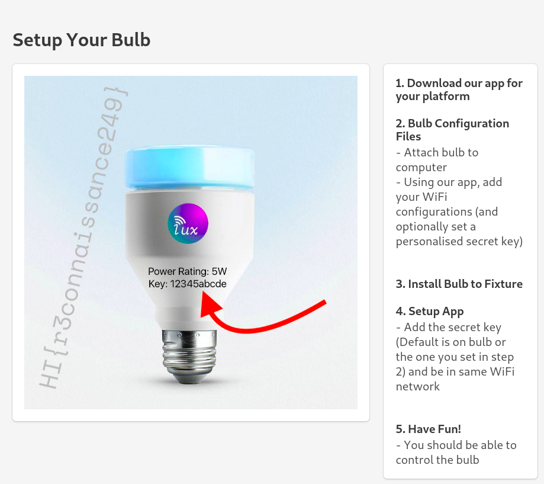

# Recon Basics Web - 424

> You need access into the Home Invasion network before you can solve this challenge. There is only one flag in this challenge. Hint: Use OSINT, gather some information

This challenge can only be solved after Recon Basics Sniff. In the packet, we were given a website: `http://192.168.51.5:80/description.xml`.

We forgot to take a screenshot of the website, so we cannot show it to you. For the sake of the writeup however, the creator of the challenge was kind enough to provide us a screenshot of the source code for the xml file. The XML file gave us *another* url. It was the company's home URL: `http://ragulbalaji.com/luxcorp`.

The company's website was the perfect first place to start. It is a buffet of free information about the company's products, which in this case, is the smart light.

The answer was literally right there on the website. The flag is `HI{r3connaissance249}`.

