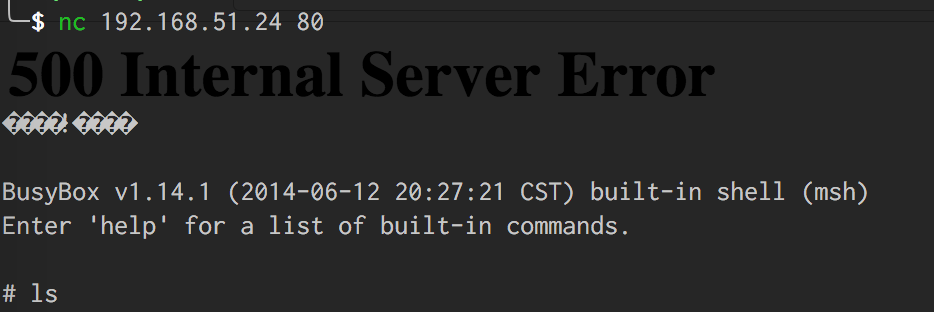
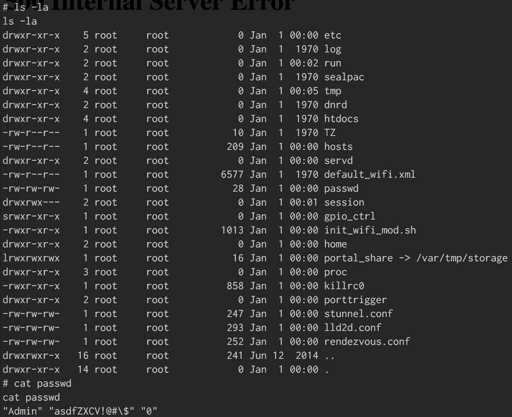

# Dlink DIR880

## Problem

> You will need access into the Home Invasion network to complete this challenge. 
> There is only one flag in this challenge. 
> Hint: There is a flaw in webfa_authentication cgi page allows for a buffer overflow for command injection flag resides in Home directory.

## Solution

From network scans, we discover that a D-Link DIR-800L router is hosted on 192.168.51.24 and we navigate to http://192.168.51.24:80 to access the router's web UI to confirm the router's make and model.

Searching https://www.exploit-db.com, we find [D-Link DIR-880L - Multiple Buffer Overflow Vulnerabilities](https://www.exploit-db.com/exploits/38725/) that appears to be suitable for triggering a buffer overflow in the router as suggested by the problem.

Modifying the "Buffer overflow in auth" script in [dlink.py](dlink.py), we upload a payload that starts a telnet server on the router. Connecting to the telnet server,

We explored the file directories and found the file `passwd`:

Showing this to a CTF administrator, we are given the flag `HI{D24DURIANPUFF}`.
