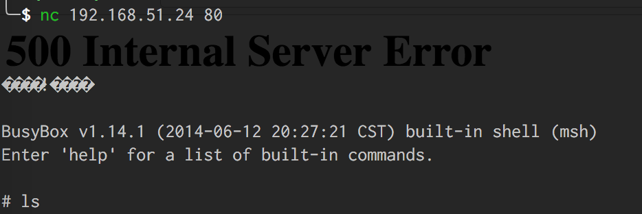
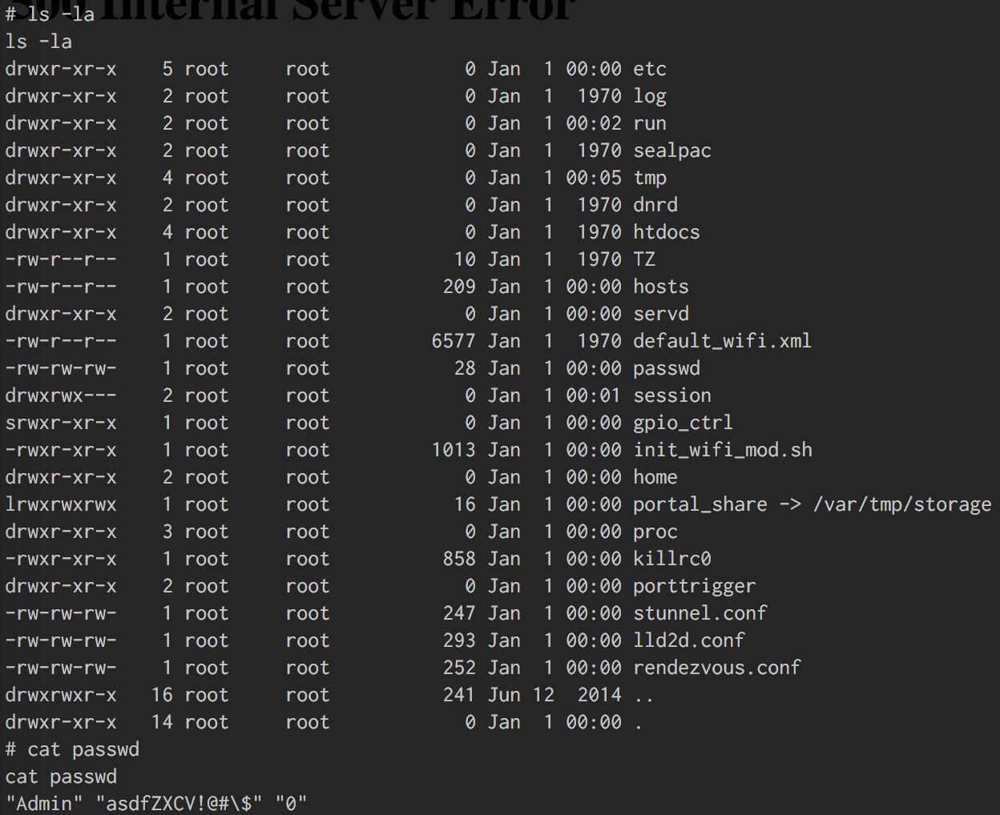

# Dlink DIR880 - 271

## Problem

> You will need access into the Home Invasion network to complete this challenge. 
> There is only one flag in this challenge. 
> Hint: There is a flaw in webfa_authentication cgi page allows for a buffer overflow for command injection flag resides in Home directory.

## Solution

From network scans, we discovered that a D-Link DIR-800L router is hosted on 192.168.51.24 and we navigated to http://192.168.51.24:80 to access the router's web UI to confirm the router's make and model.

Searching `https://www.exploit-db.com`, we found an exploit -  [D-Link DIR-880L - Multiple Buffer Overflow Vulnerabilities](https://www.exploit-db.com/exploits/38725/) - that appeared suitable for triggering a buffer overflow in the router as suggested by the problem.

We modified the "Buffer overflow in auth" script in [dlink.py](dlink.py), and uploaded a payload that starts a telnet server on the router. We successfully connected to the telnet server:

We explored the file directories and found the file `passwd`. (It is at the bottom of the screenshot). We thought it might be the flag, but it was not.

We were unable to find the flag file, and soon after the camera crashed. Our exploit did not work anymore thereafter. Fortunately, we took a screenshot of our shell access, so we showed to a CTF administrator, who gave us the flag `HI{D24DURIANPUFF}`.

