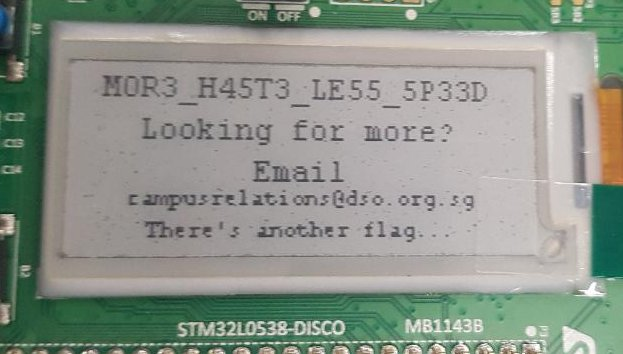

# Serially FUN! - 991

> This challenge requires you to make use of the evaluation board (STM32 Discovery board). There is only one flag in this challenge. You can bring the board home if you solve this challenge ;)
>  
> We have forgotten the username and password to the device, can you find it for us?
>  
> If the flag is ABC123, submit your flag in the format of HI{ABC123}

This challenge was created by DSO National Laboratories. 


When we came for the CTF, we were determined to solve this challenge at all cost. Afterall, Solomon is a huge fan (but still a n00b) of embedded systems, but never got the chance to play hardware challenges. This was his first time, and oh boy was he excited! 


> DSO XCTF Challenge
>  
> Connect User USB and push blue btn to begin

We followed the board's instructions, and connected to it serially using the command `screen /dev/ttyACM0`.

We received a prompt asking for the username. This told us this was the correct way to communicate with the board. 

```
$ screen /dev/ttyACM0

User: 
```

As we entered the username, our input was reflected back to us on the computer, and after submission, printed out on the board's screen too. Then the board would prompt for the password, where we were given unlimited tries.

Usually, when a challenge pipes user input back to standard output, it means format string vulnerability is involved. We tried format string specifiers like `"%x %x
` but the board's screen did not print out the stack's content. We ruled out format string exploit.


Next, we tried to fuzz the program by keying in input of different lengths. We tried input of about 25 characters, and were presented with the warning `"Canary dead"`. That meant that we could not smash the stack. Bummer.
```
User: aaaaabbbbbcccccdddddeeeeefffff
Password: 
SYS_INTEGRITY_VIOLATION: SYSTEM HALTED
```


We recalled from a previous challenge called [Dubblesort in Pwnable.tw](https://github.com/solomonbstoner/solomonbston3r-ctf-diary/blob/master/Others/Pwnable.tw/dubblesort%20pwnable.tw%20.md) where the libc's base address was simply sitting in the buffer for user input. To read that value, we needed a string of a specific length so that the `<puts>` instruction would append the target value (that we want to print) to the end of the user-supplied string. We thought the same might apply here.

Thus, we decreased the length of our input gradually from 25 to 24.... to 15. The canary kept dying.  But once we reached length 15, something magical happened. Some additional characters were printed out, exactly like Dubblesort in Pwnable.tw. However, each time we restarted the board, the values were different. We have attached pictures from 2 separate runs to let you see what the values looks like in each run. Our input in both cases were `"aaaaabbbbbccccc"`. This magic happens only when input length is 15 characters long. 

 


We did not know what to do with those values, but there was no harm trying to see if it was the password. We keyed in the extra characters as our password, and voila, we got a flag! It is `HI{M0R3_H45T3_LE55_5P33D}`.



DSO's clue was to solve this challenge was to extract the firmware from the device using ST-Link. However, it was unnecessary for the first challenge (which is what this writeup describes). It might be to extract the 2nd flag from the device though.
