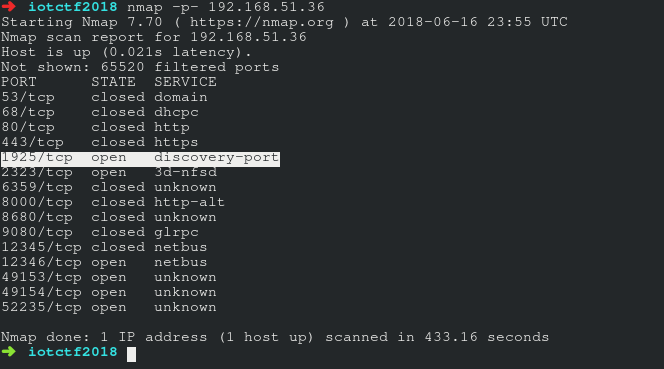
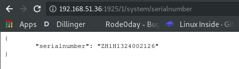

# TV - Serial Number - 559

> What is the Philip TV's serial number?
>  
> Note: you do not need to visually inspect the TV to do this challenge
>  
> Enclose the flag in HI{...}

Before attacking the smart TV, we first had to find out its location in the network. We found it using `Fing`, a mobile app for scanning networks. Its IP address was `192.168.51.36`.

We then used `Nmap` to scan the TV for open ports. One particular port, `port 1925` struck our interest. It was called `discover-port`, which seems fitting because we were trying to *discover* the TV's serial number. (Just out of curiousity, we tried to `curl` and `telnet` the other ports, but nothing useful was given.) 

`curl 192.168.51.36:1925` returned us a HTML response, so we opened it in a browser. It was a webpage of API documentation to communicate with the TV. Unsurprisingly, there was also a API method to get the TV's serial number.

We keyed in the url `http://192.168.51.36:1925/1/system/serialnumber` into the browser, and was presented the TV's serial number. 

The flag was thus `HI{ZH1H1324002126}`.
