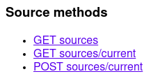
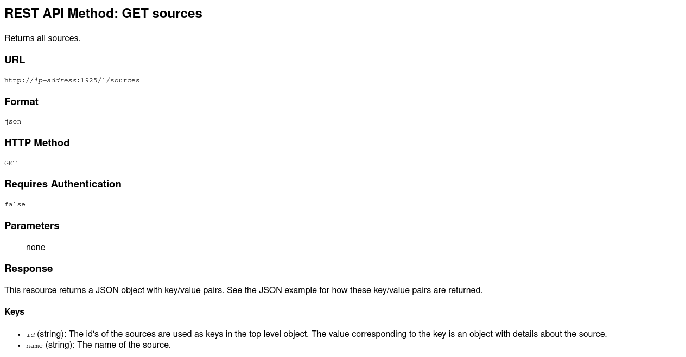
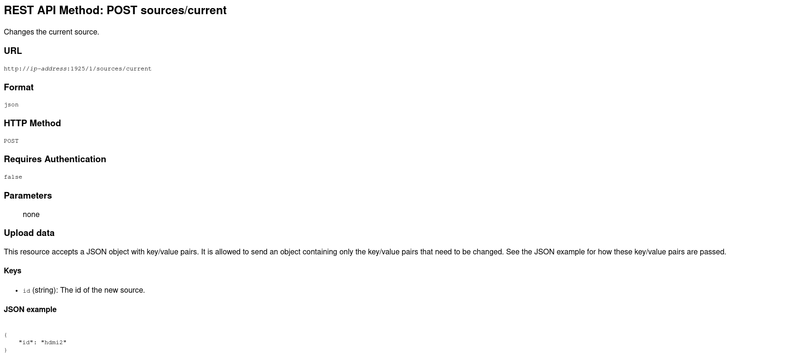
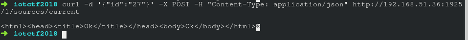
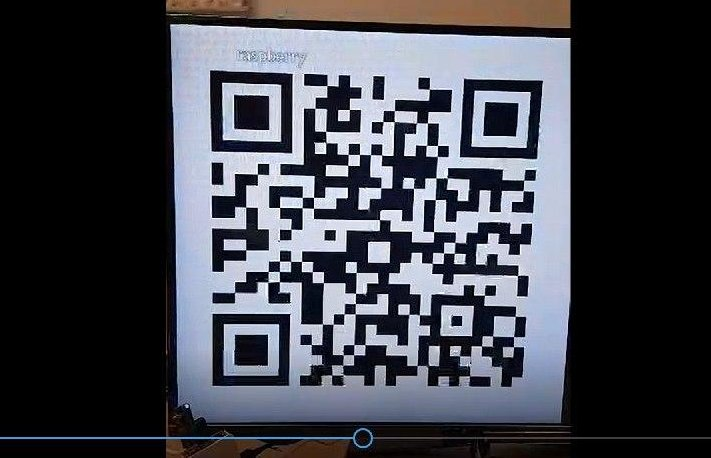

# TV - Find the right QR code - 740

> You need access into the Home Invasion network before you can solve this challenge. There is only one flag in this challenge. Hint: Access our TV and Change the TV source.

This challenge is a sequel of the challenge TV - Serial Number - 559. Remember from that challenge that we managed to find a website documenting all the API HTTP requests used to communicate with the TV. To access it, we opened a browser with the URL: `192.168.51.36:1925`. It was a website containing documentation for a list of APIs. While in TV - Serial Number, we were interested in the API, `GET system/serialnumber`, this time we were interested in a different pair of API functions.

In the documentation, there were 2 more requests of interest:
1. GET request to show all sources of the TV (The documentation is available [here](http://jointspace.sourceforge.net/projectdata/documentation/jasonApi/1/doc/API-Method-sources-GET.html) too)

2. POST request to change the current source of the TV (The documentation is available [here](http://jointspace.sourceforge.net/projectdata/documentation/jasonApi/1/doc/API-Method-sources-current-POST.html) too)

 

First, we ran the GET request to get a JSON representation of all the sources of the TV.

Then, POST request to change the current source for each source listed in the GET request. After each request, the TV would reply with "Ok". Soon, we reached source id 27.

After running the command above, the TV started showing a few QR codes in quick succession to each other. We recorded it down with our phones.

As the title of the challenge suggests, we had to manually scan and test each QR code in the video. That meant pausing the video each time a new QR appeared, then scanning it to see what it returned. Most QR codes returned garbage. However, we soon got the correct one. 

Scanning the QR code gave us the string `"QR Qr qR qr HI{Bf87S3Fe} qr qR Qr QR"`. Our flag was `HI{Bf87S3Fe}`.
