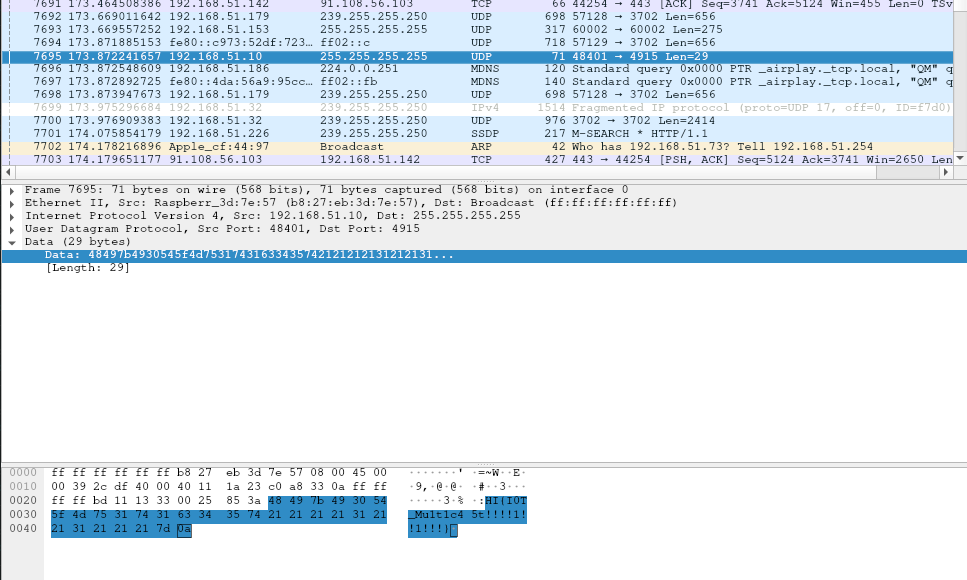

# Whats inside the network? - 424

> Theres something flying around the network.

We ran `Wireshark` in the background for about 5-10 minutes to capture network traffic in the `home invasion` network, and saved it into a pcap file. (It is not necessary to solve this challenge, but we had to refer back to said pcap file multiple times for other challenges).

We *could* solve the challenge using `strings` on the captured pcap file. That way we could get the flag for both this challenge (ie `HI{I0T_Mu1t1c45t!!!!1!!1!!!}`) and Recon Basics Sniff (ie `HI{M0RER3CON932}`).

```
➜  iotctf2018 strings spam_sniffing.pcapng | grep "HI{"
:HI{I0T_Mu1t1c45t!!!!1!!1!!!}
:HI{I0T_Mu1t1c45t!!!!1!!1!!!}
[...]
SERVER: Arduino/1.0 UPNP/1.1 GEN_ONE/HI{M0RER3CON932}
:HI{I0T_Mu1t1c45t!!!!1!!1!!!}
[...]
:HI{I0T_Mu1t1c45t!!!!1!!1!!!}
:HI{I0T_Mu1t1c45t!!!!1!!1!!!}
SERVER: Arduino/1.0 UPNP/1.1 GEN_ONE/HI{M0RER3CON932}
:HI{I0T_Mu1t1c45t!!!!1!!1!!!}
[...]
```

However, we did not solve it this way. We solved it by chance. We had no idea what source was sending what packet around the network. We were searching for a needle in the haystack in the dark. After clicking around in Wireshark, we chanced upon the relevant packet.



It actually makes sense. "flying around" probably meant a packet with no intended destination. This packet with the flag is a UDP packet broadcasted to everyone. In hindsight, it could have been a clue to make the search area smaller, but we would never know if it was the intended inference.
