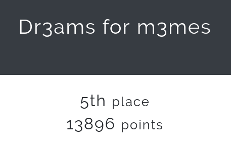

# IOT-CTF 2018

The collection of writeups in this repository is proudly brought to you by Dr3ams for M3mes, left severely sleep deprived after staying up all night to complete as many challenges as possible.

As our brains ceased to work properly as the CTF progressed, we apologise that our writeups may not be as detailed as expected. We also seek your kind assistance to bring any error to our attention, so we can make the earliest possible amendment.

The proud members of this group are

1. Foo Ming Qing
2. Wong Chi Seng
3. Solomon Tan

This is the list of completed writeups for your viewing pleasure, please. :)

| Category | Challenge | Number of solves |
| --- | --- | --- |
| ArguablySmartLights | Decrypt Everyone! | 2 |
| ArguablySmartLights | Easter Egg 1 | 7 |
| ArguablySmartLights | Firmware Reverse Easy | 9 |
| ArguablySmartLights | Recon Basics Sniff | 11 |
| ArguablySmartLights | Recon Basics Web | 9 |
| ArguablySmartLights | Stealing Unattended Certificates | 6 |
| Armv71 | shellcode | 3 |
| Armv71 | simplerop | 1 |
| Armv71 | static | 0 |
| Armv71 | warmup | 4 |
| Crypto | RSA1 | 8 |
| Crypto | RSA2 | 7 |
| Devices | Serially Fun! | 2 |
| Devices | TV - Serial Number | 8 |
| Misc | TV - Find the right QR code | 8 |
| Network | Whats inside the network? | 9 |
| Special | Home Invasion Wifi Password | 17 |
