# Bluepill

> This your last chance. After this there is no turning back. You take the blue pill, the story ends. You wake up in your bed and believe whatever you want to. You take the red pill, you stay in Wonderland, and I show you how deep the rabbit hole goes. Remember, all I'm offering is the truth. Nothing more. This challenge was sponsored by ATEA! If you are a local student player you are eligible to turn in the flag at the ATEA booth for a prize!
>  
> Solves: 27
>  
> Service: nc rev.trinity.neo.ctf.rocks 31337 or nc 209.97.136.62 31337
>  
> Download: bluepill.tar.gz

After downloading and extracting the tarball file, we are presented with 4 files.
```
$ ls
bluepill.ko  init  run.sh  tiny.kernel
$ cat run.sh 
#! /usr/bin/env bash

qemu-system-x86_64 -kernel ./tiny.kernel -initrd ./init -m 32 -nographic -append "console=ttyS0"
```

`run.sh` emulates a small Linux kernel named `tiny.kernel` using QEMU. When we ran `run.sh`, we were presented with a welcome screen all about "bluepill". It is likely related to `bluepill.ko`, the kernel module object file we were given.


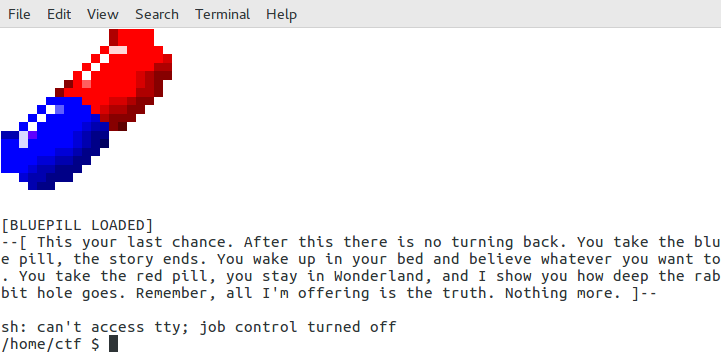


In the home directory, we were given the flag file and another file called `banner`.
```
/home/ctf $ ls -l
total 8
-rwxr-x---    1 1337     root          1836 May 14 05:42 banner
-r--------    1 0        root            45 May 26 22:51 flag
```

Even though the permissions state that `banner` is executable, it is not. `cat banner` printed out the welcome screen featuring the half-blue-half-red pill we saw earlier. Our goal is to `cat flag`, which we could not because we do not have permissions to do so. 

```
/home/ctf $ cat flag
cat: can't open 'flag': Permission denied
```

There has to be a way for us to escalate our privileges to `root`. Perhaps the key might be in the `bluepill.ko` file? We confirmed with `lsmod` that the `bluepill` kernel module is loaded into the kernel. And indeed it is! That is a clear sign that we should disassemble and reverse engineer `bluepill.ko`.
```
/home/ctf $ lsmod
bluepill 12288 0 - Live 0x0000000000000000 (O)
```


After taking a look in `bluepill.ko` using IDA, we found the a part of the function `<pill_choice>` to be of interest. It involves something called `"init_task"`. 


We are new to kernel modules, so we weren't so sure what it does. We knew it had to be the goal because of the string it prints. 

> [BLUEPILL] You made the right choice! Now see the world for what it really is ..................... !\n

I renamed the string variable `success_msg` in IDA. That's why you see `<printk>` in the screenshot of the flow graph above.

Thus, we researched into what `"init_task"` does. 

> The swapper process [pid=0] is initialized in arch/arm/kernel/init_task.c by the macro INIT_TASK.
>  
> --[Stack Overflow](https://stackoverflow.com/questions/2511403/in-the-linux-kernel-where-is-the-first-process-initialized)


> While in kernel mode, the process will have root (i.e., administrative) privileges and access to key system resources. 
>  
> -- [Kernel Mode definition](http://www.linfo.org/kernel_mode.html)


> There are two tasks with specially distinguished process IDs: swapper or sched has process ID 0 and is responsible for paging, and is actually part of the kernel rather than a normal user-mode process.
>  
> -- [Wikipedia](https://en.wikipedia.org/wiki/Process_identifier)

Since the swapper process is part of the kernel, it has kernel privileges and thus will give us access to `flag`. (We aren't sure if that is the truth, but it seems like a logical deduction). Now, we have to find out how to get to this part of the function `<pill_choice>`.

### Dissecting bluepill.ko

We found out what can escalate our privileges using `bluepill.ko`. Our goal now is to find out *how* we can do so. I broke `<pill_choice>` into a few parts so that it's easier to reverse engineer it.

##### First Check


When `pill_choice` begins, it copies a string from user space into kernel space. [strncpy_from_user(choice_35697, ???, 0x14)](https://www.fsl.cs.sunysb.edu/kernel-api/re252.html) copies 20 characters into the variable `user_string`.

Then, it opens the file `/proc/version` from the [`/proc` file system](https://linux.die.net/lkmpg/x710.html). If the file opens successfully, `<file_open>` returns the file pointer to `/proc/version`. Else, it returns 0 (and the check fails). 

The flow graph of the function `<file_open>` is included below if you are curious to see how it works. I do not think it is necessary to under every instruction in `<file_open>` though.

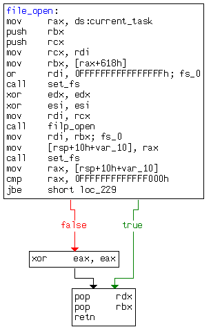

##### Second Check

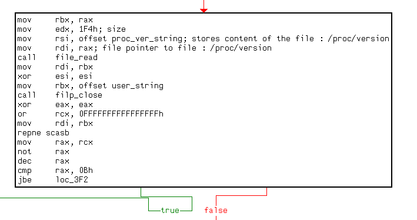

The second check reads 500 characters from the file `/proc/version` and stores it in the variable called `proc_ver_string`. The check then checks to make sure that the length of the string `choice_35697` (it was copied from user space into kernel space in the First Check) is more than 11 characters long.

For those wondering how the assembly checks the length of the user input, let us take you through the magic. Otherwise, you may continue to the Third Check.

The instructions below decrements `rcx` for each character in the string until NULL is reached (including NULL).

```
or rcx, 0xFFFFFFFFFFFFFFFF	; start count at FFFFFFFFFFFFFFFFh
mov rdi, rbx			; rbx is the address of the string.
repne scasb			; scan string for NUL, decrementing rcx for each char
```
> A common use of the REPNE SCASB instruction is to find the length of a NUL-terminated string.
>  
> --[Source](https://www.csc.depauw.edu/~bhoward/asmtut/asmtut7.html)

Since the instructions counts backwards for each character, the instructions below will make some changes to the value returned by `repne scasb` to make it human-readable. 
```
mov rax, rcx
not rax
dec rax
cmp rax, 0xB
```


For instance, if we run a string `"Hello"` through the instructions, `repne scasb` returns `0xFFFFFFFFFFFFFFF9`. Who can possibly infer the length of the string from this value? After negating the returned value, and decrementing it once, we are left with the value `0x5` (which is the length of the string `"Hello"`).

##### Third Check overview


If the user input, `user_string`, passes the Second Check, it proceeds to the Third Check. This check is a *huge* one. It involves hashing and xor encryption. It took us a long while to understand what it does. The screenshot shows the overview of the Third check. 

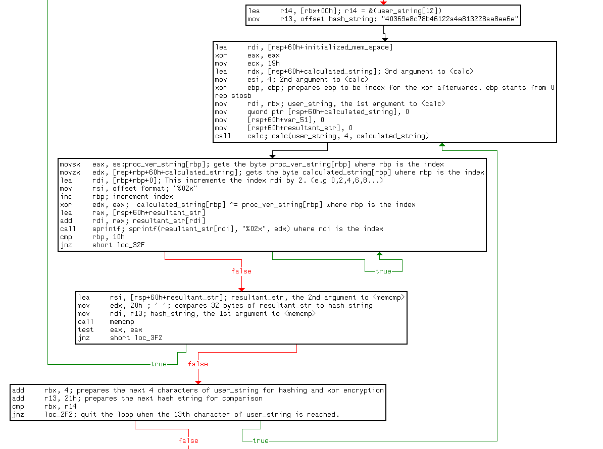

We broke down the Third check into 4 parts to understand what they do individually, then analysed them together to get the full picture. Let us take you through our anaylsis.

##### Third Check part 1

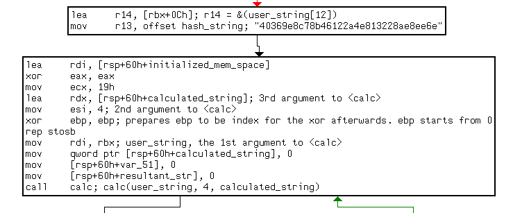

Before we analyse what this part of the Third check does, keep in mind that all the parts are interconnected. Some instructions may not make sense here, but you will see its relevance in the subsequent parts. 

With that out of the way, let's begin our analysis. First, part 1 stores the address of the 13th character of `user_string` in register `r14`, and a hash string's address in `r13`. To the untrained eye, it looks like a regular, weird string. However, its characters are all hex values, and it is 16 bytes long. It has uncanny resemblence to a hash string. It is not important for now. We'll come back to it later.

Moving on, we see that arguments are being prepared for the `<calc>` function, and there is a weird instruction called `rep stosb`. We were stuck for a moment. We did not know what `rep stosb` does, so we spent some time to research on it.

```
.text:00000000000002F2                 lea     rdi, [rsp+60h+initialized_mem_space]
.text:00000000000002F7                 xor     eax, eax
.text:00000000000002F9                 mov     ecx, 19h
[...]
.text:0000000000000308                 xor     ebp, ebp
.text:000000000000030A                 rep stosb
```

> stosb     ;store string byte
> Moves the contents of the AL register to the byte addressed by ES:DI
> DI is incremented if DF=0 or decremented if DF=1
>  
> --[Source](https://www.shsu.edu/~csc_tjm/spring2006/cs272/strings.html)

Since `rax` is 0, and `rcx` is 0x19, `rep stosb` initializes 27 bytes of `initialized_mem_space` to 0x0. We have no idea what the purpose is either. It just happened.

Then, `<calc>` is called with 3 arguments. It is invoked with the following arguments `calc(user_string, 4, calculated_string)`. 

At first we did not know what the 2nd and 3rd arguments are for. Neither were we aware of what `<calc>` does. So we took a peek inside. The flow graph was very confusing. However, we noticed that there were 3 out of the ordinary immediate values, namely `0x98BADCFE`, `0xEFCDAB89` and `0x10325476`.

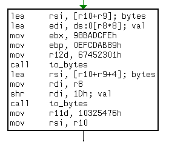

We wondered for a momeny why the function chose these specific values to move immediate into the registers. It would make sense if it moved 0x0, or say 0x1. Those are common. But to move a large immediate hex value of a specific value seemed more liekly intentional than coincidence. So we googled those values to see what purpose they serve. Turns out, they were values for md5 hashing. Remember the 16 bytes long hash string from part 1? It makes sense now. The kernel module would md5 hash user input, then compare it to an existing md5 hash. 


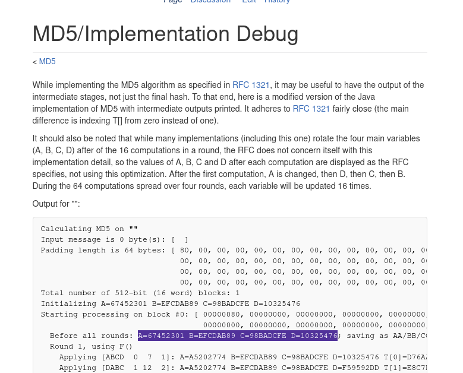

We also later found out in part 3 that the 2nd argument was the number of characters from `user_string` to hash, and the 3rd argument was the resultant hash string. Actually, we found out later in part 4 that the first argument is actually just a *substring* of user_string, but the concept of what `<calc>` does remains unchanged. That concludes part 1.

##### Third Check part 2

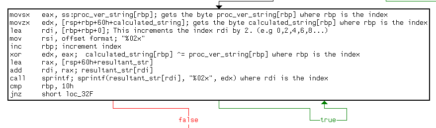

After hashing 4 characters, part 2 `XOR` encrypts each byte of `calculated_str` with each byte of `proc_ver_string` before storing the result in the string back in `calculated_str`. `rbp` is used as the index for both strings. It was initialised to 0x0 in part 1. With each iteration, `rbp` is incremented to cycle through each byte of the strings until the 16th byte, inclusive. That effectively `xor` encrypts the md5 hash of the user input. That concludes part 2.


##### Third Check part 3

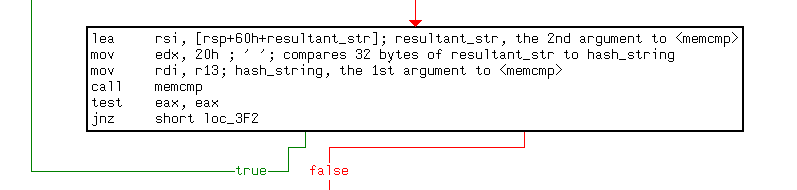

Part 3 takes `resultant_str` (which is the xor encrypted md5 hash of whatever string `<calc>` hashed) and compares it to `hash_string`, the string from part 1. If the hashes are the same, it proceeds to part 4 of the Third check. Else, it prints the failure message and quits.

##### Third Check part 4

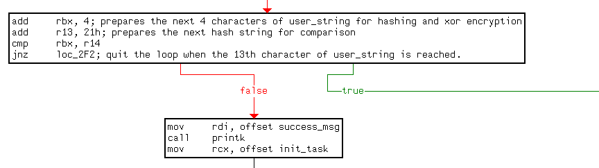


Part 4 merely repeats parts 1 to 3 thrice. We'll explain why there are only 3 iterations later. Let's analyse each instruction from top to bottom first. Of course, we'll show you its relevance to `<pill_choice>`. Let's begin.

You may not understand what `add rbx, 4` does. Neither did we for a long while. Recall that `mov rbx, offset user_string` was executed in the Second Check. This means that in the first iteration, `rbx` contained the address of `user_string[0]`. Then in the second iteration, `rbx` contained the address of `user_string[4]`. Then in the third iteration, `rbx` contained the address of `user_string[8]`. That way, `<calc>` would first hash the first 4 characters of `user_string`, then the next 4 characters of `user_string`, then the last 4 characters of `user_string`. 

What about `add r13, 21h`? You may ask. Recall from part 1 that `mov r13, offset hash_string` moved the address of `hash_string` to `r13`. After executing the add instruction, `r13` points to the next of the 3 hash strings in the `.data` section. In other words, in the first iteration, `r13` points to `40369e8c78b46122a4e813228ae8ee6e`. In the second iteration, it points to `e4a75afe114e4483a46aaa20fe4e6ead`. In the third (which is the last) iteration, it points to `8c3749214f4a9131ebc67e6c7a86d162`. 


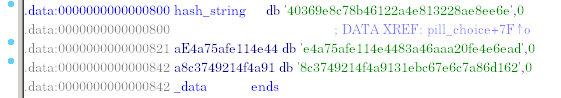


In other words, the `XOR` encrypted md5 hash of the first 4 characters of `user_string` (ie `user_string[0:4]` in Python syntax) is compared to `40369e8c78b46122a4e813228ae8ee6e`. The `XOR` encrypted md5 hash of the next 4 characters of `user_string` (ie `user_string[4:8]` in Python syntax) is compared to `e4a75afe114e4483a46aaa20fe4e6ead`. The last 4 characters of `user_string` (ie `user_string[8:12]` in Python syntax) is compared to `8c3749214f4a9131ebc67e6c7a86d162`.

Now, let us explain to you why there are only 3 iterations. Remember from Part 1 of the Third Check that `lea r14, [rbx+0xC]` loaded the address of the 13th character of `user_string` into `r14`. Essentially, it means `r14 = &(user_string[12]`. In part 4, `cmp rbx, r14` merely checks to see if `rbx` points to `user_string[12]`. If it is (and assuming we passed the 3 `<memcmp>` verifications in Part 3), the Third Check is terminated and we successfully reached `init_task`. As discussed before, it gives us escalated privileges to read the flag.


### Preparing to extract the password

We found out that part 1 of the Third Check md5 hashes the user string 4 characters at a time, then Part 2 of the Third Check `XOR` encrypts the md5 hash using `/proc/version` as the key before comparing it to the 3 hashes in its memory. To reconstruct the password, we simply decrypt the md5 hash first, then check which website can help us dehash the decrypted md5 hashes.

We made a Python script to decrypt the md5 hashes for us. It is the file `solution_to_Bluepill.py`.

After running the file, we got the following output. Ignore the `XOR` equations. Those were included for debugging our script. The bottom 3 lines are what we want.
```
[...]
0x21 ^ 0x75 = 54
0x4f ^ 0x78 = 37
0x4a ^ 0x20 = 6a
0x91 ^ 0x76 = e7
0x31 ^ 0x65 = 54
0xeb ^ 0x72 = 99
0xc6 ^ 0x73 = b5
0x7e ^ 0x69 = 17
0x6c ^ 0x6f = 03
0x7a ^ 0x6e = 14
0x86 ^ 0x20 = a6
0xd1 ^ 0x34 = e5
0x62 ^ 0x2e = 4c
XOR decrypted hash for user_string[0:4] : 0c5ff0f900941747d69b7a4de4c8da40
XOR decrypted hash for user_string[4:8] : a8ce348b696e32e6d619c34f906e5a83
XOR decrypted hash for user_string[8:12] : c05e2754376ae75499b5170314a6e54c
```


### Successfully extracting the password

Armed with the md5 hashes, we headed to [this website](https://www.md5online.org/) to check against their database to see if there is plaintext password characters corresponding to those hashes.

The screenshots below show us the plaintext characters that produce said md5 hashes.

![user_string[0:4]](img/sctf2018_bluepill_first_hash.png)
![user_string[4:8]](img/sctf2018_bluepill_second_hash.png)
![user_string[8:12]](img/sctf2018_bluepill_third_hash.png)

With this information, we concluded that the input to the file `/proc/bluepill` should be `"g1Mm3Th3r3D1"` for us to read the flag. We tested it on the local QEMU emulator. It worked.

```
/home/ctf $ echo "g1Mm3Th3r3D1" > /proc/bluepill
[BLUEPILL] You made the right choice! Now see the world for what it really is ..................... !
sh: write error: Bad address
/home/ctf # whoami
sh: whoami: not found
/home/ctf # cat flag
sctf{real_flag_is_on_the_remote_server_:)))}
```
