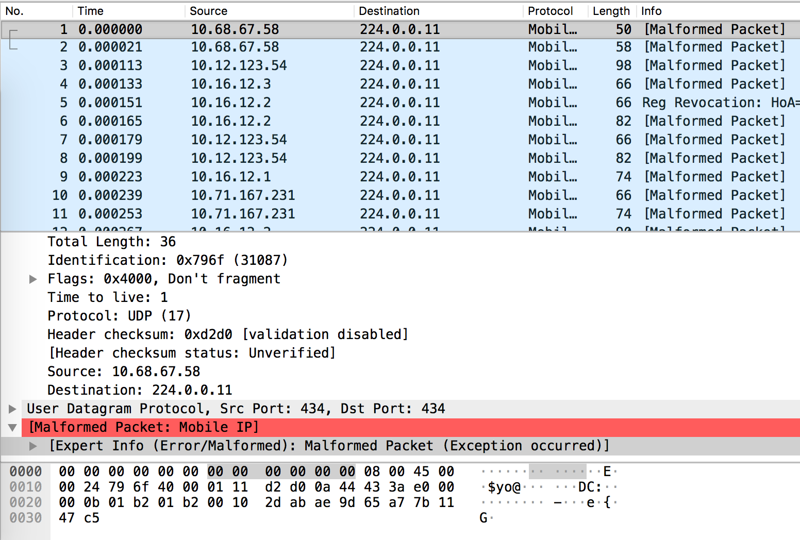

# Agent Communications

## Challenge

>Agent communications - Crypto (500)
>
>Whilst you were blowing up a government building and kicking agent asses I managed to intercept some of their internal communications. There is something fishy about the encryption they are using but I don't know what.
>
>Solves: 0
>
>Download: [agent.tar.gz](agent.tar.gz) containing [agent_comm.pcap](agent_comm.pcap)

## Solution

*We didn't solve this challenge and this writeup is inspired by the [CTF creator's hints/reflections](http://klondike.es/klog/2018/06/03/challenge-writer-write-up-security-fest-2018-ctf-challs/).*

From the challenge hint, we can pick out the words "**blow**ing" and "**fish**y". This is a clue that we have to employ the [Blowfish cipher](https://en.wikipedia.org/wiki/Blowfish_(cipher)) to solve this challenge.

Inspecting [agent_comm.pcap](agent_comm.pcap) with Wireshark, we see that it contains malformed UDP packets:

Hence we use [Scapy](https://scapy.readthedocs.io/en/latest/) to parse [agent_comm.pcap](agent_comm.pcap) and extract the UDP payloads as ciphertexts.

From the [creator's blog](http://klondike.es/klog/2018/06/03/challenge-writer-write-up-security-fest-2018-ctf-challs/), we pick up the following hints:
* Block cipher operates in ECB mode
* Key length is 2 bytes

Iterating through all possible keys, we finally find the key `b'\xa7\x1b'` which decrypts the ciphertext as

`b"Backup.\x00Send backup.\x00\x00\x00\x00They have incapacitated all the units on the lobby.\x00\x00\x00\x00\x00What were you doing?\x00\x00\x00\x00He doesn't know.\x00\x00\x00\x00\x00\x00\x00\x00I think they're trying to save him.\x00\x00\x00\x00\x00Explosion on the lobby.\x00Fire-fighting systems activated.\x00\x00\x00\x00\x00\x00\x00\x00Find them and destroy them.\x00\x00\x00\x00\x00We're under attack.\x00\x00\x00\x00\x00I repeat, We're under attack.\x00\x00\x00I can confirm they are on the roof, engaging.\x00\x00\x00Mr. Anderson is shooting at me.\x00I hit Mr. Anderson.\x00\x00\x00\x00\x00Only human.\x00\x00\x00\x00\x00sctf{I_have_been_downed_by_Mr_Anderson_on_the_roof}\x00\x00\x00\x00\x00B-212 engaging on floor 87.\x00\x00\x00\x00\x00No.\x00\x00\x00\x00\x00I have been downed by Mr. Anderson.\x00\x00\x00\x00\x00I have been downed by Mr. Anderson.\x00\x00\x00\x00\x00I have been downed by Mr. Anderson.\x00\x00\x00\x00\x00Prepare to engage again.\x00\x00\x00\x00\x00\x00\x00\x00I think I have impacted their leader.\x00\x00\x00I have incapacitated their B-212.\x00\x00\x00\x00\x00\x00\x00"`

The flag is `sctf{I_have_been_downed_by_Mr_Anderson_on_the_roof}`.
