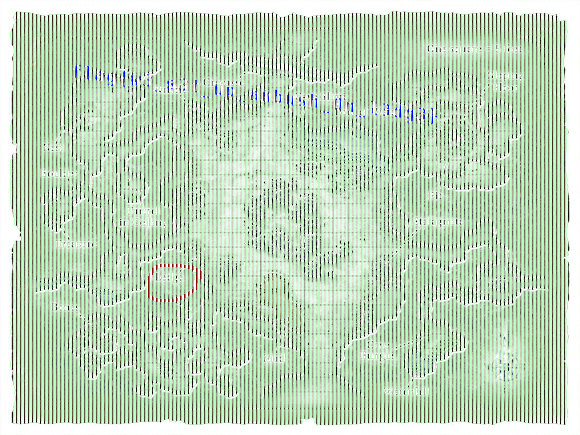
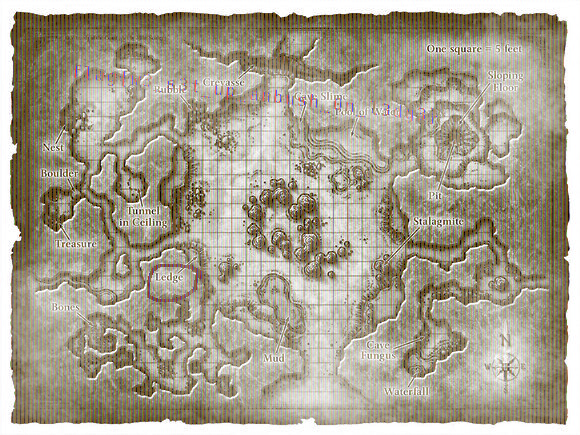

# For Secret Plans in SwampCTF2018

>Some orcs were caught in the area transporting secret plans, only problem is we cant read them. Can you?
>  
>-=Created By: matg=-

We are given this image

It looks like a map, with what seems to be some form of writing in pink and blue letters. It is too difficult to make out what is written. Considering that the flag is a long string, and this looks like a long string, I guessed it might be the flag.

I opened the image in `GIMP` and randomly tried different methods to make words more visible. I have no idea how image editting works, so I did by trial by error.

After I added a dark brown background layer below the image, and added a little white airbrush, the words became more visible.

Turns out the string *is* the flag - `flag{w3_s3t_up_ambush_0n_l3dg3}`. Honestly, it does look more like "anbush" than "ambush", but "anbush" was not accepted as the flag. Besides, this image is a map, and the sentence "some orcs were caught in the area transporting secret plans" seems to suggest that the context is military in nature, so "ambush" has to be the word.

END
