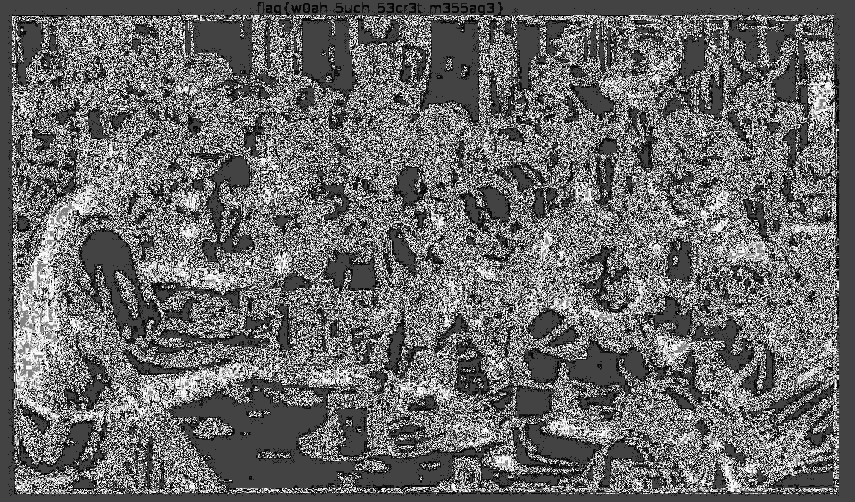

# For Wild Night Out in SwampCTF2018


>That sure was a wild night at the old tavern.
>Good thing someone was able to draw the scene for us to remember.
>But the more I look at the picture, the more it seems that something isn't quite right...
>
>-=Created By: matg=-


We are given the following picture.


Since it involves steganography, I tried 2 *possible* solutions.

1. The flag could be embedded as a string.

```
solomonbstoner@swjsUbuntu:~$ strings tavern_night.png | grep -i "flag"
solomonbstoner@swjsUbuntu:~$
```
Nope, it was not.

2. There might be other png images embedded in the file.

```
solomonbstoner@swjsUbuntu:~$ binwalk tavern_night.png

DECIMAL       HEXADECIMAL     DESCRIPTION
--------------------------------------------------------------------------------
0             0x0             PNG image, 855 x 502, 8-bit/color RGBA, non-interlaced
421           0x1A5           Copyright string: "Copyright (c) 1998 Hewlett-Packard Company"

solomonbstoner@swjsUbuntu:~$ 
```

Nope, there was not.


### Solution

I loaded up the image into GIMP, and applied [alien map filter](https://docs.gimp.org/en/plug-in-alienmap2.html) to the image. I have no idea about the maths and science behind image manipulation, so I'm just trying my luck.



We get our flag `flag{w0ah_5uch_53cr3t_m355ag3}`

END
