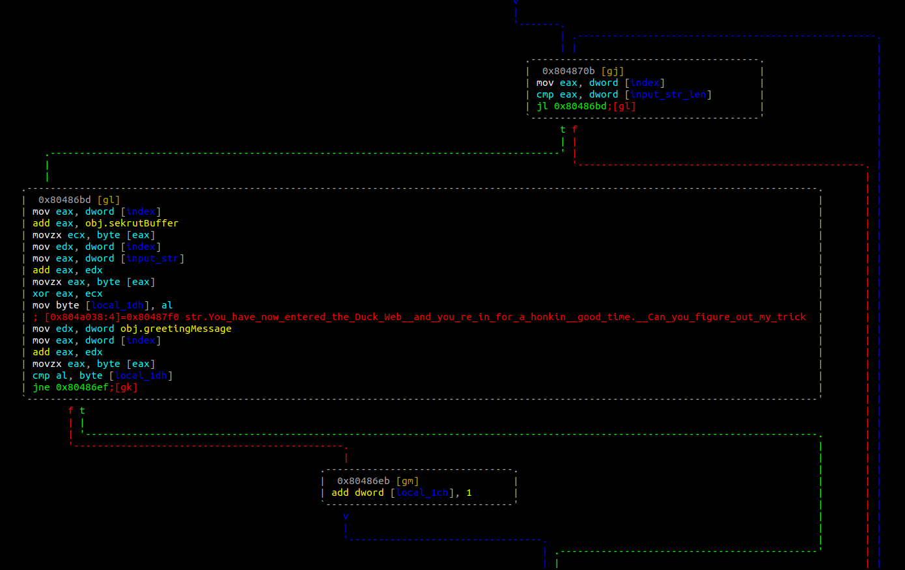
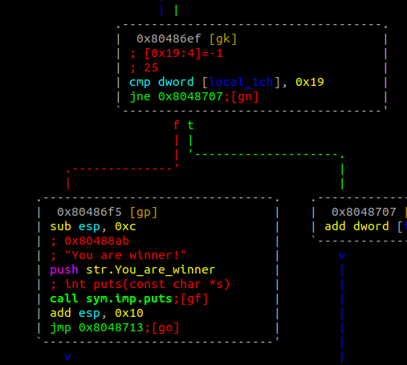
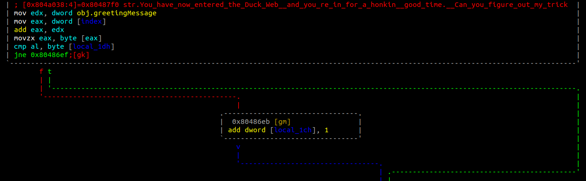

# Quackme - PicoCTF

In essence, our function of interest is `sym.do_magic`. You can ignore the portion of it that calls `malloc` and `memset`. It is useless.

`sym.do_magic` reads a line of input into the variable `input_str`, then it XOR encrypts the string with the string - `obj.sekrutBuffer` - before comparing it to the string that `obj.greetingMessage` points to.

 

The nth byte of the `obj.sekrutBuffer` byte string is the key to XOR encrypt the nth byte of the `input_str`.
```
[0x080486d8]> px 0x19 @obj.sekrutBuffer
- offset -   0 1  2 3  4 5  6 7  8 9  A B  C D  E F  0123456789ABCDEF
0x08048858  2906 164f 2b35 301e 511b 5b14 4b08 5d2b  )..O+50.Q.[.K.]+
0x08048868  5310 5451 434d 5c54 5d                   S.TQCM\T]
```

The first 0x19 bytes from the XOR encryption should match the first 0x19 bytes of the string `obj.greetingMessage` points to. 
```
[0x080486d8]> pxw 4 @obj.greetingMessage
0x0804a038  0x080487f0                                   ....
[0x080486d8]> psz @0x080487f0
You have now entered the Duck Web, and you're in for a honkin' good time.Can you figure out my trick?
[0x080486d8]> 
```

To print the string, "You are a winner!", `local_1ch` must be 0x19.



So, how do we each that value, when earlier, it was initialised to 0x0? `sym.do_magic` increments `local_1ch` by 1 each time the nth byte of the XOR encrypted `input_str` matches the nth byte of the greeting message.



We [wrote a python script](soln_quackme.py) to work backwards, and get the required input string.

```
➜  quackme git:(master) ✗ python2 soln_quackme.py 
picoCTF{qu4ckm3_6b15c941}
➜  quackme git:(master) ✗ 
```

The flag is `picoCTF{qu4ckm3_6b15c941}`.
